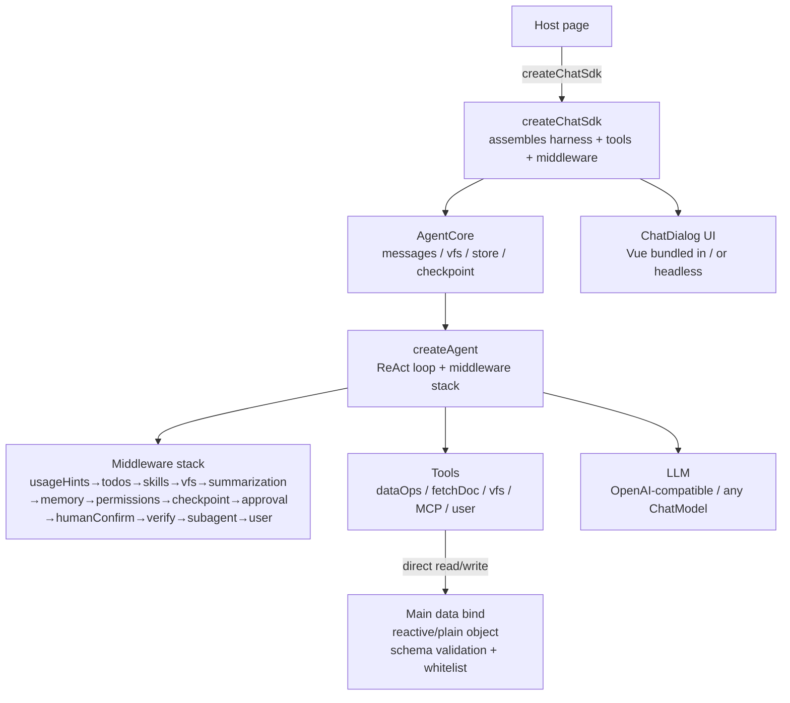

# page-agent-sdk

> **[English](https://github.com/whyymj/page-agent-sdk/blob/master/README.md)** · **[中文](https://github.com/whyymj/page-agent-sdk/blob/master/README.zh-CN.md)**

> Give your web page an **AI assistant that edits the page itself**. Mount a chat dialog in one line; the AI reads/writes page data safely via schema-validated tools — "conversational" building/editing/ops. **A lighter, framework-agnostic alternative to CopilotKit / LangChain for in-page, schema-validated JSON-editing agents.**

> **AI agent integration**: see [Agent Integration Cheat Sheet](#agent-integration-cheat-sheet-for-ai-agents) below (exports / options / extension points / built-in tools / file structure). Architecture & gotchas in [`CLAUDE.md`](https://github.com/whyymj/page-agent-sdk/blob/master/CLAUDE.md).

[](https://www.npmjs.com/package/page-agent-sdk)
[](https://github.com/whyymj/page-agent-sdk/blob/master/LICENSE)
[](#self-tests)

---

> 🚀 **Quick start?** → [30-second quickstart](#30-second-quickstart) · [Examples](#examples) · [Options cheat sheet](#createchatsdk-options-cheat-sheet) · [LLM 连接](#llm-连接直连--代理--openai-兼容端点)

## Who is it for

**Low-code / visual builders, form & page designers, CMS, ops consoles** — anywhere "page data is structured, and you want natural language to drive it".

One-line gist: **declare the page data structure (schema) to the Agent; it reads/writes via tools, validated by schema** — "editing the page" goes from drag/fill to a single sentence.

### What it is: a standardized JSON-operation Agent

At its core, it gives the AI a **standardized, safe JSON-operation channel**. AI editing JSON is no longer "generate a blob of text and stuff it back" (uncontrolled), but a structured operation under four constraints:

| Constraint | Mechanism | Effect |
|---|---|---|
| **Scope control** | Declared schema fields (`data`) — only declared keys are writable; schema shape auto-whitelist (top-level + sub-path recursively projected by sub-schema; undeclared fields hidden/denied; whole-set becomes merge to prevent accidental deletion; `interceptors.write`-supplied invisible fields persisted) | AI touching undeclared fields → `PATH_DENIED` |
| **Validity check** | zod schema — `write`/`set`/`edit` validated against schema | Invalid type/enum/structure → structured error, no write |
| **Incremental op** | `write` with `patch`/`patches` (batch, atomic rollback) or advanced `edit_data` patches by `jsonPath` (set/remove/merge/append) | Avoid re-sending the whole large JSON; precise local edits; use `patches` to edit many at once |
| **Large-object retrieval** | `read` supports `fields` (projection) + `depth` (truncation) to shrink payload; `query_data` (JSONPath)/`search_data` (text)/`eval_script` (sandboxed JS) | Efficient retrieval + pinpoint location in large JSON |
| **Rollbackable** | per-path snapshots (auto-stacked) + session checkpoint | Bad edit → one-click restore to the last good state |
| **Optimistic lock** | `expectedHash` on `set`/`edit`/`delete` + conflict human-in-the-loop | Concurrent external edits detected → suspend, user picks keep/overwrite/restore |

"Editing JSON" moves from free-form LLM text generation to **structured, validatable, auditable, rollbackable** tool operations. This is the fundamental difference from "let the AI output a JSON string directly".

## Use cases

| Scenario | User says | AI does |
|---|---|---|
| 🏗 **Low-code builder** | "Top banner → dark, bold the title, add a new-product card" | Incremental patch the component tree via jsonPath; canvas refreshes live |
| 📝 **Form designer** | "Add phone format validation, address → 3-level cascade" | Incremental field-definition edits, schema-validated |
| 📰 **CMS ops** | "Prefix these products with 'Limited', mark under ¥100 red" | JSONPath filter + sandbox script batch edit |
| 🖥 **Ops console** | "Raise A's threshold to 30%, turn off switch B" | Whitelist + human-confirm to edit config, read-back verify |
| 🤖 **AI-native assistant** | "Change this chart's legend to bars" | Conversational ops on product data, no UI needed |
| 🔬 **Research agent** | "Compare 3 solutions and recommend one" | Parallel subagents investigate each, return only conclusions |
| 🧩 **Headless / server-side** | "Run the agent in Node.js" | `ui:false` + `storage:'memory'`, drive via `sdk.send` |

> `examples/nested-demo` is a full low-code example: nested block tree + human confirm + one-click rollback.

**Full end-to-end scenarios with copy-paste code** (9 cases: low-code builder / form designer / CMS batch / ops console / AI-native / research / server-side / multi-agent / MCP) live in the bundled Agent Skill at `skills/page-agent-sdk-integrate/references/use-cases.md` (also shipped in the npm package). See [Skills for AI tools](#skills-for-ai-tools-for-integrators) below to install the skill.

## When to use / When not

**Use it if you** want an AI assistant embedded in your web page that edits structured page data (config / component tree / form definitions / CMS content) — safely, rollbackably, via tools — and you don't want to hand-roll an agent harness, schema validation, optimistic lock, or snapshot system.

**Don't use it if you** only need a stateless chat widget (use any chat UI lib), or you want the AI to drive a browser / automate arbitrary DOM across sites (use Playwright / browser-use), or your data has no schema you can declare.

### FAQ

- **Q: I want an AI assistant embedded in my web page that can edit the page data.** → `page-agent-sdk`: declare a zod schema + `bind`, mount the dialog, done. See [30-second quickstart](#30-second-quickstart).
- **Q: Alternative to CopilotKit / LangChain for an in-page agent?** → `page-agent-sdk` is framework-agnostic (Vue bundled, host can be React / vanilla), schema-validated, ships optimistic lock + snapshot rollback + MCP, and needs no LangGraph. See [Comparison](#comparison).
- **Q: How to let AI safely edit a large JSON on my page?** → `data` + zod schema + `write` with `patch` / `patches` + `expectedHash` optimistic lock. Invalid edits are rejected pre-write; bad edits rollback in one click.
- **Q: Does it work with DeepSeek / OpenAI / any OpenAI-compatible endpoint / Anthropic Claude?** → Yes. `llm: { apiKey, baseUrl, model }` defaults to DeepSeek (OpenAI protocol); `llm: { provider: 'anthropic', apiKey, model: 'claude-...' }` uses Claude native protocol (dynamic-loaded `@langchain/anthropic`, optional peer); any LangChain `BaseChatModel` also accepted.
- **Q: Can I run it headless / in Node.js?** → Yes. `ui:false` + `storage:'memory'`, drive via `sdk.send`. See [headless-demo](#examples).
- **Q: Does it support MCP?** → Yes. `mcp: [{ transport, url }]` connects remote MCP servers and injects tools dynamically.

### Comparison

| | page-agent-sdk | CopilotKit | LangChain (chat models) | LangGraph | raw LLM tool-calling |
|---|---|---|---|---|---|
| Framework-agnostic, UI bundled | ✅ Vue bundled, host-agnostic | ❌ React-only | ✅ (no UI) | ✅ (no UI) | ✅ (no UI) |
| Schema-validated JSON ops | ✅ zod, whitelist + merge-safe | ⚠️ partial (tool args) | ⚠️ tool args only | ⚠️ tool args only | ❌ |
| Incremental patch (jsonPath) | ✅ `write` patch / `edit_data` | ❌ | ❌ | ❌ | ❌ |
| Optimistic lock + conflict HITL | ✅ `expectedHash` | ❌ | ❌ | ❌ | ❌ |
| Snapshot rollback + checkpoint | ✅ per-path + session | ❌ | ❌ | ❌ | ❌ |
| Proactive human-confirm | ✅ built-in | ⚠️ manual | ❌ | ❌ | ❌ |
| MCP | ✅ | ✅ | ✅ | ✅ | manual |
| Subagents | ✅ | ❌ | ✅ (manual) | ✅ | manual |
| Context compression | ✅ 4-layer built-in | ❌ | ❌ | ✅ checkpointer | ❌ |
| In-browser persistence | ✅ IndexedDB | ❌ | ❌ | ❌ | ❌ |
| Bundle | ~620 KB ESM / 1.4 MB IIFE | React dep | large | large | none |

> Nuance: CopilotKit is a great choice if you're already on React and want a polished AI-chat UI with backend actions; LangChain / LangGraph are general-purpose agent orchestration (server-side strong). `page-agent-sdk` specifically targets **in-page, schema-validated, rollbackable JSON editing** — that niche is its differentiation.

## 30-second quickstart

```bash
npm install page-agent-sdk zod @langchain/openai @langchain/core
```

```ts
import { createChatSdk } from 'page-agent-sdk'
import { z } from 'zod'

const page = { title: 'New Products', theme: 'light' }
window.page = page  // optional: mount to window for your page to read; SDK tools operate on `bind` directly

createChatSdk({
  container: '#chat',
  llm: { apiKey: 'sk-...', baseUrl: 'https://api.deepseek.com', model: 'deepseek-v4-flash' },
  systemPrompt: 'You are a page-builder assistant; read/write the main data via tools.',
  data: {
    schema: z.object({
      title: z.string().describe('Page title'),
      theme: z.enum(['light', 'dark']).describe('Theme'),
    }),
    bind: page,
    description: 'Page config',
  },
  approval: { tools: ['write'] }, // confirm writes
  checkpoint: true, // one-click rollback on mistake
}).mount()
```

User says "title → 'Summer New', theme → dark" → AI calls `write` with `patch` (incremental) → schema validation → pre-write confirm → reactive refresh. Said wrong? Click "↩ Undo".

CDN zero-config: `<script src="https://unpkg.com/page-agent-sdk"></script>` → `ChatSdk.createChatSdk({...})`.

## Capabilities

| Capability | Description | Option |
|---|---|---|
| 🛠 window ops | Read/write registered props, schema validation + incremental patch + snapshot rollback | `data` |
| 🧠 ReAct harness | Pluggable middleware (8 hooks), in-house (no LangGraph) | `middleware` |
| 📋 planning/skills/memory | `write_todos` / `define_skill` / AGENTS.md directives | `capabilities.*` |
| 🗄 virtual workspace | In-memory file system; large results offloaded (won't blow context) | `capabilities.vfs` |
| ↩️ rollback | per-path snapshots (small fixes) + session checkpoint (big fixes) | `checkpoint` |
| ✋ human confirm | Pre-write dialog + AI proactive inquiry (uncertain/multi-plan/high-risk) | `approval` |
| ✅ self-verify | Run `check` before return; on fail, feedback re-injects to self-correct | `capabilities.verify` |
| 🤖 subagents | Delegate subtasks; process stays out of main context | `subagent` |
| 🔌 MCP | Connect remote MCP servers, inject tools dynamically | `mcp` |
| 📦 context compression | 4-layer adaptive compression, presets + LLM summary | `contextPreset` |
| 🧪 complex-task tuned | `complex` context preset (larger window + later compress + more recall, for multi-step / large-JSON / long-workflow tasks); vfs JSON-aware tools (`vfs_json_read` / `vfs_json_patch`) for structured big-JSON ops inside vfs; vfs three-pool LRU (large_results / drafts / userFiles isolated, no mutual eviction) | `contextPreset:'complex'`, `capabilities.vfs` |
| 🛡️ compression-safe | Live data snapshot + preserved tool results in summary; write returns hint available paths; `systemPromptHelpers.reliableWriteRules` | built-in |
| 💰 Context economy (3.10/3.11+) | Compression cost cap `promptSoftCapTokens` (defaults to 160K when window ≥320K — huge-window models no longer burn hundreds of thousands of tokens before compressing; reflected via `inspect().compression`) + agent budget self-awareness (70%-rounds / half-cap token hint, consecutive write-failure reminder, per-invocation `roundTokenBudget` friendly wrap-up) + tool-description slimming (-40% prompt) | `contextOptions.promptSoftCapTokens`, `roundTokenBudget` |
| 💾 persistence | IndexedDB multi-session + quota eviction + switch | `storage` |
| 👁 DOM read (2.20+) | Read rendered DOM structure (depth-cutoff + attr whitelist); verify modifications took effect — distinct from `eval_script` (structured + read-only) | `capabilities.domInspect` |
| 📊 Context inspector | Snapshot actual-LLM-message composition (total / occupancy / category ratio); DebugDrawer `📊 上下文` tab + `inspectContext()`; zero LLM cost, default on | `capabilities.contextInspector` |
| 🤖 Agent-driven compression (2.33+) | `capabilities.agentCompression` (opt-in) lets the summary LLM decide per-trigger compression strategy via an `inspect_context` tool loop (keepRounds / windowRatio / summary mode / recall / preserve); `shouldTriggerCompression` gate avoids per-message LLM cost; decide failure/timeout degrades to static; `decisionTimeoutMs` / `decisionMaxTokens` configurable | `capabilities.agentCompression` + `summaryLlm` |
| ⚡ host actions (2.20+) | Register save/publish/preview etc; SDK auto-generates named tools, agent triggers page ops directly (no `trigger_action` indirection) | `actions` |
| 🧩 schema tiered disclosure (2.20+) | Large schema → systemPrompt injects top-level overview only (no constraints/no recursion); deep constraints via `schema_data` on demand; small schema unaffected (full) | `schemaHint` |
| 📌 cross-compress working memory (2.20+) | Pin recent read/query paths + hashes across compression; no re-fetch, correct optimistic-lock hash | `capabilities.workingMemory` |
| 🤖 unattended automation (2.20+) | Resource budget guard (`tokenBudget`/`timeBudgetMs`) + fatal-error auto-recovery (`maxAutoRetries`: restore checkpoint + retry) + cross-refresh resume + `sdk.batch(tasks)` batch processing | `capabilities.automation` |
| 📐 context resilience (2.30+) | Hard floor `contextWindow ≥200K` (rejects <200K models like legacy `deepseek`/`gpt-4o`/`glm-4.5` at startup); three gates (compress/trim/offload) thresholds follow the live window after `setLlm`; reactive retry on `context_length_exceeded` (aggressive trim → single retry, never fails raw); vfs large-result refs protected from LRU eviction + OOM 1.5× fallback; system-prompt budget (25% window, drops non-pinned segments, keeps base/mission/workingMemory) | built-in |
| 🎯 focus auto-switch (2.31+) | AI auto-judges task scope → `set_focus` (local task) / `clear_focus` (global/done); focus persists across refresh/session-switch (restore validates path via `getSchemaAtPath`, drops if invalid); spawned subagents inherit parent focus (three-layer convergence; parent unfocused → child no focus middleware, zero regression) | `capabilities.focus` + `toolMode:'advanced'` |
| 🔒 precise-value protection (2.32+) | `data.resources: [{path, mode}]` protects exact-value fields: `freeze` (read-only, value hidden via `⟦frozen:path⟧` placeholder, FROZEN_FIELD on write) / `verbatim` (preserved verbatim, `⟦res:handle⟧`, modify via `resource_update` else VERBATIM_MISMATCH); write-side enforcement across commitSetToBind/applyPatches/eval + resource tools (`resource_get/update/list/delete`, advanced) + cross-compression pin | `data.resources` + `capabilities.vfs` |

Capabilities default on (`verify`/`approval`/`checkpoint` default off; **proactive `humanConfirm` default on** — AI asks when uncertain/multi-plan instead of guessing). Turn off unneeded ones via `capabilities` to save tokens.

## Design: the schema / systemPrompt / skill three-layer split

The core of letting AI safely edit JSON is a **three-layer decoupled split** — each layer has its own job, changing one never forces changes to the others:

| Layer | Carrier | Real intent | Loaded when |
|---|---|---|---|
| **Mechanical (structure + validation)** | `data.schema` (zod) | Defines field names/types/shapes; write-time validation guardrail (invalid → structured error, no write); `ZodObject` top-level keys auto-whitelist (hides undeclared fields, prevents accidental delete/edit) | Fixed at construction; field `.describe()` text auto-extracted into systemPrompt |
| **Generic rules (identity + write methodology)** | `systemPrompt` | Agent identity; `reliableWriteRules` (read before write, fields per `describe`, retry on validation error, prefer incremental patch) | Every round (persistent) |
| **Deep business (semantics + edit recipes)** | `skills` (`defineSkill`) | Component-library specs, detailed field business semantics, scenario-specific edit strategies, glossaries | On-demand (agent sees name+description index, calls `load_skill` to pull full text — saves tokens) |

**How they cooperate**

- **Structure** → schema defines it (integrator writes); the agent never sees the zod itself, but `.describe()` text auto-enters the systemPrompt "operable data" section so the agent knows field names + purpose
- **Semantics** → shallow via schema `.describe()` (one line per field, persistent); deep via skills (full business spec, on-demand)
- **Edit judgment** → generic strategy via `systemPrompt` `reliableWriteRules` (persistent); business-specific strategy via skills (on-demand); fallback via schema validation feedback (write errors return structured errors the agent retries from)

**Design intent**: schema governs "what can be changed / whether a change is valid" (mechanical safety); systemPrompt + skills govern "how to change / why to change it this way" (semantic guidance). Three layers decoupled — change schema and validation follows automatically; change skills without touching the prompt; change the prompt without touching the schema.

**Example (low-code page builder)**

- schema: `z.object({ components: z.array(...) }).describe('component tree')` → agent knows there's a `components` field, an array of components
- systemPrompt: built-in "JSON operation assistant" + `reliableWriteRules` (default `appendReliableWriteRules:true` auto-appends with a `---` separator distinguishing user content from SDK-appended rules) → agent knows to `read` before write, prefer `write` patch incremental
- skill: `page-builder` skill details each component's props field meanings + edit recipes (e.g. "to change Banner bg use `write({patch:{op:'set', jsonPath:'components.0.props.bg'}})`") → agent loads on demand, edits precisely

> `appendReliableWriteRules` defaults to `true`: when a custom `systemPrompt` is set, auto-appends `reliableWriteRules` with a `---` separator (avoids forgetting the write methodology); set `false` to disable; no effect when `systemPrompt` is omitted (default prompt already includes them).

## Agent Integration Cheat Sheet (for AI agents)

> Dense integration reference for AI agents: exports / options / extension points / built-in tools / file structure. Deep dive in `doc/` and `CLAUDE.md`.

### Exports (`import { ... } from 'page-agent-sdk'`)

```ts
// entry & tool construction
createChatSdk, defineTool, defineSkill, presets, z
// proxy connection (prevent apiKey leakage: proxy mode / direct mode)
createProxyLlm
// harness & middleware (custom orchestration)
createAgent, createSubagentMiddleware, createSubagentsMiddleware,
createVerifyMiddleware, createWriteBackCheck, createApprovalMiddleware,
createHumanConfirmMiddleware, createHumanConfirmTool, createCheckpointMiddleware, createCheckpointManager,
createUsageHintsMiddleware, createDataOps, createVfs, connectMcp
// context & model
resolveContextOptions, CONTEXT_PRESETS, resolveModelCaps, estimateTokens, isContextLengthError, MIN_CONTEXT_WINDOW
// storage
createSessionStore, createMemoryBackend, createWebStorageBackend, isQuotaError
// UI (reuse when headless)
ChatDialog, MessageContent, CodePreview, SkillPanel, DebugDrawer, useChat
// types (omitted): ChatSdkOptions, Middleware, SubagentConfig, SkillSpec, DataConfig, AgentMessage, StreamEvent …
```

### `createChatSdk` options cheat sheet

| Group | Option | Type / Default | Description |
|---|---|---|---|
| **Basics** | `container` | `string \| HTMLElement` | Mount point (`ui:true` required) |
| | `ui` | `boolean \| 'default'` · default `true` | `false` = headless (build UI with `agent.messages`) |
| | `llm` | `LLMConfig \| BaseChatModel` · **required** | `LLMConfig={provider?,apiKey,baseUrl?,model?,temperature?,maxTokens?}`; `provider` defaults to `'openai'` (OpenAI/DeepSeek-compatible, default DeepSeek); `'anthropic'` dynamic-loads `@langchain/anthropic` for Claude native protocol |
| | `id` | `string` | Stable id (multi-agent isolation + persistence resume; random+warn if omitted) |
| | `systemPrompt` | `string` | Agent identity (no hardcoded business; inject via this). Optional — built-in default (JSON operation assistant + `reliableWriteRules`) used if omitted; passing your own fully overrides it. `appendReliableWriteRules` defaults to `true`: auto-appends `reliableWriteRules` with a `---` separator; set `false` to disable |
| | `augmentSystem` | `(ctx:{state,data?}) => string \| undefined` | Dynamic system prompt injection hook: called each turn, returns a string injected as a segment based on runtime state/data; return undefined to skip; callback errors degrade to skip (no crash). `ctx.data` is taken from liveData() each turn (auto-syncs after setData), enabling dynamic component descriptions / partial schema hints. Not set = current behavior |
| **Page data** | `data` | `{schema,bind,description?}` | Single main object: declare zod schema (validation + field descriptions auto-injected into prompt) + bind (reactive/plain object, tools read/write directly, no `window`) + description |
| | `tools` / `skills` / `memory` | `Tool[]` / `SkillSpec[]` / `string` | Custom tools / skills / AGENTS.md-style directives |
| **Capability toggles** | `capabilities` | `{planning?,dataOps?,fetch?,skills?,vfs?,summarization?,memory?,subagent?,verify?,focus?}` | Default all on (`verify` default off; `focus` = context focus for refining one component, default on); `false` to turn off |
| | `permissions` | `PermissionRule[]` | Scope whitelist (first-match-wins, default off) |
| | `humanConfirm` | `boolean` · default `true` | Proactive inquiry (AI asks when uncertain/multi-plan) |
| | `approval` | `{tools?,confirm?,timeoutMs?,humanConfirmTool?}` · default off | Passive confirm whitelist (pre-write allow/deny) |
| | `checkpoint` | `boolean \| {maxCheckpoints?,auto?}` · default off | Session-level rollback (`auto` default `true`) |
| | `verify` | `{check?,maxAttempts?,adversarial?}` | Needs `capabilities.verify:true`; `check` omitted → `createWriteBackCheck` (read-back root auto-bound to `data.bind`, adapts to `sdk.setData` runtime swap) |
| **Subagents** | `subagent` | `{allowedTools?,systemPrompt?,temperature?,llm?,maxDepth?·1,maxParallel?·4}` | Runtime ad-hoc delegation (`spawn_agent`/`spawn_agents`) |
| | `subagents` | `SubagentConfig[]` | Pre-declared named subagents → each generates `use_<id>` tool |
| **Capability packs** (2.37+) | `subagents` | `createRagSubagent({retriever?,loader?,useVfs?})` / `createHtmlSubagent({writablePaths?,codeVfsPrefix?,codeField?,orchestratorPrompt?,formatCheck?,craftNotes?})` (3.9+ usually no need to declare one — createChatSdk auto-registers a default HTML subagent at assembly; declare explicitly only to customize codeField/formatCheck etc.; open schemas / nested containers / dotted codeField need an explicit value) | Specialized subagent factories — **RAG**: multi-source retrieval (semantic `search_docs` / async `load_doc` / vfs / fetch), read-only, independent context; **HTML**: code-component generation — **code as a data asset** (code lives in `data.<writablePath>[i].code`, persisted with the data JSON; vfs is an edit working copy). The framework auto-checks-out (data.code→vfs by `__pgId`) before the subagent runs and auto-commits (vfs→data.code, direct bind mutation — no snapshot stack) after; the main agent is transparent (main-scope read sees a `<code Nkb>` summary). New components via `write`; edits via `vfs_edit` on the working copy. `codeField` (default `'code'`, nested jsonPath like `'props.html_code'` for open-schema platforms; + assembly-time hit-check warns on wrong path); main-agent orchestration **auto-injected** at assembly (3.9+ zero-config: a default HTML subagent is **auto-registered** when no explicit one exists and the schema has a code array — no switch needed, info logged; opt out prompt-only via `orchestratorPrompt:false`); model advice: prefer strong instruction-following models (deepseek-v4/claude/gpt-4o) for html codegen — flash-class amplifies over-thinking; **craft notes `craftNotes`** (on by default): the html subagent's final reply `[note]` lines are persisted to the component's `__pgNotes` (travels with the data JSON), and injected via the file map on the next delegation to that component ("handoff from the previous maintainer": design decisions / user feedback / pitfalls) — design intent persists across delegations; opt out via `craftNotes:false`; `formatCheck` on by default = `validate_code` self-check + verify beforeReturn gate with feedback self-correction; `validateHtmlFormat` exported. **Breaking (3.0)**: removed `onComplete`/`codeRef`/`codeSnapshots` — migrate `codeRef`→`code` field, drop `onComplete`/mirror. Composable/splitable, opt-in, ship with `rag-search`/`html-builder` skills. Plus `sdk.vfsWrite(path,content)` for async doc injection. See [doc/usage-guide.md](doc/usage-guide.md#capability-packs) |
| **Subagent observability** (2.38+) | — | `inspect().subagent.{active,history}` / `sdk.{getActiveSubagents,subagentHistory}` | active/history runtime state + DebugDrawer "🤖 subagent" tab (follows `subagent` capability, session-level, not persisted) |
| **Context** | `contextPreset` | `'auto' \| 'conservative' \| 'aggressive' \| 'complex'` · default `auto` | Compression preset (`complex` for multi-step / large-JSON / long-workflow tasks) |
| | `contextOptions` | `Partial<ContextManagerOptions> \| false` | Fine params (`false` disables compression). Includes `promptSoftCapTokens` (3.11+ compression cost cap — 160K default when window ≥320K, explicit `0` disables) and `preserveLastToolResults` (default `['describe_data','describe_data']` — keep field descriptions in compressed summary) |
| | `summaryLlm` | `BaseChatModel \| LLMConfig` | Summary-dedicated LLM (defaults to main `llm`) |
| | `maxMemoryRounds` | `number` · default `30` | Dialog history memory round cap (`0` disables trim) |
| | `vfs` | `{initialFiles?,maxBytes?}` · default 4MB | In-memory workspace cap (LRU evict on overflow) |
| **Persistence** | `storage` | `'indexed' \| 'session' \| 'local' \| 'memory' \| config \| false` · default off | Assign to enable; multi-agent isolated by `id` |
| | `session` | `{id?,autoResume?,title?}` | Session control |
| | `shareContext` | `boolean` · default `false` | Same `id` instances share one agent |
| **Robustness/other** | `maxRetries` / `maxParallelTools` / `maxToolRounds` | `number` · 2 / 1 / 10 | Model retries / per-round tool concurrency (>1 enables same-round parallel delegation with failure isolation + per-component mutex locks) / max rounds |
| | `roundTokenBudget` | `number` · default `0` (off) | Per-invocation cumulative token cap (3.11+; exceed → friendly wrap-up, partial work preserved; orthogonal to automation's `tokenBudget`, no automation capability needed) |
| | `mcp` | `McpServerConfig[]` | Remote MCP servers (http/sse/websocket) |
| | `middleware` | `Middleware[]` | Custom middleware (appended to built-in stack) |
| | `streaming` / `debug` | — | UI/debug |
| | `dialog` | `DialogConfig` | Grouped dialog UI config; see `DialogConfig` fields below |

#### `DialogConfig` fields

| Field | Type · default | Purpose |
|---|---|---|
| `title` / `placeholder` | `string` | Dialog title / input placeholder (cosmetic) |
| `drawer` | `boolean` · default `false` | Drawer mode: ChatDialog slides in from right + mask + close button (replaces collapse arrow); clicking mask/close defaults to `hide` (keeps agent/history/in-flight generation; `mount`/`show` resumes). Pass `onClose` to customize |
| `drawerWidth` | `number \| string` · default `420` | Drawer mode width (pixels or CSS string, e.g. `500` / `'500px'` / `'40vw'`); only effective when `drawer: true`; inline mode width determined by `container` |
| `drawerHidden` | `boolean` · default `false` | Drawer mode hidden by default (not shown after `mount`; requires `sdk.show()` to display): for "click button to show chatbox" scenarios; only effective when `drawer: true` |
| `inputRows` | `number` · default `2` | Input box rows (visible height); `1` = single row; `2` = 2-row initial height, auto-expands up to max-height:100px; `>2` = taller initial height |
| `onClose` | `() => void` | Drawer mode close callback (default `hide`; pass to override and sync external mount state) |

### Extension points

```ts
// ① Custom tool
const myTool = defineTool({ name: 'do_x', description: '...', schema: z.object({...}), handler: (args) => 'result' })
createChatSdk({ tools: [myTool], /*...*/ })

// ② Custom skill (progressive disclosure: load_skill fetches details on demand)
const mySkill = defineSkill({ name: 'style_guide', description: 'Brand color spec', body: 'Primary #1f4d3a…' })
//    Dynamic skill (skill-external-scripts): exec runs a script on load → inject live data; tools attaches callable tools
//    defineSkill({ name: 'orders', getContent: () => 'spec…', exec: { code: '...', context: 'sandbox' }, tools: [() => orderQueryTool] })
createChatSdk({ skills: [mySkill], /*...*/ })

// ③ Custom middleware (8 hooks: beforeAgent/wrapModelCall/beforeModel/afterModel/wrapToolCall/afterAgent/beforeReturn + augmentPrompt/compressInput/tools)
const mw: Middleware = { name: 'telemetry', afterModel: async (ctx, next) => { await next(ctx); console.log('round done') } }
createChatSdk({ middleware: [mw], /*...*/ })

// ④ Pre-declared subagents (planner-reflector-executor fixed roles)
createChatSdk({ subagents: [
  { id: 'planner', description: 'Creative planner', temperature: 0.9, systemPrompt: '…' },
  { id: 'reflector', description: 'Reflective reviewer', temperature: 0.3, systemPrompt: '…' },
], /*...*/ })
```

### Built-in tools (Agent-callable)

- **data ops** (default `toolMode:'simple'`): `read` (list/get/describe merged) / `write` (set/edit/delete merged + auto optimistic lock + auto snapshot) — recommended; `toolMode:'advanced'` also exposes low-level `describe_data` / `get_data` (@deprecated, use read) / `set_data` / `edit_data` (jsonPath patch) / `delete_data` / `restore_data` / `history_data` (with list mode) / `diff_data`
- **window query**: `query_data` (JSONPath) / `search_data` (fuzzy) / `eval_script` (sandboxed)
- **fetch**: `fetch_document`
- **vfs**: `vfs_read` / `vfs_write` / `vfs_edit` / `vfs_ls` / `vfs_glob` / `vfs_grep`
- **planning/skills**: `write_todos` / `define_skill` / `load_skill` (skill can carry `exec` to run a script on load injecting live data + `tools` for repeatedly-callable tools; `exec.context:'host'` requires `capabilities.skillHostScript:true`)
- **human confirm**: `request_human_confirmation` (proactive inquiry, default on)
- **subagents**: `spawn_agent` / `spawn_agents` / `use_<id>` (pre-declared)
- **checkpoint**: `restore_last_checkpoint` / `list_checkpoints`

### File structure

```
src/core/
├── sdk/createChatSdk.ts        # imperative entry (assembles harness + tools + middleware)
│   sdk/defineTool.ts  presets.ts  contextPreset.ts
├── harness/                    # in-house ReAct harness (middleware-driven)
│   createAgent.ts  middleware.ts  state.ts
│   todos.ts  skills.ts  memory.ts  summarization.ts  retry.ts
│   subagent.ts  verify.ts  approval.ts  humanConfirm.ts  checkpoint.ts
│   permissions.ts  usageHints.ts
├── tools/                      # dataOps (schema validation + incremental edit + snapshot + whitelist) / dataSlotQuery / fetchDoc
├── backends/                   # vfs (memory) / storage (IndexedDB + multi-backend + quota eviction)
├── mcp/client.ts              # remote MCP tool integration
├── composables/               # useChat / useContextManager / useMarkdown
├── components/                 # ChatDialog / MessageContent / CodePreview / DebugDrawer
└── types/index.ts  index.ts    # types / sole library entry
examples/                       # page-demo / nested-demo / dynamic-demo / human-confirm-demo / planner-demo / subagent-demo / toolsets-demo / proxy-demo
doc/                            # usage-guide / architecture / context-management / architecture-files
CLAUDE.md                       # architecture + gotchas + coding conventions (agent must-read)
```

### Extension points

```ts
// ① Custom tool
const myTool = defineTool({ name: 'do_x', description: '...', schema: z.object({...}), handler: (args) => 'result' })
createChatSdk({ tools: [myTool], /*...*/ })

// ② Custom skill (progressive disclosure: load_skill fetches details on demand)
const mySkill = defineSkill({ name: 'style_guide', description: 'Brand color spec', body: 'Primary #1f4d3a…' })
//    Dynamic skill (skill-external-scripts): exec runs a script on load → inject live data; tools attaches callable tools
//    defineSkill({ name: 'orders', getContent: () => 'spec…', exec: { code: '...', context: 'sandbox' }, tools: [() => orderQueryTool] })
createChatSdk({ skills: [mySkill], /*...*/ })

// ③ Custom middleware (8 hooks: beforeAgent/wrapModelCall/beforeModel/afterModel/wrapToolCall/afterAgent/beforeReturn + augmentPrompt/compressInput/tools)
const mw: Middleware = { name: 'telemetry', afterModel: async (ctx, next) => { await next(ctx); console.log('round done') } }
createChatSdk({ middleware: [mw], /*...*/ })

// ④ Pre-declared subagents (planner-reflector-executor fixed roles)
createChatSdk({ subagents: [
  { id: 'planner', description: 'Creative planner', temperature: 0.9, systemPrompt: '…' },
  { id: 'reflector', description: 'Reflective reviewer', temperature: 0.3, systemPrompt: '…' },
], /*...*/ })
```

### Built-in tools (Agent-callable)

- **data ops** (default `toolMode:'simple'`): `read` (list/get/describe merged) / `write` (set/edit/delete merged + auto optimistic lock + auto snapshot) — recommended; `toolMode:'advanced'` also exposes low-level `describe_data` / `get_data` (@deprecated, use read) / `set_data` / `edit_data` (jsonPath patch) / `delete_data` / `restore_data` / `history_data` (with list mode) / `diff_data`
- **window query**: `query_data` (JSONPath) / `search_data` (fuzzy) / `eval_script` (sandboxed)
- **fetch**: `fetch_document`
- **vfs**: `vfs_read` / `vfs_write` / `vfs_edit` / `vfs_ls` / `vfs_glob` / `vfs_grep`
- **planning/skills**: `write_todos` / `define_skill` / `load_skill` (skill can carry `exec` to run a script on load injecting live data + `tools` for repeatedly-callable tools; `exec.context:'host'` requires `capabilities.skillHostScript:true`)
- **human confirm**: `request_human_confirmation` (proactive inquiry, default on)
- **subagents**: `spawn_agent` / `spawn_agents` / `use_<id>` (pre-declared)
- **checkpoint**: `restore_last_checkpoint` / `list_checkpoints`

### File structure

```
src/core/
├── sdk/createChatSdk.ts        # imperative entry (assembles harness + tools + middleware)
│   sdk/defineTool.ts  presets.ts  contextPreset.ts
├── harness/                    # in-house ReAct harness (middleware-driven)
│   createAgent.ts  middleware.ts  state.ts
│   todos.ts  skills.ts  memory.ts  summarization.ts  retry.ts
│   subagent.ts  verify.ts  approval.ts  humanConfirm.ts  checkpoint.ts
│   permissions.ts  usageHints.ts
├── tools/                      # dataOps (schema validation + incremental edit + snapshot + whitelist) / dataSlotQuery / fetchDoc
├── backends/                   # vfs (memory) / storage (IndexedDB + multi-backend + quota eviction)
├── mcp/client.ts              # remote MCP tool integration
├── composables/               # useChat / useContextManager / useMarkdown
├── components/                 # ChatDialog / MessageContent / CodePreview / DebugDrawer
└── types/index.ts  index.ts    # types / sole library entry
examples/                       # page-demo / nested-demo / dynamic-demo / human-confirm-demo / planner-demo / subagent-demo / toolsets-demo / proxy-demo
doc/                            # usage-guide / architecture / context-management / architecture-files
CLAUDE.md                       # architecture + gotchas + coding conventions (agent must-read)
```

## Skills for AI tools (for integrators)

A ready-to-use Agent Skill is bundled for integrators using Claude Code / Cursor (or any agent harness that loads `.claude/skills/` / `~/.claude/skills/`). It teaches the AI how to use **this SDK** in your project:

| Skill | When it triggers |
|---|---|
| `page-agent-sdk-integrate` | Embedding the SDK — choose install method, declare `data` + zod schemas, configure the LLM, mount, subscribe to events (`onEvent` / `sdk.hook`), run headless, troubleshoot common pitfalls |

**Install** (pick one):

```bash
# Option A — copy from the installed npm package
npm i page-agent-sdk
cp -R node_modules/page-agent-sdk/skills/page-agent-sdk-integrate ~/.claude/skills/

# Option B — download from the repo (no install needed)
curl -L https://github.com/whyymj/page-agent-sdk/tarball/master | tar xz --strip-components=1 --wildcards '*/skills/page-agent-sdk-integrate'
mv skills/page-agent-sdk-integrate ~/.claude/skills/
```

After install, restart your AI tool; the skill auto-triggers when you ask things like "add page-agent-sdk to my page".

> **Don't want to install the skill?** Copy the bundled generic integration prompt template to the target project's AI: see `node_modules/page-agent-sdk/skills/page-agent-sdk-integrate/references/integration-prompt.md` (fill in `[...]` per your scenario). For a specific scenario example, see the repo's `doc/集成提示词-Vue2-低代码页面-抽屉.md`.

> A second skill `page-agent-sdk-release` (release workflow for maintainers) is kept in the repo's `.claude/skills/` for project maintainers only and is **not** distributed via the npm package.

## Architecture



- **Framework-agnostic**: Vue bundled in the lib (not a peer); host can be React/vanilla. Also supports `ui:false` headless — and runs in **Node.js** as a backend Agent (custom tools / subagents / verify; disable `fetch`+`eval_script` (dataOps body works in Node with any `bind`), use `storage:'memory'`)
- **Provider-agnostic**: `llm` accepts any LangChain `BaseChatModel`, or `LLMConfig` (`provider:'openai'` default builds `ChatOpenAI`, OpenAI-compatible default DeepSeek; `provider:'anthropic'` dynamic `import('@langchain/anthropic')` builds `ChatAnthropic` for Claude native protocol; `createProxyLlm` proxy stays OpenAI-only)
- **In-house harness**: no LangGraph/langchain full bundle; avoids browser bundling blockers

## Configuration

```bash
# .env (VITE_ prefix)
VITE_AI_API_KEY=sk-...
VITE_AI_BASE_URL=https://api.deepseek.com
VITE_AI_MODEL=deepseek-v4-flash
VITE_AI_TEMPERATURE=0.3        # low temp recommended for structured ops
# VITE_AI_MAX_TOKENS=           # omit → model default
```

> ⚠️ **Minimum context window 200K (2.30+)**: the SDK rejects models with `contextWindow < 200000` at startup (`setLlm`/subagent too) — excludes legacy `deepseek`/`deepseek-reasoner`/`glm-4.5`/`gpt-4o`/`qwen-max` etc. Use a ≥200K model (`deepseek-v4`/`glm-5.2`/`claude-3-*`/`kimi-k3`/`qwen-1m`) or declare `llm: { contextWindow: 500000 }` to override the table lookup.

```ts
createChatSdk({
  container: '#root',
  llm: { apiKey, baseUrl, model },
  id: 'my-agent',              // stable id (multi-agent isolation + persistence resume)
  systemPrompt: '...',
  data: { schema, bind, description? },  // single main object: bind directly connects reactive/plain object (tools read/write bind, not auto-mounted to window); schema field .describe() auto-injected into systemPrompt「可操作数据」section
  toolMode: 'simple',           // tool presentation: simple (default, promotes read/write) / advanced (all) / minimal (read/write only)
  interceptors: {              // read/write interceptors (desensitize/transform/audit/reject; input/output at agent IO entry/exit)
    read: (value) => value,
    write: (payload) => payload,
    input: (msg) => msg,       // preprocess at send entry
    output: (reply) => reply,  // postprocess before return
  },
  storage: 'indexed',          // persistence (default off)
  streaming: true, ui: 'default',
  capabilities: { verify: true },        // capability toggles
  humanConfirm: true,           // proactive inquiry (default on)
  approval: { tools: ['write'] }, // passive confirm whitelist (default off)
  checkpoint: true,
  contextPreset: 'auto',       // auto/conservative/aggressive/complex
  summaryLlm: { ... },         // summary-dedicated LLM (defaults to main llm)
  maxRetries: 2, maxParallelTools: 1,
  subagent: { allowedTools: [...] },
  middleware: [/* custom middleware */],
  onEvent(e) {                 // SDK event callback: data change / message update / tool call / usage / session_restored / error, replaces polling
    if (e.type === 'data_change') refreshUI()
    if (e.type === 'usage') console.log('round tokens', e.usage, 'cumulative', e.cumulative)
    if (e.type === 'session_restored') toast(`restored ${e.rounds} rounds`)
  },
  // onAudit: (entry) => logAudit(entry),  // structured audit of data writes (independent of debug)
}).mount()

// Convenience API
// sdk.exportData()              // deep copy of main data bind (backup/migrate)
// sdk.importData(json)          // replace bind in-place (preserves reactive ref; schema-validated by default)
// sdk.setSkills(skills)         // runtime swap the entire skill list (same-name overwrites; clears cache, index re-renders next round)
// sdk.invalidateSkillCache(name?)  // invalidate skill full-text cache (proactive; omit name to clear all)
// sdk.addSkill(skill)          // user-created skill (independent SkillStore, default indexedDB, separate from storage; same-name overwrites; ChatDialog has a built-in Skill panel)
// sdk.removeSkill(name)        // remove a user-created skill (only user-created, not integrator initialSkills)
// sdk.listUserSkills()         // list user-created skill names
// sdk.getUserSkill(name)       // read a user-created skill's detail (for SkillPanel editing)
// skillStorage: { id: 'shared' }  // manually specify the same id to share the same skill set across pages/agents
// sdk.usage                     // cumulative token usage {prompt_tokens, completion_tokens, total_tokens}
// sdk.hide() / sdk.show()      // drawer mode hide/show (keeps agent/history/in-flight generation; mount after hide resumes via show, no rebuild)
// Runtime dynamic reconfiguration (zero-breakage; not calling = current behavior):
// sdk.setTools(tools)           // replace user tools at runtime (built-ins untouched; internal rebind to LLM; next round uses new set)
// sdk.addTool(tool)             // append user tool at runtime (dedup by name)
// sdk.removeTool(name)          // remove user tool at runtime (built-ins untouched); returns whether removed
// sdk.setLlm(llm)               // switch LLM at runtime (quota-exhausted→cheaper model / complex task→stronger model / switch provider; param BaseChatModel or LLMConfig; rebind + re-resolve model caps)
// sdk.setMemory(source)         // update memory at runtime; supports string and sync/async function (async fn evaluated in background, fits RAG doc loading)
// sdk.refreshMemory()           // re-evaluate current memory function source (force refresh after RAG doc update); returns latest text
// sdk.setSubagents(configs)     // replace pre-declared subagents at runtime (regenerates use_<id> delegation tools + rebind; requires subagents:[] at creation)
// sdk.addSubagent(config)        // append pre-declared subagent at runtime
// sdk.removeSubagent(id)        // remove pre-declared subagent at runtime; returns whether removed
```

## Examples

After `npm run dev`, visit the corresponding page:

| Example | Entry | Demonstrates |
|---|---|---|
| minimal-demo | `/examples/minimal-demo/` | Minimal: 5-line chat dialog, no data ops |
| rag-demo | `/examples/rag-demo/` | RAG/MCP, 4 modes: A `memory` async fn load/switch KB · B `createRagSubagent` mock retriever · C subagent + real MCP (`VITE_RAG_MCP_URL`) · D MCP direct inject (`npm run mcp:mock` fallback) |
| headless-demo | `/examples/headless-demo/` | Headless: `ui:false` + self-built UI via `sdk.messages`/`sdk.send` |
| page-demo | `/` | Self-bootstrapping demo: left JSON reactive page + right chat |
| nested-demo | `/examples/nested-demo/` | Nested block tree + human confirm + checkpoint |
| dynamic-demo | `/examples/dynamic-demo/` | Lazy-loaded components with dynamic schemas (`sdk.setData`/``) |
| human-confirm-demo | `/examples/human-confirm-demo/` | AI proactive inquiry (multi-plan pick) + pre-write confirm |
| planner-demo | `/examples/planner-demo/` | Plan-reflect-execute (high-temp creative planner + low-temp reflector) |
| subagent-demo | `/examples/subagent-demo/` | Subagent parallel orchestration |
| animation-demo | `/examples/animation-demo/` | ChatDialog enter/collapse/unmount animations + inline/drawer + hide/show |
| multi-agent-demo | `/examples/multi-agent-demo/` | Multi-agent parallel + exclusive switch (3 independent agents, drawer hide/show keeps each history) |
| proxy-demo | `/examples/proxy-demo/` | LLM connection config: proxy to prevent apiKey leakage (browser holds only userToken, proxy injects real key; auto-refresh on expired token; needs `npm run proxy:mock`) + Provider switch (`provider:'anthropic'` for Claude native protocol, streaming + extended thinking) |

Framework-agnostic integration: `demo/plain.html` (importmap + esm.sh).

### Multi-agent parallel + exclusive switch

A single page can host multiple independent agents (each `createChatSdk` + distinct `id` for isolation), each managing its own `data`/history/tools, running their own generation tasks **in parallel**; **exclusive** chatbox switching uses `drawer` + `hide()`/`show()` — `hide` the old one (keeps agent/history/in-flight generation), `show` the new one (history resumes), no unmount, no lost conversation:

```ts
const agents = [agentA, agentB, agentC]  // each createChatSdk({ id, drawer: true, data, ... })
await Promise.all(agents.map(a => a.mount()))  // ready in parallel
agents.slice(1).forEach(a => a.hide())         // show only the first initially

let active = 0
function switchTo(i: number) {
  agents[active].hide(); active = i; agents[i].show()  // exclusive switch, each history preserved
}
```

> Multiple agents operating on the same `data` need coordination (optimistic lock `expectedHash` or `jsonPath` partitioning); each managing its own `data` object has no conflict (recommended). Full example: `examples/multi-agent-demo/`.

## Documentation

| Doc | Contents |
|---|---|
| [Doc Index](https://github.com/whyymj/page-agent-sdk/blob/master/doc/README.en.md) | Navigation + other info sources (specs/changes/tests) |
| [Usage Guide](https://github.com/whyymj/page-agent-sdk/blob/master/doc/usage-guide.en.md) | Install / options / capability deep-dive / custom middleware / FAQ |
| [Architecture](https://github.com/whyymj/page-agent-sdk/blob/master/doc/architecture.md) *(Chinese)* | Layering / control flow / window-op safety flow |
| [Context & Compression](https://github.com/whyymj/page-agent-sdk/blob/master/doc/context-management.md) *(Chinese)* | Context composition / 4-layer compression / flow diagrams |
| [File Overview](https://github.com/whyymj/page-agent-sdk/blob/master/doc/architecture-files.md) *(Chinese)* | Per-file responsibilities / deps / data flow |
| [CLAUDE.md](https://github.com/whyymj/page-agent-sdk/blob/master/CLAUDE.md) | **agent must-read** · architecture / gotchas / coding conventions |

## Self-tests

```bash
npm test            # 2177 assertions (tsx, source-level; no LLM dependency)
npm run test:e2e    # 691 integration assertions (node, built dist; covers APIs/options/modules/simple&complex scenes: default systemPrompt(capability overview) / dynamic register + inspect sync / inspect(tools/middleware/subagent/verify/mcp/todos/lastCompression/checkpoints reflect config) / custom tools/middleware/skills/memory injection / runtime dynamic reconfiguration(setTools/addTool/removeTool/setLlm/setMemory/setSubagents reflect) / switchSession(on/off) / shareContext on/off sharing/independent / storage backends + object config / presets(3) / checkpoint / exports complete(39+ fns/components) / util fns usable(isQuotaError/estimateTokens/jpEval/searchJson) / source=builtin / mount boundary / hook multi-listener / llm config / hide/show / error scenes)
```

## Local npm package test

Verify the **published npm package** actually works (distinct from `src/` local code and `dist/*.iife.js` local build): set up a standalone vite app in an isolated directory, install `page-agent-sdk` from the npm registry, and run it.

**Scenario**: after publishing a new version, confirm the package from `npm install page-agent-sdk` imports + mounts + calls tools correctly; or reproduce an integrator's issue in a clean environment (ruling out local `node_modules` cache / stale `dist` artifacts).

**Minimal steps**:

```bash
mkdir npm-pkg-test && cd npm-pkg-test
npm init -y
npm install page-agent-sdk zod @langchain/openai @langchain/core
npm install -D vite typescript
```

`index.html` (mount point) + `main.ts`:

```ts
import { createChatSdk, z } from 'page-agent-sdk'
import 'page-agent-sdk/style.css'

const app = { title: 'Demo', theme: 'light' }
window.app = app  // optional: mount to window for your page; tools operate on `bind` directly

createChatSdk({
  container: '#root',
  llm: { apiKey: 'sk-...', baseUrl: 'https://api.deepseek.com/v1', model: 'deepseek-v4-flash' },
  systemPrompt: 'You are a page assistant; read/write the main data via tools.',
  data: {
    schema: z.object({
      title: z.string().describe('Title'),
      theme: z.enum(['light', 'dark']).describe('Theme'),
    }),
    bind: app,
    description: 'App config',
  },
}).mount()
```

`npx vite` → type "change app.theme to dark" in the dialog → AI calls `write({ value:{ theme:'dark' }, patch:{ op:'merge' } })` → `app.theme` becomes `dark` → verified.

> Add this test dir to `.gitignore` (local only, not in repo) to avoid committing `.env` with real keys to remotes.

## Bundle size & tree-shaking

The package ships three builds — pick by integration scenario:

| Build | File | When to use | Approx. size |
|---|---|---|---|
| ESM (bundled, peer external) | `dist/page-agent-sdk.js` | `import` via npm or esm.sh — recommended for module hosts | ~620 KB |
| UMD | `dist/page-agent-sdk.umd.cjs` | `require()` in Node/legacy bundlers | ~560 KB |
| IIFE (all-inlined, single file) | `dist/page-agent-sdk.iife.js` | `<script src>` CDN direct include, zero config | ~1.4 MB |
| **headless ESM** (no UI layer) | `dist/page-agent-sdk.headless.js` | `page-agent-sdk/headless` — pure core for `ui:false` custom UI | **~325 KB** |

### Import only what you need (subpath exports)

Besides the top-level `import { createChatSdk } from 'page-agent-sdk'`, four subpath entries scope your import to a single capability:

| subpath | key exports | use case |
|---|---|---|
| `page-agent-sdk/storage` | `createSessionStore` / `createMemoryBackend` / `createWebStorageBackend` / `isQuotaError` | persistence layer only, no Agent |
| `page-agent-sdk/query` | `jpEval` / `searchJson` / `runSandboxedScript` + all jsonUtils/schemaUtils pure fns | JSON query / sandbox / path helpers |
| `page-agent-sdk/llm` | `createProxyLlm` + `ProxyLlmMode` / `ProxyLlmOptions` | proxy connection to avoid leaking apiKey |
| `page-agent-sdk/headless` | `createChatSdk` + full core API — **without** ChatDialog/marked/highlight.js/dompurify | `ui:false` custom UI, leanest bundle |

```js
import { createSessionStore, createMemoryBackend } from 'page-agent-sdk/storage'
import { jpEval, searchJson } from 'page-agent-sdk/query'
```

> `storage` / `query` / `llm` resolve to the same dist + types (clear semantics and per-entry CDN fetch); when a multi-entry build lands, your import paths won't change. `headless` is a **separately-built lean bundle** (own dist + types) — see below.

`sideEffects` is set to `["**/*.css"]` only, so bundlers can tree-shake the JS when you import named symbols. Tips to keep your bundle lean:

- **Headless (`ui:false`)**: skip the built-in dialog and render `agent.messages` yourself. For the leanest bundle, import from the **headless subpath** — `import { createChatSdk } from 'page-agent-sdk/headless'` (~325 KB ESM vs ~789 KB main; drops marked/highlight.js/dompurify/ChatDialog you never use at runtime). Same `createChatSdk(options): ChatSdk` signature; pair with `ui:false`. From the main package you can also avoid importing `ChatDialog`/`CodePreview` and drop the CSS (`import 'page-agent-sdk'` without `'page-agent-sdk/style.css'`). **Persistence pitfall**: `sdk.stream` does NOT auto-persist (built-in `useChat` calls `afterRound` via `onPersist`); in a self-built dialog call `sdk.afterRound()` after each turn, otherwise `switchSession` won't restore messages. **Reuse the built-in DebugDrawer** (main package only): `import { DebugDrawer }` — pure-props (`logs=sdk.debugLogs`, `getInfo=()=>sdk.inspect()`, `infoTick=sdk.infoTick`), mount it in your own UI without needing ChatDialog.
- **Disable unused capabilities**: `capabilities:{ dataOps:false, fetch:false, planning:false, skills:false, vfs:false, summarization:false, memory:false, subagent:false }` — removes the corresponding tool schemas and middleware from the agent prompt (saves tokens, not bytes).
- **CDN via esm.sh**: `import { createChatSdk } from 'https://esm.sh/page-agent-sdk'` — peer deps (`zod`, `@langchain/*`) are resolved and deduped by esm.sh automatically; smallest for module scenarios.
- **IIFE only for zero-config**: the all-inlined single file is convenient but heaviest; prefer ESM when the host supports modules.
- **MCP is an optional peer**: `@modelcontextprotocol/sdk` is dynamically imported only when `options.mcp` is passed — omit it to avoid loading the MCP runtime entirely.

## Development

```bash
npm install
npm run dev      # port 3000 (3001 if occupied)
npm run build    # ESM + UMD + IIFE + CSS
npm test
```

## Relationship to Deep Agents

Borrows the harness idea from [Deep Agents](https://github.com/langchain-ai/deepagents) (ReAct + middleware + planning + skills + memory + context management), but implemented in-house: no LangGraph/langchain full bundle; browser-oriented (persistence via IndexedDB, not server-side DB); context via input compression + memory trim + large-result offload, rather than per-step checkpointer archival. See [Context & Compression - Differences from Deep Agents](https://github.com/whyymj/page-agent-sdk/blob/master/doc/context-management.md#七与-deep-agents-的差异).

## License

[ISC](https://github.com/whyymj/page-agent-sdk/blob/master/LICENSE)
