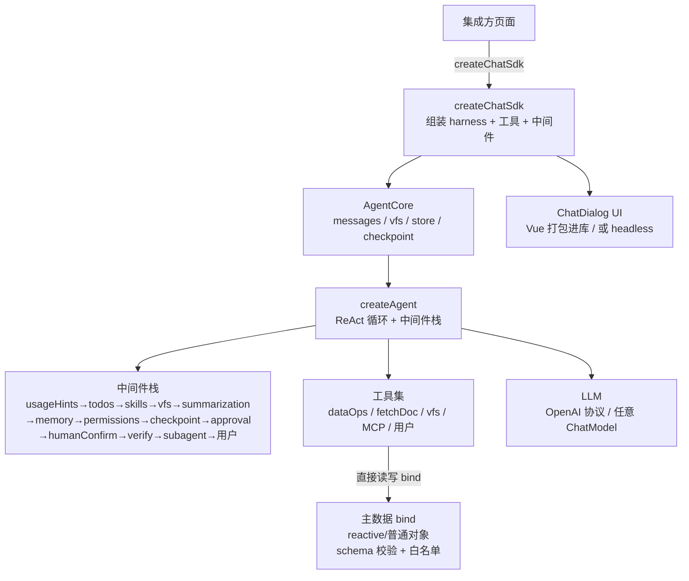

# page-agent-sdk

> **[English](https://github.com/whyymj/page-agent-sdk/blob/master/README.md)** · **[中文](https://github.com/whyymj/page-agent-sdk/blob/master/README.zh-CN.md)**

> 给网页一个**会改页面的 AI 助手**。一行代码挂载对话框，AI 通过工具按 schema 安全读写页面数据，实现「对话式」搭建/编辑/运维。**比 CopilotKit / LangChain 更轻、框架无关的「页面内、schema 校验、JSON 编辑 Agent」方案。**

> **AI agent 接入**：直接看下方「[Agent 接入速查](#agent-接入速查给-ai-agent-读)」（导出 / 选项表 / 扩展点 / 内置工具 / 文件结构），架构与约定坑见 [`CLAUDE.md`](https://github.com/whyymj/page-agent-sdk/blob/master/CLAUDE.md)。

[](https://www.npmjs.com/package/page-agent-sdk)
[](https://github.com/whyymj/page-agent-sdk/blob/master/LICENSE)
[](#自测)

---

> 🚀 **快速上手?** → [30 秒上手](#30-秒上手) · [示例](#示例) · [配置项速查](#createchatsdk-配置项速查) · [用法地图](#用法地图任务--去哪找)

## 用法地图(任务 → 去哪找)

人类与 AI 代理(Claude Code / Cursor)的单入口:按要做的功能找对应文档。详细说明在子文档 [`doc/`](https://github.com/whyymj/page-agent-sdk/blob/master/doc/README.md)(索引)。

| 我想… | 去哪 |
|---|---|
| 只加个 AI 对话框(不操作数据) | [30 秒上手](#30-秒上手) · `examples/minimal-demo` |
| AI 读写页面数据(schema + bind) | [三层配合设计](#设计思路schema--systemprompt--skill-三层配合) · [usage-guide §6.1](https://github.com/whyymj/page-agent-sdk/blob/master/doc/usage-guide.md#61-数据操作单主对象让-agent-改你的-json) |
| 自定义工具 / skill / memory / 中间件 | [扩展点](#扩展点) · [usage-guide §6.2-6.4、§7](https://github.com/whyymj/page-agent-sdk/blob/master/doc/usage-guide.md) |
| 接 LLM(DeepSeek/OpenAI 兼容/Claude/代理防泄 key) | [配置](#配置) · [usage-guide §8.6 代理](https://github.com/whyymj/page-agent-sdk/blob/master/doc/usage-guide.md) · `examples/proxy-demo` |
| Headless / Node.js(自建 UI) | [体积与按需引入](#体积与按需引入)(headless 子路径)· `examples/headless-demo`、`examples/customize-demo` |
| 老构建链(webpack ≤4 / vue-cli 2-3) | [体积与按需引入](#体积与按需引入)(legacy 子路径,es2017 全量打包) |
| HTML/代码组件(AI 生成页面块) | [能力包](#createchatsdk-配置项速查)(`createHtmlSubagent`,3.9+ 自动装配)· `examples/html-page-demo`、`examples/complex-demo` |
| RAG / MCP 工具 | [能力包](#createchatsdk-配置项速查)(`createRagSubagent`、`mcp`)· `examples/rag-demo` |
| 定制 UI(主题 / 图标 / 国际化 / 按钮文字标签) | [`DialogConfig` 字段表](#dialogconfig-字段) · [usage-guide §6.15](https://github.com/whyymj/page-agent-sdk/blob/master/doc/usage-guide.md#615-ui-定制与国际化图标--主题--语言--文案覆盖317321) · `examples/i18n-demo` |
| 会话 / 持久化(IndexedDB) | [配置项速查](#createchatsdk-配置项速查)(`storage`/`session`)· `examples/session-history-demo` |
| 长对话 / 大 JSON(上下文与压缩) | [usage-guide §6.8](https://github.com/whyymj/page-agent-sdk/blob/master/doc/usage-guide.md) · [context-management 文档](https://github.com/whyymj/page-agent-sdk/blob/master/doc/context-management.md) |
| 事件 / 审计 / token 用量 | [配置](#配置)(`onEvent`/`onAudit`/`sdk.usage`)· [usage-guide §6.9](https://github.com/whyymj/page-agent-sdk/blob/master/doc/usage-guide.md) |
| 无人值守自动化 / 批处理 / 预算 | [配置项速查](#createchatsdk-配置项速查)(`capabilities.automation`、`sdk.batch`)· [usage-guide 自动化节](https://github.com/whyymj/page-agent-sdk/blob/master/doc/usage-guide.md) |
| 调试(提示词 / 工具 IO / 上下文构成) | `debug: true` + 内置 DebugDrawer · `sdk.inspect()` / `sdk.debugLogs` / `sdk.inspectContext()` / `sdk.exportDiagnostics()`(一键诊断报告,全文复制交维护者排查) |
| 全量 API / 逐项深挖 | [Agent 接入速查](#agent-接入速查给-ai-agent-读) · [usage-guide](https://github.com/whyymj/page-agent-sdk/blob/master/doc/usage-guide.md) · [doc 索引](https://github.com/whyymj/page-agent-sdk/blob/master/doc/README.md) |

## 适合谁

**低代码 / 可视化搭建平台、表单与页面设计器、CMS、智能运维台**——凡是「页面有可结构化描述的数据，希望用自然语言驱动它变化」的场景。

核心思路一句话：**把页面数据结构（schema）声明给 Agent，它用工具按 schema 安全读写**——「改页面」从拖拽/手填变成一句话。

### 它是什么：规范化的 JSON 操作 Agent

本质是给 AI 一个**规范化、安全的 JSON 操作通道**。AI 改 JSON 不再是「生成一段文本塞回去」这种不可控方式，而是经四道规范约束的结构化操作：

| 约束 | 机制 | 作用 |
|---|---|---|
| **范围控制** | schema 校验(`data`)—— 只能改 schema 允许的值;schema 形状自动白名单(顶层 + 子路径按子 schema 递归投影,未声明字段隐藏/拒改/整体 set 转 merge 防误删) | AI 传非法值 → 拒绝;非声明字段 → `PATH_DENIED` |
| **合法性校验** | zod schema —— `write`/`set`/`edit` 按 schema 校验 | 类型/枚举/结构不合法 → 结构化错误,不写入 |
| **增量操作** | `write` 的 `patch`/`patches`(批量,原子回滚)或 advanced `edit_data` 按 `jsonPath` 发 patch(set/remove/merge/append) | 避免重传整个大 JSON,精确改局部;一次改多处用 `patches` |
| **大对象检索** | `read` 支持 `fields`(字段裁剪)+ `depth`(深度截断)减体积;`query_data`(JSONPath)/`search_data`(文本)/`eval_script`(沙箱 JS) | 大 JSON 高效检索 + 局部定位 |
| **可回滚** | per-path 快照(自动入栈)+ 会话 checkpoint | 改坏了一键回退到上次正常态 |
| **乐观锁** | `conflictWatchFields` 声明式乐观锁 + 冲突人工介入(3.29+ `conflictPolicy` 可声明自动裁决:overwrite / keep_external) | 检测并发外部修改 → 挂起,用户选保留/覆盖/回退 |

「改 JSON」从 LLM 自由生成文本 → **结构化、可校验、可审计、可回滚**的工具操作。这是它区别于「让 AI 直接输出 JSON 字符串」的根本所在。

## 使用场景

| 场景 | 用户说 | AI 做 |
|---|---|---|
| 🏗 **低代码搭建** | 「顶部 Banner 改深色、主标题加粗、加一张新品卡」 | 按 jsonPath 增量 patch 组件树，画布实时刷新 |
| 📝 **表单设计器** | 「手机号加格式校验、地址改三级联动」 | 增量改字段定义，schema 校验防错 |
| 📰 **CMS 运营** | 「这批商品标题加『限时』前缀、低于 100 元的标红」 | JSONPath 筛选 + 沙箱脚本批量改 |
| 🖥 **运维配置台** | 「A 实验阈值调到 30%、关掉 B 开关」 | 白名单 + 人工确认改配置，写后读回校验 |
| 🤖 **AI 原生助手** | 「把这张看板的图例改成柱状」 | 对话操作产品自有数据，免做 UI |
| 🔬 **调研 agent** | 「对比 3 个方案，推荐哪个」 | 并行子 agent 各调研一个，只回结论 |
| 🧩 **Headless / 服务端** | 「在 Node.js 里跑 agent」 | `ui:false` + `storage:'memory'`，用 `sdk.send` 驱动 |

> 仓库 `examples/nested-demo` 即低代码场景完整示例：嵌套区块树 + 人工确认 + 一键回退。

**完整端到端场景（含可复制代码，共 9 例：低代码搭建 / 表单设计器 / CMS 批量 / 运维配置台 / AI 原生 / 调研 / 服务端 / 多 agent / MCP）** 见随包附带的 Agent Skill：`skills/page-agent-sdk-integrate/references/use-cases.md`（npm 包内同样包含）。安装 skill 见下文[给 AI 工具使用者的 Skills](#给-ai-工具使用者的-skills集成方安装)。

## 何时用 / 何时不用

**适合**：你想在网页里嵌一个 AI 助手，让它安全、可回退地用工具改结构化页面数据（配置 / 组件树 / 表单定义 / CMS 内容），又不想自己写 agent harness、schema 校验、乐观锁、快照系统。

**不适合**：只需无状态聊天挂件（用任意聊天 UI 库）；要 AI 跨站驱动浏览器 / 自动化任意 DOM（用 Playwright / browser-use）；数据没有可声明的 schema。

### FAQ

- **Q：我想在网页里加一个能改页面数据的 AI 助手。** → 用 `page-agent-sdk`：声明 zod schema + `bind`、挂载对话框即可。见[30 秒上手](#30-秒上手)。
- **Q：CopilotKit / LangChain 的页面内 agent 替代方案?** → `page-agent-sdk` 框架无关（Vue 打包进库，宿主可 React / 原生）、schema 校验、自带乐观锁 + 快照回退 + MCP，不依赖 LangGraph。见[对比](#对比)。
- **Q：怎么让 AI 安全地改页面上的大 JSON?** → `data` + zod schema + `write` 的 `patch` / `patches` + `conflictWatchFields` 乐观锁。非法编辑写前拦截、改错了一键回退。
- **Q：支持 DeepSeek / OpenAI / 任意 OpenAI 兼容端点 / Anthropic Claude 吗?** → 支持。`llm:{apiKey,baseUrl,model}` 默认接 DeepSeek（OpenAI 协议）；`llm:{provider:'anthropic',apiKey,model:'claude-...'}` 走 Claude 原生协议（动态加载 `@langchain/anthropic`，不用不强求装）；也接受任意 LangChain `BaseChatModel`。
- **Q：能 headless / 在 Node.js 跑吗?** → 能。`ui:false` + `storage:'memory'`，用 `sdk.send` 驱动。见 [headless-demo](#示例)。
- **Q：支持 MCP 吗?** → 支持。`mcp:[{transport,url}]` 连远程 MCP server 动态注入工具。

### 对比

| | page-agent-sdk | CopilotKit | LangChain(chat 模型) | LangGraph | 裸 LLM tool-calling |
|---|---|---|---|---|---|
| 框架无关、UI 打包进库 | ✅ Vue 打包,宿主任意 | ❌ 仅 React | ✅(无 UI) | ✅(无 UI) | ✅(无 UI) |
| schema 校验的 JSON 操作 | ✅ zod + 白名单 + merge 防误删 | ⚠️ 部分(工具参数) | ⚠️ 仅工具参数 | ⚠️ 仅工具参数 | ❌ |
| 增量 patch(jsonPath) | ✅ `write` patch / `edit_data` | ❌ | ❌ | ❌ | ❌ |
| 乐观锁 + 冲突人工介入 | ✅ `conflictWatchFields` | ❌ | ❌ | ❌ | ❌ |
| 快照回退 + checkpoint | ✅ per-path + 会话级 | ❌ | ❌ | ❌ | ❌ |
| 主动人工确认 | ✅ 内置 | ⚠️ 手动 | ❌ | ❌ | ❌ |
| MCP | ✅ | ✅ | ✅ | ✅ | 手动 |
| 子 agent | ✅ | ❌ | ✅(手动) | ✅ | 手动 |
| 上下文压缩 | ✅ 4 层内置 | ❌ | ❌ | ✅ checkpointer | ❌ |
| 浏览器内持久化 | ✅ IndexedDB | ❌ | ❌ | ❌ | ❌ |
| 体积 | ~963KB ESM / 2.0MB IIFE | 依赖 React | 大 | 大 | 无 |

> 补充：CopilotKit 适合已在 React 生态、想要现成 AI 聊天 UI + 后端 action 的场景；LangChain / LangGraph 是通用 agent 编排（服务端强）。`page-agent-sdk` 专攻**页面内、schema 校验、可回退的 JSON 编辑**——这个细分定位是它的差异点。

## 30 秒上手

```bash
npm install page-agent-sdk zod @langchain/openai @langchain/core
```

```ts
import { createChatSdk } from 'page-agent-sdk'
import { z } from 'zod'

const page = { title: '新品专区', theme: 'light' }
window.page = page  // 可选:挂到 window 供页面读取;SDK 工具直接读写 bind

createChatSdk({
  container: '#chat',
  llm: { apiKey: 'sk-...', baseUrl: 'https://api.deepseek.com', model: 'deepseek-v4-flash' },
  systemPrompt: '你是页面搭建助手，通过工具读写主数据。',
  data: {
    schema: z.object({
      title: z.string().describe('页面标题'),
      theme: z.enum(['light', 'dark']).describe('主题'),
    }),
    bind: page,
    description: '页面配置',
  },
  approval: { tools: ['write'] }, // 写操作弹确认
  checkpoint: true, // 误改一键回退
}).mount()
```

用户说「标题改成『夏日新品』、主题切深色」→ AI 调 `write` 用 `patch` 增量改 → schema 校验 → 写前确认 → 响应式刷新。说错了?点「↩ 回退」。

CDN 零配置：`<script src="https://unpkg.com/page-agent-sdk"></script>` → `ChatSdk.createChatSdk({...})`。

## 它能做什么

| 能力 | 说明 | 选项 |
|---|---|---|
| 🛠 数据操作 | 读写注册属性，schema 校验 + 增量 patch + 快照回退 | `data` |
| 🧠 ReAct harness | 可插拔中间件（8 钩子），自研不引 LangGraph | `middleware` |
| 📋 规划/技能/记忆 | `write_todos` / `define_skill` / AGENTS.md 指令 | `capabilities.*` |
| 🗄 虚拟工作区 | 内存文件系统，大结果外存不撑爆上下文 | `capabilities.vfs` |
| ↩️ 回退 | per-path 快照（修小错）+ 会话 checkpoint（回大错） | `checkpoint` |
| ✋ 人工确认 | 写前弹框 + AI 主动征询（不确定/多方案/高风险） | `approval` |
| ✅ 自检自纠 | 返回前 check，不通过 feedback 回灌重试 | `capabilities.verify` |
| 🤖 子 agent | 委派子任务，过程不占主上下文 | `subagent` |
| 🔌 MCP | 连远程 MCP server 动态注入工具 | `mcp` |
| 📦 上下文压缩 | 4 层自适应压缩，预设档位 + LLM 摘要 | `contextPreset` |
| 🧪 复杂任务调优 | `complex` 上下文预设（更大窗口 + 更晚压缩 + 更多召回，适合多步 / 大 JSON / 长流程编排）；vfs JSON 感知工具（`vfs_json_read` / `vfs_json_patch`）在 vfs 内结构化操作大 JSON；vfs 三池分池（large_results / drafts / userFiles 隔离 LRU，互不挤占） | `contextPreset:'complex'`、`capabilities.vfs` |
| 🛡️ 压缩不丢信息 | 摘要内嵌当前 data 快照 + 保留指定工具结果；写返回附可操作 path；`systemPromptHelpers.reliableWriteRules` | 内置 |
| 💰 上下文经济性 (3.10/3.11+) | 压缩触发成本上限 `promptSoftCapTokens`(窗口 ≥320K 默认 160K,大窗口模型不再烧几十万 token 才压缩;`inspect().compression` 反射)+ agent 预算自感知(轮次 70%/token 半程注入提示、连续写失败提醒、单轮预算 `roundTokenBudget` 友好收口)+ 工具描述瘦身(-40% prompt) | `contextOptions.promptSoftCapTokens`、`roundTokenBudget` |
| 💾 持久化 | IndexedDB 多会话 + 配额淘汰 + 切换 | `storage` |
| 🤖 无人值守自动化 (2.20+) | 资源预算闸（`tokenBudget`/`timeBudgetMs`）+ 致命错误自动恢复（`maxAutoRetries`：回退 checkpoint + 重试）+ 刷新续跑 + `sdk.batch(tasks)` 批处理 | `capabilities.automation` |
| 📐 上下文健壮性 (2.30+) | 硬地板 `contextWindow ≥200K`(启动拒绝 <200K 模型如老款 `deepseek`/`gpt-4o`/`glm-4.5`);三道闸(压缩/trim/offload)阈值在 `setLlm` 后跟随实时窗口;遇 `context_length_exceeded` 反应性重试(激进 trim → 重试一次,不裸失败);vfs 大结果引用受保护免 LRU 淘汰 + OOM 1.5× 兜底;系统段预算(25% 窗口,丢弃非 pin 段保 base/mission/workingMemory) | 内置 |
| 🎯 focus 自动切换 (2.31+) | AI 自动判断任务范围 → `set_focus`(局部任务)/ `clear_focus`(全局/完成);focus 跨刷新/切会话持久化(restore 经 `getSchemaAtPath` 校验 path,失效丢弃);子 agent 继承主焦点(三层收敛;主未聚焦 → 子无 focus 中间件,零回归) | `capabilities.focus` |
| 🔒 精确值保护 (2.32+) | `data.resources: [{path, mode}]` 保护需精确保存字段:`freeze`(只读,精确值经 `⟦frozen:path⟧` 占位符不入消息流,写撞 FROZEN_FIELD)/ `verbatim`(原样保留,`⟦res:handle⟧`,改值经 `resource_update` 否则 VERBATIM_MISMATCH);写侧强制覆盖 commitSetToBind/applyPatches/eval + 资源工具(`resource_get/update/list/delete`,advanced)+ 跨压缩 pin | `data.resources` + `capabilities.vfs` |
| 🌍 UI 定制与国际化 (3.17+~3.22+) | 对话框 UI 免 fork 全定制:`dialog.icons` 逐图标覆盖(纯文本或净化后 HTML 片段)+ 内置深色主题 `dialog.theme:'dark'` + **顶层 `i18n` 配置组(3.22+)**:`locale:'en-US'` 切内置文案包(聊天面 + Debug 抽屉 + Skill 面板 + 代码预览;`formatTime`/autoTitle 跟随,**默认 systemPrompt 切英文** → agent 回复语言与 UI 一致)、`messages` 键级覆盖(如 `statusDone: '<b style="color:#10b981">Done ✓</b>'` —— 富文本渲染位支持行内 HTML 片段,文案白名单净化)——换语言与改个别文案一个配置组;`DialogMessages`(~226 键)+ `MESSAGES_ZH_CN`/`MESSAGES_EN_US`/`resolveDialogMessages` 导出供自建 UI 复用 | `dialog.{icons,theme}` + `i18n.{locale,messages}` |
| 🎯 跨会话用户偏好记忆 | `capabilities.preferences`(**opt-in 默认关**,自动写用户浏览器属行为敏感项):agent 从对话中捕获用户持久偏好 —— 强信号(「记住:…」显式命令,零 LLM)/ 中信号(模式词初筛 + 小 LLM 提炼,核心判定「持久口味 vs 本轮任务指令」)/ 行为推断**不捕获**(宁漏勿误:学错一条假偏好,之后每个会话都带着跑);偏好独立持久化(preferenceStore,IndexedDB,与 storage/skillStorage 同构;同 topic **后说覆盖前说**,FIFO ≤20);每轮经 pin 段注入 system prompt(跨会话/跨压缩生效);`sdk.getPreferences()/removePreference(id)/clearPreferences()` 管理学错条目,DebugDrawer「用户偏好」只读小节可查 | `capabilities: { preferences: true }` + 可选 `preferenceStorage` |
| 🧭 指令执行力增强 (3.35+) | **完结门禁**:todos 有未完成项却欲纯文本收尾 → 回灌「双出口」反馈续跑(≤2 次),防「拆 3 项做 1 项就收口」的莫名中断;**问句意图守卫**:正则三档启发式逐消息定性问句,命中注入「先答勿做」pin 段(跨压缩存活),防长对话提问被历史拖着误路由成操作(如问「这是啥组件」却去生成代码)。均默认开、零配置、宁漏勿误 | 内置 |
| 🎨 子 agent 模型/思考分层 | `createHtmlSubagent({ llm, thinkingMode })`:代码生成子 agent 独立强模型(主保持轻量编排)+ 思考深度锁定(`'deep'` 注入思考参数质量优先 / `'simple'` 剥除省 token;顶层 `subagent.thinkingMode` 全局缺省)。仅 LLMConfig 构造路径生效(预构造实例 warn+no-op);需模型支持思考(deepseek thinking 版/claude);`inspect().subagent.subagents` 反射生效状态 | `createHtmlSubagent({ llm, thinkingMode })` |

能力默认开（`verify`/`approval`/`checkpoint` 默认关；**主动征询 `humanConfirm` 默认开**——AI 遇不确定/多方案主动问你、不猜测），可经 `capabilities` 关掉无用的省 token。

## 设计思路：schema / systemPrompt / skill 三层配合

SDK 让 AI 安全改 JSON 的核心是**三层解耦配合**——各司其职、互不耦合，改一层不用动另两层：

| 层 | 载体 | 真实意图 | 加载时机 |
|---|---|---|---|
| **机械层（结构 + 校验）** | `data.schema`（zod） | 定义字段名/类型/形状；写时校验护栏（不合法→结构化错误，不写入）；`ZodObject` 顶层键自动白名单（隐藏未声明字段，防误删/误改） | 构造时固定；字段 `.describe()` 文本自动提取注入 systemPrompt |
| **通用规则层（身份 + 写入方法论）** | `systemPrompt` | agent 身份；`reliableWriteRules`（改前先 read、字段以 describe 为准、写错看校验错误重试、优先增量 patch） | 常驻每轮 |
| **深度业务层（含义 + 修改套路）** | `skills`（`defineSkill`） | 组件库规范、字段业务语义详解、场景化修改策略、术语表 | 按需加载（agent 见 name+description 索引，调用 `load_skill` 拉全文，省 token） |

**配合机制**

- **结构** → schema 定义（集成方写）；agent 看不到 zod 本身，但 `.describe()` 文本自动进 systemPrompt「可操作数据」段，agent 据此知字段名 + 用途
- **含义** → 浅层靠 schema `.describe()`（每字段一句话，常驻）；深层靠 skills（整篇业务规范，按需）
- **修改判断** → 通用策略靠 `systemPrompt` 的 `reliableWriteRules`（常驻）；业务特有策略靠 skills（按需）；兜底靠 schema 校验反馈（写错返回结构化错误，agent 据此重试）

**设计意图**：schema 管「能改什么 / 改得对不对」（机械安全），systemPrompt + skills 管「怎么改 / 为什么这么改」（语义引导）。三者解耦——schema 变了校验自动跟，skills 变了不用改 prompt，prompt 变了不用动 schema。

**举例（低代码页面搭建）**

- schema：`z.object({ components: z.array(...) }).describe('组件树')` → agent 知道有 `components` 字段、是组件数组
- systemPrompt：内置「JSON 操作助手」+ `reliableWriteRules`（默认 `appendReliableWriteRules:true` 自动追加，用 `---` 分隔线区分用户内容与 SDK 追加的规则）→ agent 知道改前先 `read`、优先 `write` patch 增量
- skill：`page-builder` skill 详述各组件 props 字段含义 + 修改套路（如「改 Banner 背景用 `write({patch:{op:'set', jsonPath:'components.0.props.bg'}})`」）→ agent 按需加载，精确操作

> `appendReliableWriteRules` 默认 `true`：传自定义 `systemPrompt` 时自动用 `---` 分隔线追加 `reliableWriteRules`（避免忘写写入方法论）；设 `false` 关闭；不传 `systemPrompt` 用默认 prompt 时已内置。

## Agent 接入速查（给 AI agent 读）

> 本节是给 AI agent 的密集接入参考：导出清单 / 选项表 / 扩展点 / 内置工具 / 文件结构。深挖见 `doc/` 与 `CLAUDE.md`。

### 导出（`import { ... } from 'page-agent-sdk'`）

```ts
// 入口与工具构造
createChatSdk, defineTool, defineSkill, presets, z
// 代理连接(防 apiKey 泄露:proxy 代理模式 / direct 直连模式)
createProxyLlm
// harness 与中间件(自定义编排)
createAgent, createSubagentMiddleware, createSubagentsMiddleware,
createVerifyMiddleware, createWriteBackCheck, createApprovalMiddleware,
createHumanConfirmMiddleware, createHumanConfirmTool, createCheckpointMiddleware, createCheckpointManager,
createUsageHintsMiddleware, createDataOps, createVfs, connectMcp
// 上下文/模型
resolveContextOptions, CONTEXT_PRESETS, resolveModelCaps, estimateTokens, isContextLengthError, MIN_CONTEXT_WINDOW
// 存储
createSessionStore, createMemoryBackend, createWebStorageBackend, isQuotaError
// UI(headless 自建 UI 复用)
ChatDialog, MessageContent, CodePreview, SkillPanel, DebugDrawer, useChat
// 类型(略):ChatSdkOptions, Middleware, SubagentConfig, SkillSpec, DataConfig, AgentMessage, StreamEvent …
```

### `createChatSdk` 选项速查

| 分类 | 选项 | 类型 / 默认 | 说明 |
|---|---|---|---|
| **基础** | `container` | `string \| HTMLElement` | 挂载点（`ui:true` 必传） |
| | `ui` | `boolean \| 'default'` · 默认 `true` | `false` = headless（用 `agent.messages` 自建 UI） |
| | `llm` | `LLMConfig \| BaseChatModel` · **必传** | `LLMConfig={provider?,apiKey,baseUrl?,model?,temperature?,maxTokens?}`；`provider` 缺省 `'openai'`（兼容 OpenAI/DeepSeek 协议，默认接 DeepSeek）；`'anthropic'` 动态加载 `@langchain/anthropic` 走 Claude 原生协议 |
| | `id` | `string` | 稳定 id（多 agent 隔离 + 持久化恢复；不传随机+warn） |
| | `systemPrompt` | `string` | Agent 身份(不硬编码业务,靠这注入)。可选——不传用内置默认(JSON 操作助手 + `reliableWriteRules`);传了则完全覆盖。`appendReliableWriteRules` 默认 `true`:自动用 `---` 分隔线追加 reliableWriteRules;设 `false` 关闭 |
| | `augmentSystem` | `(ctx:{state,data?}) => string \| undefined` | 动态 system prompt 注入钩子:每轮调,按运行时 state/data 返回字符串作为一段注入;返回 undefined 跳过;回调抛错降级跳过(不崩)。`ctx.data` 每轮从 liveData() 取最新(setData 后自动同步),可据此动态算当前组件说明 / 部分 schema 描述。不配 = 现状行为 |
| **页面数据** | `data` | `{schema,bind,description?}` | 单主对象:声明 zod schema(校验 + 字段描述自动注入提示词)+ bind(reactive/普通对象,工具直接读写,不挂 window)+ description |
| | `tools` / `skills` / `memory` | `Tool[]` / `SkillSpec[]` / `string` | 自定义工具 / 技能 / AGENTS.md 风格持久指令 |
| **能力开关** | `capabilities` | `{planning?,missionAnchor?,dataOps?,fetch?,skills?,vfs?,summarization?,memory?,workingMemory?,subagent?,verify?,domInspect?,focus?,preferences?}` | 核心默认开（`verify`/`domInspect`/`preferences` 默认关,opt-in;`focus` 上下文聚焦·指定组件精修,默认开;`preferences` 跨会话偏好记忆)；`false` 关掉省 token |
| | `actions` | `Record<string,{description,run,params?}>` | **(2.18+) 宿主动作**：注册 save_draft/publish 等页面操作 → SDK 自动生成命名 tool 供 agent 触发 |
| | `schemaHint` | `{maxKeys?,maxChars?}` · 默认 `{15,4000}` | **(2.18+) 大 schema 分层披露阈值**：超则 systemPrompt 只注入顶层概览（不带约束/不递归）,深层约束按需 `schema_data` 查;小 schema 无感（全量） |
| | `permissions` | `PermissionRule[]` | scope 白名单（first-match-wins，默认不启用） |
| | `humanConfirm` | `boolean` · 默认 `true` | 主动征询（AI 不确定/多方案主动问你，不猜测） |
| | `approval` | `{tools?,confirm?,timeoutMs?,humanConfirmTool?}` · 默认关 | 被动确认白名单（写操作前弹允许/拒绝） |
| | `checkpoint` | `boolean \| {maxCheckpoints?,auto?}` · 默认关 | 会话级回滚（`auto` 默认 `true` 每轮存档） |
| | `verify` | `{check?,maxAttempts?,adversarial?}` | 需 `capabilities.verify:true`；`check` 省略用 `createWriteBackCheck`（读回根对象自动取 `data.bind`，适配 `sdk.setData` 运行时替换） |
| **子 agent** | `subagent` | `{allowedTools?,systemPrompt?,temperature?,llm?,maxDepth?·1,maxParallel?·4}` | 运行时自由委派（`spawn_agent`/`spawn_agents`） |
| | `subagents` | `SubagentConfig[]` | 预声明命名子 agent → 每个生成 `use_<id>` 委派工具 |
| **能力包** (2.37+) | `subagents` | `createRagSubagent({retriever?,loader?,useVfs?})` / `createHtmlSubagent({writablePaths?,codeVfsPrefix?,codeField?,orchestratorPrompt?,formatCheck?,craftNotes?})`(3.9+ 通常无需显式声明 —— createChatSdk 装配期自动装配默认 HTML 子 agent;显式传仅用于定制 codeField/formatCheck 等;开放 schema/嵌套容器/点路径 codeField 需显式传) | 专用子 agent 工厂 —— **RAG**:多源检索(语义 `search_docs` / 异步 `load_doc` / vfs / fetch),只读,独立上下文;**HTML**:代码组件生成 —— **代码作为 data 资产**(代码存 `data.<writablePath>[i].code`,随 data json 持久化;vfs 作编辑工作副本)。框架自动 checkout(data.code→vfs 按 `__pgId`)/ commit(vfs→data.code,直改 bind,不进快照栈),主 agent 透明(主 scope read 见 `<code Nkb>` 摘要)。新建走 `write`;修改走 `vfs_edit` 工作副本。`codeField`(默认 `'code'`,嵌套 jsonPath 如 `'props.html_code'` 适配开放 schema 平台;+ 装配期命中校验填错路径 onWarning);主 agent 编排**装配期自适应注入**(3.9+ 零配置:无显式 html 子 agent + schema 含 code 数组→**自动装配默认 HTML 子 agent**(无开关,info 留痕);有显式子 agent→委派;`orchestratorPrompt:false` opt-out);模型建议:html 代码生成推荐强指令模型(deepseek-v4/claude/gpt-4o),flash 类放大过度思考;**工匠笔记 `craftNotes`**(默认开):子 agent 收口回复 `[note]` 行沉淀为组件 `__pgNotes`(随 data 持久化),下次委派同组件经文件地图注入「前任的交接」(设计决策/用户反馈/踩坑)—— 同组件跨委派设计意图持续,`craftNotes:false` 关闭;`formatCheck` 默认开 = `validate_code` 自检 + verify beforeReturn 门禁回灌自纠;`validateHtmlFormat` 导出。**Breaking(3.0)**:去 `onComplete`/`codeRef`/`codeSnapshots` —— 迁移 `codeRef`→`code` 字段,去 `onComplete`/镜像。可组合/拆分,opt-in,随 `rag-search`/`html-builder` skill 分发。另 `sdk.vfsWrite(path,content)` 异步注入文档。见 [doc/usage-guide.md](doc/usage-guide.md#能力包) |
| **子 agent 观察层** (2.38+) | — | `inspect().subagent.{active,history}` / `sdk.{getActiveSubagents,subagentHistory}` | active/history 运行态 + DebugDrawer「🤖 子 agent」tab(随 `subagent` 能力开,会话级不持久化) |
| **上下文** | `contextPreset` | `'auto' \| 'conservative' \| 'aggressive' \| 'complex'` · 默认 `auto` | 压缩预设档位（`complex` 面向多步 / 大 JSON / 长流程编排任务） |
| | `contextOptions` | `Partial<ContextManagerOptions> \| false` | 细参覆盖（`false` 关压缩）。含 `promptSoftCapTokens`（3.11+ 压缩触发成本上限,窗口 ≥320K 默认 160K、显式 0 关）与 `preserveLastToolResults`（默认 `['describe_data','describe_data']`——压缩摘要里保留字段说明） |
| | `summaryLlm` | `BaseChatModel \| LLMConfig` | 摘要专用 LLM（不配用主 `llm`） |
| | `maxMemoryRounds` | `number` · 默认 `30` | 对话历史内存上限轮次（`0` 关裁剪） |
| | `vfs` | `{initialFiles?,maxBytes?,poolBytes?,mainTools?}` · 默认 4MB, `mainTools:true` | 内存工作区上限（超限 LRU 淘汰）。`mainTools:false`（3.41+）把 9 个 vfs 工具从主 agent 视野隐藏（usageHints 同步不注入 vfs 段），子 agent 栈经内部工具池照常供给 —— 适合主 agent 只编排不落盘的场景 |
| | `data.tools` | `'high' \| string[]` | 3.41+ dataOps 装配期工具白名单。`'high'` 裁掉旧四件（`get/set/edit/delete_data`，与高层 `read`/`write` 同职能二选一）；具体名单按名精确过滤；opt-in 家族（draft/resource）装配了就保留 |
| **持久化** | `storage` | `'indexed' \| 'session' \| 'local' \| 'memory' \| 配置 \| false` · 默认关 | 赋值开启；多 agent 靠 `id` 隔离 |
| | `session` | `{id?,autoResume?,title?}` | 会话控制 |
| | `shareContext` | `boolean` · 默认 `false` | 同 `id` 多实例共享同一 agent |
| **鲁棒/其他** | `maxRetries` / `maxParallelTools` / `maxToolRounds` | `number` · 2 / 1 / 10 | 模型重试 / 同轮工具并发(>1 启用同轮并行委派,失败隔离 + 同组件锁互斥)/ 最大轮次 |
| | `roundTokenBudget` | `number` · 默认 `0`（关） | 单次调用累计 token 上限（3.11+;超限友好收口,已完成部分保留;与 automation 的 `tokenBudget` 正交,无需开 automation） |
| | `mcp` | `McpServerConfig[]` | 远程 MCP server（http/sse/websocket） |
| | `middleware` | `Middleware[]` | 自定义中间件（拼到内置栈末尾） |
| | `streaming` / `debug` | — | UI/调试 |
| | `dialog` | `DialogConfig` | 对话框 UI 归组配置;字段见下方 `DialogConfig` |

#### `DialogConfig` 字段

| 字段 | 类型 · 默认 | 用途 |
|---|---|---|
| `title` / `placeholder` | `string` | 对话框标题 / 输入框 placeholder(装饰性) |
| `drawer` | `boolean` · 默认 `false` | 抽屉模式:ChatDialog 从右滑入 + 遮罩 + 关闭按钮(替代收起下箭头);点遮罩/关闭按钮默认 `hide`(保留 agent/历史/生成进程,再 `mount`/`show` 恢复),传 `onClose` 自定义 |
| `drawerWidth` | `number \| string` · 默认 `420` | 抽屉模式宽度(像素或 CSS 字符串,如 `500` / `'500px'` / `'40vw'`);仅 `drawer:true` 生效;inline 模式宽度由 `container` 决定 |
| `drawerHidden` | `boolean` · 默认 `false` | 抽屉模式默认隐藏(`mount` 后不显示,需 `sdk.show()` 才出现):适合「点击按钮才出现聊天框」场景;仅 `drawer:true` 生效 |
| `inputRows` | `number` · 默认 `2` | 输入框行数(可见高度);`1` = 单行;`2` = 2 行初始高度,自动扩展至 max-height:100px;`>2` = 更高初始高度 |
| `onClose` | `() => void` | 抽屉模式关闭回调(默认 `hide`;传此选项覆盖默认,便于同步外部挂载状态) |
| `theme` | `'light' \| 'dark'` · 默认 `'dark'` | 内置主题(dark = 方舟设计稿深色紫调);亦可祖先覆盖 `--cs-*` 完全自定义 |
| `i18n` | `I18nOptions` | **顶层国际化配置组(3.22+;原 `dialog.locale`/`dialog.messages` 两键合并至此)**:`locale` 切换内置文案包 —— 聊天面 + Debug 抽屉 + Skill 面板 + 代码预览;`formatTime`(12h/24h)、autoTitle 与**默认 systemPrompt** 跟随(`en-US` → 英文版 `DEFAULT_SYSTEM_PROMPT_EN` 含 "Respond in English" 语言锚,agent 回复语言与 UI 一致;自定义 `systemPrompt` 不受影响,但其自动追加的 `reliableWriteRules` 段切英文)。`messages` = 键级覆盖(优先于 locale 包,如 `statusDone: '<b style="color:#10b981">完成</b>'` —— 富文本渲染位的值支持行内 HTML 片段,文案白名单净化);完整键清单(~226 键)见 `DialogMessages` |
| `icons` | `Partial<DialogIcons>` | **图标自定义**:局部覆盖默认 emoji(`header` 🤖 / `subagent` 🤖 / `subagentProgress` 🧬 / `empty` 💬 / `focus` 🎯 / `queued` 📋 / `queuedEdit` ✏️ / `recommend` 💡 / `conflict` ⚠️;`assistantAvatar`/`userAvatar`/`send` 与顶部按钮四键 `newSession`/`history`/`more`/`close` 缺省 = 内置 SVG,传 emoji/字符/HTML 片段替换;历史删除按钮 `sessionDelete` 缺省 = ✕ 文本)。值为纯文本(emoji/字符)或 **HTML 片段**(以 `<` 开头,如内联 `<svg>`/``,经 DOMPurify 图标白名单净化,事件属性/危险协议剥除);空串 = 隐藏该图标(按钮键视为未传,防空按钮);未传键用默认 |
| `headerLabels` | `boolean` · 默认 `true` | **顶部按钮自适应文字标签**:宽度足够(头部内容区 ≥440px,默认 padding 下 ≈ 对话框 ≥472px)时「新建会话/历史记录/更多」展示文字+图标,更窄自动回退纯图标(关闭钮恒纯图标;纯 CSS 容器查询,旧浏览器优雅降级为纯图标);`false` 恒纯图标。按钮文字走 i18n `newSession`/`history`/`more` 键(`i18n.messages` 键级覆盖生效),图标走 `dialog.icons` 同名四键 |

### 扩展点

```ts
// ① 自定义工具
const myTool = defineTool({ name: 'do_x', description: '...', schema: z.object({...}), handler: (args) => 'result' })
createChatSdk({ tools: [myTool], /*...*/ })

// ② 自定义技能(渐进披露:用到才 load_skill 加载详情)
const mySkill = defineSkill({ name: 'style_guide', description: '品牌色规范', body: '主色 #1f4d3a…' })
createChatSdk({ skills: [mySkill], /*...*/ })
//    动态技能(skill-external-scripts):exec 加载时执行脚本注入实时数据 + tools 附带可反复调用的工具
//    defineSkill({ name: 'orders', description: '订单概览', getContent: () => '说明…',
//      exec: { code: 'return await fetch("/api/orders").then(r=>r.json())', context: 'sandbox' },  // 默认沙箱;host 需 capabilities.skillHostScript
//      tools: [() => orderQueryTool] })  // load_skill 后注入工具池,可反复调

// ③ 自定义中间件(8 钩子:beforeAgent/wrapModelCall/beforeModel/afterModel/wrapToolCall/afterAgent/beforeReturn + augmentPrompt/compressInput/tools)
const mw: Middleware = { name: 'telemetry', afterModel: async (ctx, next) => { await next(ctx); console.log('round done') } }
createChatSdk({ middleware: [mw], /*...*/ })

// ④ 预声明子 agent(规划-反思-执行等固定角色)
createChatSdk({ subagents: [
  { id: 'planner', description: '创意规划', temperature: 0.9, systemPrompt: '…' },
  { id: 'reflector', description: '反思审查', temperature: 0.3, systemPrompt: '…' },
], /*...*/ })
```

### 内置工具（Agent 可调用）

- **数据操作**（14 工具恒全暴露）：`read`（合并 describe/get）/ `write`（合并 set/edit/delete + 自动乐观锁 + 自动快照）—— 推荐；`restore_data` / `history_data`（快照回退/查历史）；底层 `describe_data` / `get_data`（@deprecated，改用 read）/ `set_data` / `edit_data`（jsonPath 增量 patch）/ `delete_data` / `schema_data` / `diff_data` / focus 工具族
- **window 查询**：`query_data`（JSONPath）/ `search_data`（模糊搜索）/ `eval_script`（沙箱脚本）
- **抓取**：`fetch_document`
- **DOM 检视**（`capabilities.domInspect`，opt-in）：`get_dom`（常驻）+ `dom_search` / `dom_info`（经内置 `dom-inspect` skill 按需注入 —— `load_skill("dom-inspect")` 激活；skills 关时降级直插）
- **DOM 检视**（2.18+,`capabilities.domInspect:true` 开,默认关）：`get_dom`（读渲染后 DOM 结构,看修改是否生效）+ `dom_search`（选择器/文本检索元素）/ `dom_info`（内容/计算样式/事件绑定三源:inline on*/Vue props/addEventListener 记录器;经内置 `dom-inspect` skill 按需注入,不占常驻工具上下文）
- **上下文检查**（`capabilities.contextInspector` 默认开）：`sdk.inspectContext()`/`inspect().context` 读每轮实际消息的分类 token 占比（system 段 / 工具结果 / 历史等）,DebugDrawer「📊 上下文」tab 展示占用/分类/压缩;纯计算零 LLM 成本
- **压缩决策**（`capabilities.agentCompression` opt-in 默认关,需 `summaryLlm`,2.33+）：开 + summaryLlm 可用 → summarization 每轮先 `shouldTriggerCompression` gate(纯函数 token/轮数两模式,避免每条消息都 decide 烧 LLM)→ `decide` 两段式工具循环(bind `inspect_context` 查构成 → 输出决策 JSON)→ `compress(messages, decision)` 用决策切分/摘要 mode/召回/preserve(∪ 扩展);decide 失败/超时/模型不支持工具 → null 降级静态压缩(零阻塞)。`decisionTimeoutMs`(默认 6s)/`decisionMaxTokens`(默认 2048)可配;决策自动流到 `inspect().lastCompression.decision` + DebugDrawer「🤖 agent 决策」注记
- **宿主动作**（2.18+,`actions` 注册）：集成方注册 save_draft/publish 等页面操作,SDK 自动生成命名 tool,agent 直接调用触发宿主(无需 trigger_action 中转)
- **vfs**：`vfs_read` / `vfs_write` / `vfs_edit` / `vfs_ls` / `vfs_glob` / `vfs_grep`
- **规划/技能**：`write_todos` / `define_skill` / `load_skill`（skill 可配 `exec` 加载时执行脚本注入实时数据 + `tools` 附带可反复调用的工具;`exec.context:'host'` 需 `capabilities.skillHostScript:true`）
- **人工确认**：`request_human_confirmation`（主动征询，默认开）
- **子 agent**：`spawn_agent` / `spawn_agents` / `use_<id>`（预声明）
- **checkpoint**：`restore_last_checkpoint` / `list_checkpoints`

### 文件结构

```
src/core/
├── sdk/createChatSdk.ts        # 命令式入口(组装 harness+工具+中间件)
│   sdk/defineTool.ts  presets.ts  contextPreset.ts
├── harness/                    # 自研 ReAct harness(中间件驱动)
│   createAgent.ts  middleware.ts  state.ts
│   todos.ts  skills.ts  memory.ts  summarization.ts  retry.ts
│   subagent.ts  verify.ts  approval.ts  humanConfirm.ts  checkpoint.ts
│   permissions.ts  usageHints.ts
├── tools/                      # dataOps(单主对象+schema 白名单+增量编辑+快照)/ dataSlotQuery / fetchDoc
├── backends/                   # vfs(内存) / storage(IndexedDB+多后端+配额淘汰)
├── mcp/client.ts              # MCP 远程工具接入
├── composables/               # useChat / useContextManager / useMarkdown
├── components/                 # ChatDialog / MessageContent / CodePreview / DebugDrawer
└── types/index.ts  index.ts    # 类型 / 库唯一入口
examples/                       # page-demo / nested-demo / dynamic-demo / human-confirm-demo / planner-demo / subagent-demo / toolsets-demo / proxy-demo
doc/                            # usage-guide / architecture / context-management / architecture-files
CLAUDE.md                       # 架构要点 + 约定坑 + 编码规范（agent 必读）
```

## 给 AI 工具使用者的 Skills（集成方安装）

内置一个开箱即用的 Agent Skill，供使用 Claude Code / Cursor（或任何加载 `.claude/skills/` / `~/.claude/skills/` 的 agent 工具）的集成方使用。它教 AI 如何在**你的项目**中使用本 SDK：

| Skill | 触发场景 |
|---|---|
| `page-agent-sdk-integrate` | 集成 SDK —— 选引入方式、声明 `data` + zod schema、配 LLM、挂载、订阅事件（`onEvent` / `sdk.hook`）、跑 headless、排查常见坑 |

**安装**（任选其一）：

```bash
# 方式 A —— 从已安装的 npm 包复制
npm i page-agent-sdk
cp -R node_modules/page-agent-sdk/skills/page-agent-sdk-integrate ~/.claude/skills/

# 方式 B —— 从仓库下载（无需安装）
curl -L https://github.com/whyymj/page-agent-sdk/tarball/master | tar xz --strip-components=1 --wildcards '*/skills/page-agent-sdk-integrate'
mv skills/page-agent-sdk-integrate ~/.claude/skills/
```

安装后重启 AI 工具；当你说「把 page-agent-sdk 加到我的页面」等时 skill 自动触发。

> **不想装 skill?** 用随包附带的通用对接提示词模板复制给对接项目的 AI：见 `node_modules/page-agent-sdk/skills/page-agent-sdk-integrate/references/integration-prompt.md`（按场景填空 `[...]` 即可）。特定场景示例见仓库 `doc/集成提示词-Vue2-低代码页面-抽屉.md`。

> 另有 `page-agent-sdk-release`（维护者发布工作流）skill 仅保留在仓库 `.claude/skills/` 供项目维护者自用，**不**通过 npm 包公开分发。

## 架构



- **框架无关**：Vue 打包进库（非 peer），宿主用 React/原生都行；也支持 `ui:false` headless 自建 UI —— 且可在 **Node.js 服务端**跑作后端 Agent（自定义工具/子 agent/自检；关 `fetch`+`eval_script`，dataOps 主体传 `bind` 即可跑，用 `storage:'memory'`）
- **provider 抽离**：`llm` 传任意 LangChain `BaseChatModel`，或 `LLMConfig`（`provider:'openai'` 缺省构造 `ChatOpenAI`，兼容 OpenAI 协议默认接 DeepSeek；`provider:'anthropic'` 动态 `import('@langchain/anthropic')` 构造 `ChatAnthropic` 走 Claude 原生协议；`createProxyLlm` 代理连接保持 OpenAI-only）
- **自研 harness**：不引 LangGraph/langchain 整包，规避浏览器打包阻塞

## 配置

```bash
# .env（前缀 VITE_）
VITE_AI_API_KEY=sk-...
VITE_AI_BASE_URL=https://api.deepseek.com
VITE_AI_MODEL=deepseek-v4-flash
VITE_AI_TEMPERATURE=0.3        # 结构化操作建议低温
# VITE_AI_MAX_TOKENS=           # 不配则按模型自动取值
```

> ⚠️ **最小上下文窗口 200K(2.30+)**:SDK 启动(`setLlm`/子 agent 同样)拒绝 `contextWindow < 200000` 的模型 —— 排除老款 `deepseek`/`deepseek-reasoner`/`glm-4.5`/`gpt-4o`/`qwen-max` 等。用 ≥200K 模型(`deepseek-v4`/`glm-5.2`/`claude-3-*`/`kimi-k3`/`qwen-1m`)或声明 `llm: { contextWindow: 500000 }` 覆盖查表。

```ts
createChatSdk({
  container: '#root',
  llm: { apiKey, baseUrl, model },
  id: 'my-agent',              // 稳定 id（多 agent 隔离 + 持久化恢复）
  systemPrompt: '...',
  data: { schema, bind, description? },  // 单主对象:bind 直连 reactive/普通对象(工具直接读写 bind,不自动挂 window);schema 字段 .describe() 自动注入 systemPrompt「可操作数据」段
  storage: 'indexed',          // 持久化（默认关）
  streaming: true, ui: 'default',
  capabilities: { verify: true },        // 能力开关
  humanConfirm: true,           // 主动征询（默认开；AI 不确定/多方案主动问你）
  approval: { tools: ['write'] }, // 被动确认白名单（默认关）
  checkpoint: true,
  contextPreset: 'auto',       // auto/conservative/aggressive/complex
  summaryLlm: { ... },         // 摘要专用 LLM（不配用主 llm）
  maxRetries: 2, maxParallelTools: 1,
  subagent: { allowedTools: [...] },
  middleware: [/* 自定义中间件 */],
  onEvent(e) {                 // SDK 事件回调:订阅常用时机(主数据变化/消息更新/工具调用/用量/会话恢复/错误),替代轮询
    if (e.type === 'data_change') refreshUI()
    if (e.type === 'usage') console.log('本轮 token', e.usage, '累计', e.cumulative)
    if (e.type === 'session_restored') toast(`已恢复 ${e.rounds} 轮对话`)
  },
  // onAudit: (entry) => logAudit(entry),  // 数据写操作结构化审计(独立于 debug)
}).mount()

// 便捷 API
// sdk.exportData()              // 深拷贝主数据 bind(备份/迁移)
// sdk.importData(json)          // 整体替换 bind(就地还原保留 reactive 引用,默认经 schema 校验)
// sdk.setSkills(skills)         // 运行时替换整个 skill 列表(同名覆盖;清缓存,下轮索引重渲染)
// sdk.invalidateSkillCache(name?)  // 清 skill 全文缓存(动态 skill 内容变化时主动失效)
// sdk.addSkill(skill)          // 用户创建 skill(独立 SkillStore 持久化,默认 indexedDB,与 storage 分离;同名覆盖;ChatDialog 内置 Skill 管理面板)
// sdk.removeSkill(name)        // 删除用户创建的 skill(仅删用户创建的,不删集成方 initialSkills)
// sdk.listUserSkills()         // 列出用户创建的 skill 名
// sdk.getUserSkill(name)       // 读取用户创建的 skill 详情(SkillPanel 编辑用)
// skillStorage: { id: 'shared' }  // 手动指定同一 id → 跨页面/跨 agent 复用同一套用户 skill
// sdk.usage                     // 累计 token 用量 {prompt_tokens, completion_tokens, total_tokens}
// sdk.hide() / sdk.show()      // 抽屉模式隐藏/显示(保留 agent/历史/生成进程;hide 后再 mount 直接 show 不重建)
// 运行时动态重配置(零破坏,不调用 = 现状):
// sdk.setTools(tools)           // 运行时替换用户工具集(内置不动,内部 rebind 重新绑定到 LLM,下一轮即生效)
// sdk.addTool(tool)             // 运行时追加用户工具(去重 by name)
// sdk.removeTool(name)          // 运行时移除用户工具(内置不动);返回是否移除成功
// sdk.setLlm(llm)               // 运行时切换 LLM(配额耗尽切便宜模型/复杂任务切强模型/切 provider;参数 BaseChatModel 或 LLMConfig;rebind + 重解析模型能力)
// sdk.setMemory(source)         // 运行时更新 memory;支持 string 与同步/异步函数(异步函数后台求值,适合 RAG 加载文档)
// sdk.refreshMemory()           // 重新求值当前 memory 函数 source(RAG 文档更新后强制刷新);返回最新文本
// sdk.setSubagents(configs)     // 运行时替换预声明子 agent(重新生成 use_<id> 委派工具 + rebind;需创建时配 subagents:[])
// sdk.addSubagent(config)        // 运行时追加预声明子 agent
// sdk.removeSubagent(id)        // 运行时移除预声明子 agent;返回是否移除成功
```

## 示例

`npm run dev` 后访问对应页面：

| 示例 | 入口 | 演示 |
|---|---|---|
| minimal-demo | `/examples/minimal-demo/` | 最简集成:5 行加 AI 对话框,无数据操作 |
| rag-demo | `/examples/rag-demo/` | RAG / MCP 四模式:A `memory` 异步函数加载/切库 · B `createRagSubagent` mock 检索 · C 子 agent + 真实 MCP(`VITE_RAG_MCP_URL`)· D MCP 直连注入(mock fallback:`npm run mcp:mock`)|
| headless-demo | `/examples/headless-demo/` | Headless:`ui:false` + 自建 UI(`sdk.messages`/`sdk.send`) |
| page-demo | `/` | 自举 demo：左 JSON 响应式页面 + 右对话框 |
| nested-demo | `/examples/nested-demo/` | 嵌套区块树 + 人工确认 + checkpoint |
| dynamic-demo | `/examples/dynamic-demo/` | 懒加载组件 + 动态注册 schema（`sdk.setData`/``） |
| human-confirm-demo | `/examples/human-confirm-demo/` | AI 主动征询（多方案点选）+ 写前确认 |
| planner-demo | `/examples/planner-demo/` | 规划-反思-执行（高温创意 planner + 低温 reflector） |
| subagent-demo | `/examples/subagent-demo/` | 子 agent 并行编排 |
| animation-demo | `/examples/animation-demo/` | ChatDialog 入场/收起/卸载动画 + inline/drawer 模式 + hide/show |
| multi-agent-demo | `/examples/multi-agent-demo/` | 多 Agent 并行 + 互斥切换（三独立 agent，drawer hide/show 保留各自历史） |
| proxy-demo | `/examples/proxy-demo/` | LLM 连接配置：代理防 apiKey 泄露（浏览器只持 userToken，代理注入真实 key；含 token 过期自动刷新；需 `npm run proxy:mock`）+ Provider 切换（`provider:'anthropic'` 走 Claude 原生协议，流式 + extended thinking） |

框架无关集成：`demo/plain.html`（importmap + esm.sh）。

### 多 Agent 并行 + 互斥切换

同一页面可挂多个独立 Agent（各自 `createChatSdk` + 不同 `id` 隔离），各管各 `data`/历史/工具，可**并行**跑各自生成任务；聊天框**互斥切换**用 `drawer` + `hide()`/`show()`——切换时 `hide` 旧的（保留 agent/历史/生成进程）、`show` 新的（历史恢复），不卸载不丢对话：

```ts
const agents = [agentA, agentB, agentC]  // 各自 createChatSdk({ id, drawer: true, data, ... })
await Promise.all(agents.map(a => a.mount()))  // 并行就绪
agents.slice(1).forEach(a => a.hide())         // 初始只显示第一个

let active = 0
function switchTo(i: number) {
  agents[active].hide(); active = i; agents[i].show()  // 互斥切换，历史各自保留
}
```

> 多 agent 操作同一 `data` 需协调（乐观锁 `expectedHash` 或按 `jsonPath` 分区）；各管各 `data` 对象则无冲突（推荐）。完整示例见 `examples/multi-agent-demo/`。

## 文档

| 文档 | 内容 |
|---|---|
| [文档索引](https://github.com/whyymj/page-agent-sdk/blob/master/doc/README.md) | 各文档导航 + 其他信息源（规范/变更/自测） |
| [使用手册](https://github.com/whyymj/page-agent-sdk/blob/master/doc/usage-guide.md) | 安装 / 配置项 / 能力详解 / 自定义中间件 / FAQ |
| [功能架构](https://github.com/whyymj/page-agent-sdk/blob/master/doc/architecture.md) | 分层 / 控制流 / 数据操作安全流 |
| [上下文与压缩](https://github.com/whyymj/page-agent-sdk/blob/master/doc/context-management.md) | 上下文组成 / 4 层压缩 / 流程图 |
| [文件全览](https://github.com/whyymj/page-agent-sdk/blob/master/doc/architecture-files.md) | 逐文件职责 / 依赖 / 数据流 |
| [CLAUDE.md](https://github.com/whyymj/page-agent-sdk/blob/master/CLAUDE.md) | **agent 必读** · 架构要点 / 约定坑 / 编码规范 |

## 自测

```bash
npm test            # 2762 项断言（tsx 源码级，不依赖 LLM）
npm run test:e2e    # 906 项集成断言（node 跑构建产物 dist；覆盖各 API/配置项/功能模块/简单与复杂场景：默认 systemPrompt(含能力概述) / 动态注册与 inspect 同步 / inspect(tools/middleware/subagent/verify/mcp/todos/lastCompression/checkpoints 反映配置) / 自定义 tools/middleware/skills/memory 注入 / 运行时动态重配置(setTools/addTool/removeTool/setLlm/setMemory/setSubagents 反映) / switchSession(开/未开) / shareContext 开/关共享独立 / storage 后端+对象配置 / presets 三预设 / checkpoint / 导出项完整(39+ 函数/组件) / 工具函数可用(isQuotaError/estimateTokens/jpEval/searchJson) / source=builtin / mount 边界 / hook 多监听器 / llm 配置 / 错误场景）
```

## 本地 npm 包测试

验证 **npm 发布包**实际可用（区别于 `src/` 本地代码与 `dist/*.iife.js` 本地产物）：在独立目录建一个 vite 应用，从 npm registry 装 `page-agent-sdk` 跑起来。

**场景**：发布新版后确认 `npm install page-agent-sdk` 装到的包能正常 import + mount + 调工具；或在干净环境复现集成方遇到的问题（排除本机 `node_modules` 缓存/`dist` 旧产物的干扰）。

**最小步骤**：

```bash
mkdir npm-pkg-test && cd npm-pkg-test
npm init -y
npm install page-agent-sdk zod @langchain/openai @langchain/core
npm install -D vite typescript
```

`index.html`（挂载点）+ `main.ts`：

```ts
import { createChatSdk, z } from 'page-agent-sdk'
import 'page-agent-sdk/style.css'

const app = { title: '示例', theme: 'light' }
window.app = app  // 可选:挂到 window 供页面读取;工具直接读写 bind

createChatSdk({
  container: '#root',
  llm: { apiKey: 'sk-...', baseUrl: 'https://api.deepseek.com/v1', model: 'deepseek-v4-flash' },
  systemPrompt: '你是页面助手，用工具读写主数据。',
  data: {
    schema: z.object({
      title: z.string().describe('标题'),
      theme: z.enum(['light', 'dark']).describe('主题'),
    }),
    bind: app,
    description: '应用配置',
  },
}).mount()
```

`npx vite` → 对话框输入「把 app.theme 改成 dark」→ AI 调 `write({ value:{ theme:"dark" }, patch:{ op:"merge" } })` → `app.theme` 变为 `dark` 即验证通过。

> 建议此测试目录加入 `.gitignore`（纯本地，不进仓库），避免把含真实 key 的 `.env` 提交到远程。

## 体积与按需引入

包提供三种构建产物,按集成场景选择:

| 产物 | 文件 | 适用场景 | 大小 |
|---|---|---|---|
| ESM(peer 外置) | `dist/page-agent-sdk.js` | npm 或 esm.sh `import`,模块化宿主推荐 | ~963 KB |
| UMD | `dist/page-agent-sdk.umd.cjs` | Node/老 bundler `require` | ~762 KB |
| IIFE(全量单文件) | `dist/page-agent-sdk.iife.js` | CDN `<script>` 直引,零配置 | ~2.0 MB |
| **headless ESM**(无 UI 层) | `dist/page-agent-sdk.headless.js` | `page-agent-sdk/headless` —— `ui:false` 自建 UI 纯核心 | **~446 KB** |
| **legacy ESM**(es2017 全量打包) | `dist/page-agent-sdk.legacy.js` | `page-agent-sdk/legacy` —— **webpack ≤4 / vue-cli 2-3 老构建链宿主**:`await import('page-agent-sdk/legacy')` 懒加载 chunk,零 transpile/零 peer | **~3.0 MB** |

### 按需引入(subpath exports)

除了顶层 `import { createChatSdk } from 'page-agent-sdk'`,四个子路径入口让你只引特定能力:

| subpath | 主要导出 | 场景 |
|---|---|---|
| `page-agent-sdk/storage` | `createSessionStore` / `createMemoryBackend` / `createWebStorageBackend` / `isQuotaError` | 只要持久化层,不引 Agent |
| `page-agent-sdk/query` | `jpEval` / `searchJson` / `runSandboxedScript` + jsonUtils/schemaUtils 全部纯函数 | JSON 查询 / 沙箱 / 路径操作工具集 |
| `page-agent-sdk/llm` | `createProxyLlm` + `ProxyLlmMode` / `ProxyLlmOptions` | 防 apiKey 泄露的代理连接 |
| `page-agent-sdk/headless` | `createChatSdk` + 全核心 API —— **不含** ChatDialog/marked/highlight.js/dompurify | `ui:false` 自建 UI,最精简 bundle |

```js
import { createSessionStore, createMemoryBackend } from 'page-agent-sdk/storage'
import { jpEval, searchJson } from 'page-agent-sdk/query'
```

> `storage` / `query` / `llm` 指向同一份 dist + types(语义清晰 + 便于 CDN 按入口拉取);未来切多入口构建时 import 路径零迁移。`headless` 是**独立打包的精简产物**(独立 dist + types)—— 见下。

`sideEffects` 仅标记 `["**/*.css"]`,打包器可对 JS 做 tree-shaking。瘦身建议:

- **headless(`ui:false`)**:不渲染内置对话框,自渲染 `agent.messages`。要最精简 bundle,从 **headless 子路径** 引入 —— `import { createChatSdk } from 'page-agent-sdk/headless'`(ESM ~446KB vs 主包 ~963KB;去掉运行时从不使用的 marked/highlight.js/dompurify/ChatDialog)。`createChatSdk(options): ChatSdk` 签名不变,配 `ui:false` 用。从主包引入也可不引 `ChatDialog`/`CodePreview` 并省略 CSS(`import 'page-agent-sdk'` 不引 `'page-agent-sdk/style.css'`)。**持久化坑**:`sdk.stream` 不自动落盘(内置 useChat 经 onPersist 调 afterRound);自建对话框每轮后需手动 `sdk.afterRound()`,否则 `switchSession` 切回丢消息。**复用内置 DebugDrawer**(仅主包):`import { DebugDrawer }`(纯 props:`logs=sdk.debugLogs` / `getInfo=()=>sdk.inspect()` / `infoTick=sdk.infoTick`,可选 `exportDiagnostics=()=>sdk.exportDiagnostics()`,缺省降级本地聚合),在自己的 UI 里挂载,无需 ChatDialog。
- **关闭无用能力**:`capabilities:{ dataOps:false, fetch:false, planning:false, skills:false, vfs:false, summarization:false, memory:false, subagent:false }` —— 移除对应工具 schema 与中间件(省 token,非字节)。
- **CDN 用 esm.sh**:`import { createChatSdk } from 'https://esm.sh/page-agent-sdk'` —— peer(`zod`、`@langchain/*`)由 esm.sh 自动解析去重,模块场景最小。
- **IIFE 仅用于零配置**:全量单文件方便但最重,宿主支持模块时优先 ESM。
- **MCP 为可选 peer**:`@modelcontextprotocol/sdk` 仅在传 `options.mcp` 时动态 import —— 不用 MCP 完全不加载该运行时。

## 开发

```bash
npm install
npm run dev      # 端口 3000（被占则 3001）
npm run build    # ESM + UMD + IIFE + CSS
npm test
```

## 与 Deep Agents 的关系

借鉴 [Deep Agents](https://github.com/langchain-ai/deepagents) 的 harness 思路（ReAct + 中间件 + planning + skills + memory + context 管理），但自研实现：不引 LangGraph/langchain 整包；面向浏览器端（持久化用 IndexedDB 而非服务端 DB）；上下文用输入压缩 + 内存裁剪 + 大结果 offload，而非每步 checkpointer 存档。详见 [上下文与压缩 - 与 Deep Agents 的差异](https://github.com/whyymj/page-agent-sdk/blob/master/doc/context-management.md#七与-deep-agents-的差异)。

## License

[ISC](https://github.com/whyymj/page-agent-sdk/blob/master/LICENSE)
