# page-agent-sdk 功能架构

> 框架无关的「页面内 Agent」JS SDK。Agent 通过自定义 tool 读写宿主页面 `window` 对象(schema 校验 + 乐观锁),并具备 planning / skills / 内存工作区 / context 管理 / 冲突人工介入能力。
> 核心为**自研 Deep Agents 风格 harness**(ReAct + 可插拔中间件),不引入 LangGraph/langchain 整包(规避 [`deepagentsjs#292`](https://github.com/langchain-ai/deepagentsjs/issues/292) 浏览器打包阻塞)。

本文从多个视角描述:**分层结构**、**组装与挂载**、**ReAct 主循环**、**数据操作与乐观锁**、**冲突人工介入**、**上下文压缩与持久化**、**事件流**、**会话恢复**、**子 agent 编排**、**MCP**、**Approval**、**模块抽离**、**体验平面**、**数据槽深潜(⑭)**、**能力全景与鲁棒性契约(⑮)**。

---

## ① 分层结构

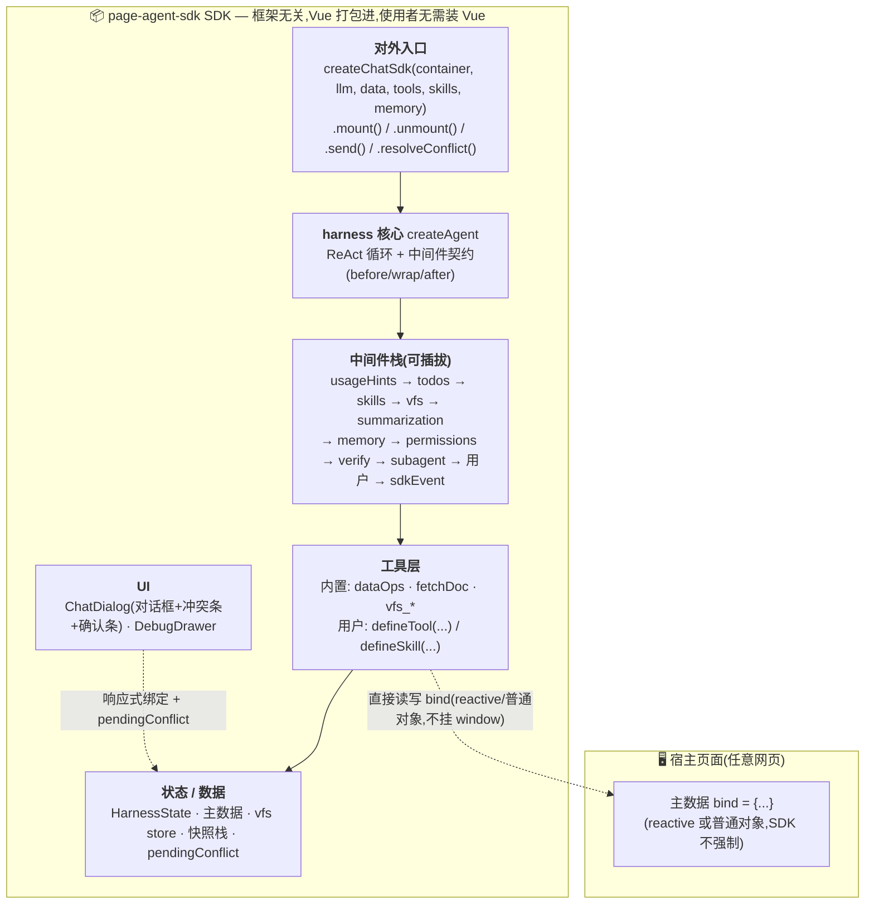

### 分层职责

| 层 | 职责 | 关键源文件 |
|---|---|---|
| **对外入口** | 命令式 API,组装 harness + 内置工具/中间件,挂载 UI,暴露冲突解决 | `src/core/sdk/createChatSdk.ts`、`defineTool.ts` |
| **harness 核心** | ReAct 循环 + 中间件生命周期 + 格式自纠 + verify 自纠 | `src/core/harness/createAgent.ts`、`middleware.ts`、`state.ts` |
| **中间件栈** | 可插拔能力(planning/skills/工作区/压缩/记忆/权限/verify/subagent) | `src/core/harness/{todos,skills,summarization,memory,permissions,verify,subagent,usageHints}.ts` |
| **工具层** | Agent 可调用的能力(数据操作含乐观锁/抓文档/工作区/自定义) | `src/core/tools/{dataOps,fetchDoc}.ts`、`backends/vfs.ts`、`utils/offload.ts` |
| **状态/数据** | 运行态 + 主数据 + 工作区 + 快照栈 + 冲突挂起 | `HarnessState`、主数据 bind、`VfsStore`、`pendingConflict` ref |
| **UI(通用)** | 对话框 + 调试抽屉 + 冲突条 + 确认条(SDK 内) | `src/core/components/{ChatDialog,DebugDrawer}.vue` |

---

## ② 组装与挂载流程

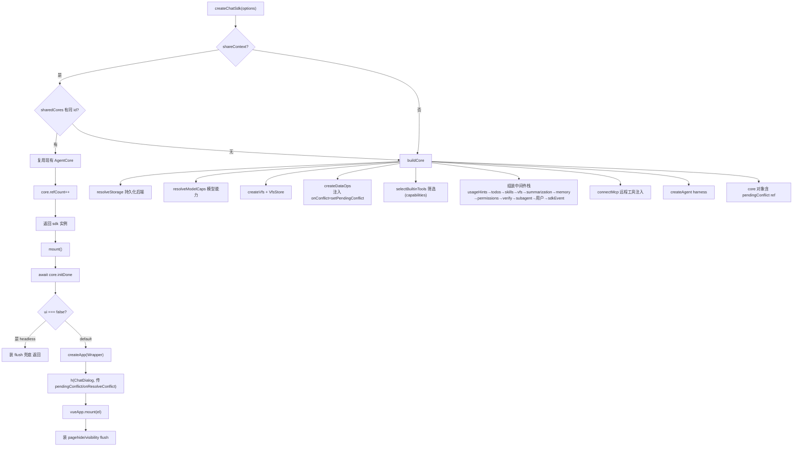

**要点:**
- `shareContext` 复用 core 时,`pendingConflict` ref 也共享——同 id 多实例是「同一 agent 的多对话框视图」,共享冲突 UI 一致
- `dataOps` 关闭(`capabilities.dataOps:false`)时不注入 `onConflict`,`pendingConflict` 永远 null,无副作用

---

## ③ ReAct 主循环(含中间件钩子 + 格式自纠 + verify 自纠)

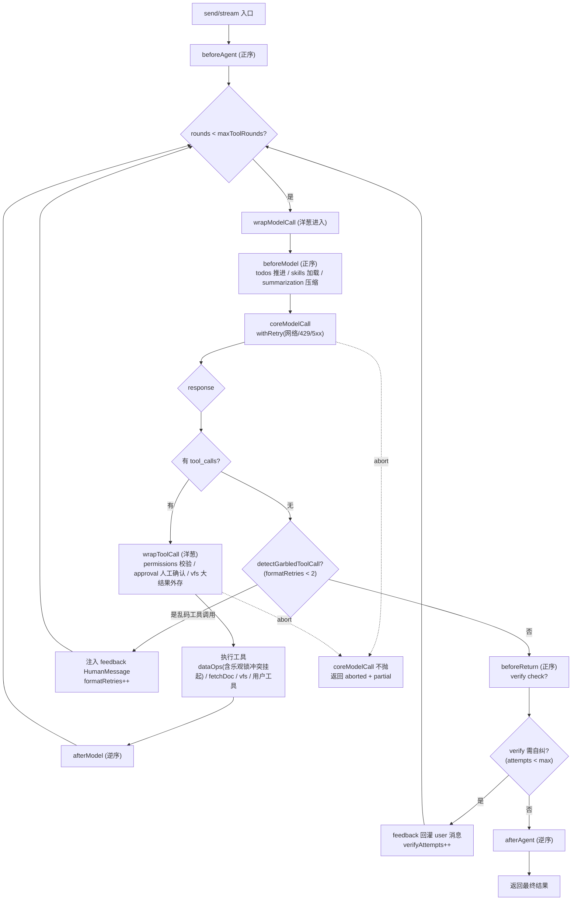

> 钩子顺序:**before 类正序、after 类逆序、wrap 类洋葱(reduceRight)**。
> `formatRetries` / `verifyAttempts` 均为 **per-run**(每次 stream/invoke 调用重置),长会话不累加。
> abort 时 `coreModelCall` 不抛、返回已生成 partial;**挂起的 approval/conflict 由 stream 包装层监听 abort 自动收口**(见 ⑤)。

---

## ④ 数据操作与乐观锁流程

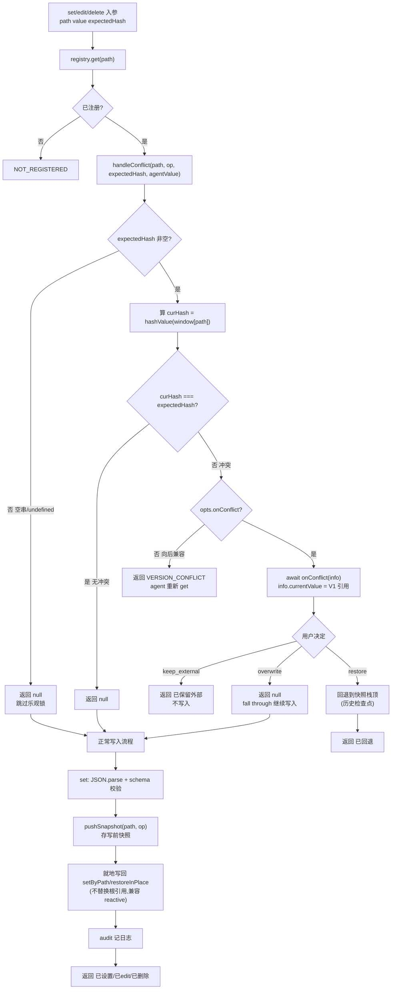

**数据存储位置:**
- **实际值** → 宿主 `window[path]`(唯一数据源,V0/V1/V2 都在这)
- **快照** → `dataOps` 闭包内 `snapshots: SnapshotEntry[]`(纯内存栈,FIFO 限长 20)
- **hash** → 实时计算 `djb2(safeStringify(value))`,不存储,只在 `get_data`/`read` 返回末尾附 `hash=xxx`(整体 bind 的 hash)
- **冲突挂起信息** → `core.pendingConflict` ref(响应式内存,供 UI)+ `SdkEvent 'conflict'` 外发

**关键约定:**
- `get` 不存快照 → `restore` 只能回到「快照栈顶(历史检查点)」,无法回到 agent `get` 时的 V0
- `overwrite` 由正常流程 `pushSnapshot`(避免冲突时重复 push 浪费栈位)
- 不传 `expectedHash` → 向后兼容直接写(不校验)

---

## ⑤ 冲突人工介入(挂起 + 事件 + UI + abort 联动)

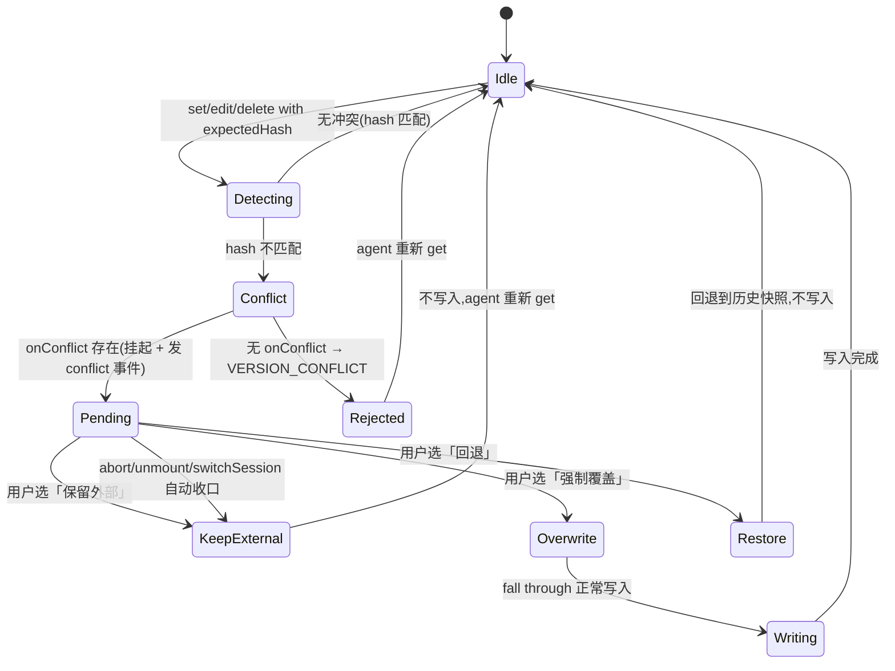

**三选项语义:**
| 选项 | 行为 | window[path] 结果 |
|------|------|-------------------|
| `keep_external` | 不写入,保留外部改后的值 | V1(外部改后) |
| `overwrite` | 强制执行 agent 写入 | V2(agent 值) |
| `restore` | 回退到快照栈顶(历史检查点) | 栈顶快照值(可能撤销外部改) |

**挂起收口(防永久挂起):**
- **abort**:用户停止生成 → `stream`/`fetchResponse` 包装层监听 `signal.abort` → 自动 `resolveConflict('keep_external')`
- **unmount**:`unmount()` 调 `resolveConflict('keep_external')`
- **switchSession**:`switchSession()` 开头调 `resolveConflict('keep_external')`

**集成方接入:**
- 内置 UI:ChatDialog 渲染冲突条(三按钮 + 值对比 diff),用户点按钮调 `sdk.resolveConflict(action)`
- headless:`watch(sdk.pendingConflict)` 或 `sdk.hook(e => e.type==='conflict')` 自建 UI,调 `sdk.resolveConflict(action)`
- 独立 `createDataOps(config, { onConflict })`:不接 ChatDialog 时自行处理冲突

---

## ⑥ 上下文压缩与持久化

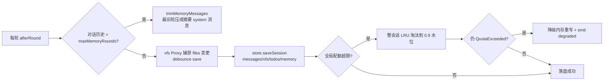

> 详细压缩策略见 [`context-management.md`](./context-management.md);持久化配额/淘汰/降级见 [`usage-guide.md`](./usage-guide.md)「存储」段与上方流程图。

---

## ⑦ 事件流(订阅入口 + 各事件触发点)

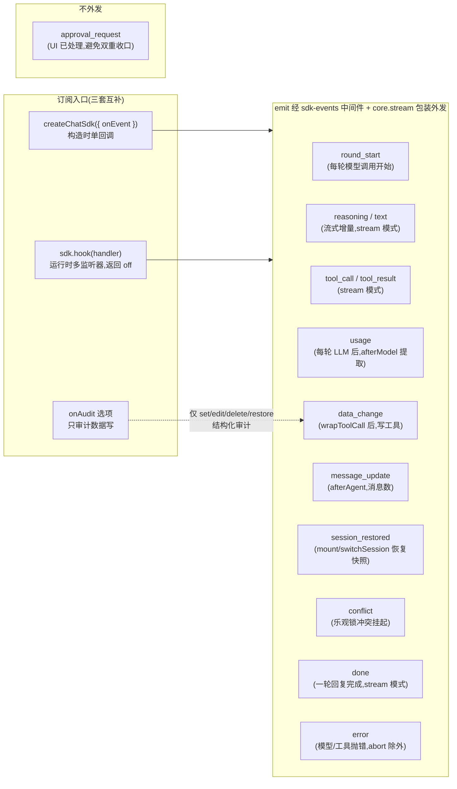

**要点:**
- `onEvent`(构造时单回调)与 `sdk.hook`(运行时多监听器、可取消)功能重叠,前者便捷、后者灵活,可并存
- `onAudit` 独立于 `debug`,无需 `debug:true`,只发数据写操作的结构化审计事件
- 流式事件(`text`/`reasoning`/`tool_call`/`tool_result`/`done`)仅 **stream 模式**触发(UI 默认 stream;`sdk.send` 走 invoke 无流式,但 `data_change`/`message_update`/`error` 仍发)
- `sdk.usage` 累计 token 用量,单轮明细经 `usage` 事件外发

---

## ⑧ 会话恢复流程(mount 自动恢复 / switchSession 切换)

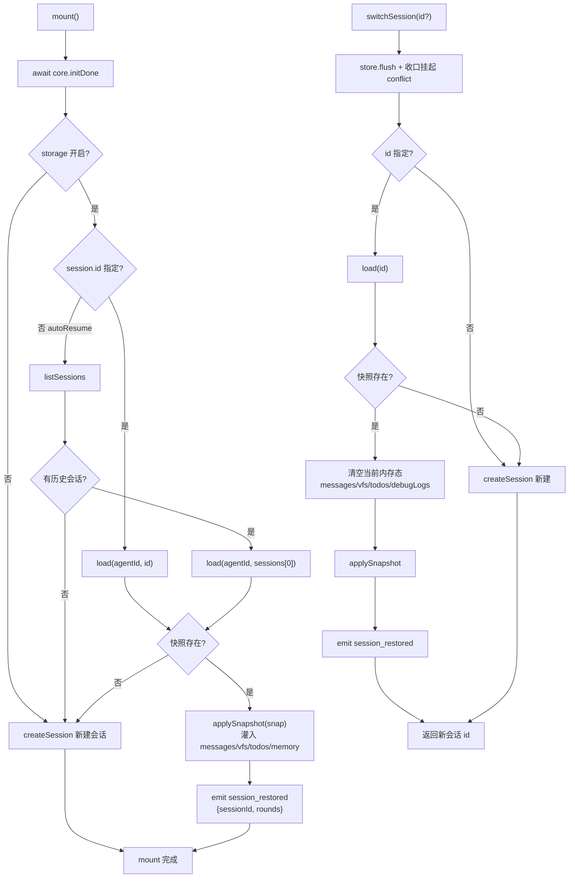

**要点:**
- `applySnapshot` 灌入 messages/vfs/todos/memory;**不灌 `bind`**(bind 是集成方外部业务对象,由集成方管理)
- 恢复会话后发 `session_restored` 事件(`rounds` = 恢复的消息数),集成方可据此提示「已恢复 N 轮对话」
- `switchSession` 开头自动收口挂起的 conflict(按「保留外部」),防切会话后旧 conflict Promise 永挂

---

## ⑨ 子 agent 编排(spawn 委派 + 进度转发)

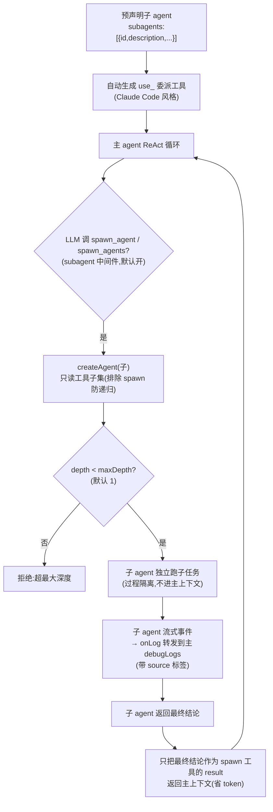

**要点:**
- 子 agent 只读工具子集,排除 `spawn_agent`/`spawn_agents` 防递归
- 子 agent 过程不进主上下文,只回最终结论 → 省 token
- `maxDepth`(默认 1)递归物理切断;预声明子 agent 自动生成 `use_<id>` 委派工具
- 子 agent 日志经 `onLog` 转发到主 debugLogs(带 `source` 标签,调试面板可区分)
- **子 agent 思考过程可见**:子的 `reasoning`(思考增量)经 `subagent` 事件(kind=reasoning)转发到主 UI,在 spawn 步骤「🧬 子 agent 进度」块折叠展示(spawn 进行中显示"思考中…");`text` 不转发(是生成内容,经 vfs/data 落地,不进进度块)。**仅进 UI 不进主 LLM 上下文**(隔离不破)。DebugDrawer「🤖 子 agent」tab 在子工具事件时 bump `infoTick` 实时刷新(修前:子 LLM 思考期间 UI 完全静默)
- **code-as-data-asset(createHtmlSubagent 单模式)**:代码作 `data.code` 资产(进服务端 DB),vfs 作编辑工作副本;框架 beforeAgent checkout(data.code→vfs 按 `__pgId` 文件名)/ afterAgent commit(改过的 vfs→data.code 增量,直改 bind 不进快照栈 + recomputeBaseline 防主 agent autoLock 误冲突)自动搬运,主 agent 透明(主 scope read 见 `<code Nkb>` 摘要挡上下文)。`__pgId` 框架无感注入(schema extend 加 / read 深投影隐藏 / 写 path guard 拒 `__pg*` / persist 透明带)。**多组件天然支持**(checkout/commit 遍历 writablePaths 下所有带 `__pgId` 的元素,vfs 多文件隔离)
- **focus × code-as-data-asset vfs 守卫**:`focus.ts` 的 WRITE_TOOLS 刻意排除 vfs(vfs path 非数据 jsonPath,与焦点前缀不可比,防误拦);但子 agent 改代码必经 `vfs_edit`,故 `codeAssetMiddleware.wrapToolCall` 在执行前补一道守卫:有焦点(`state.focuses`,子 agent 继承主焦点)时,vfs 代码文件 `__pgId` 必须在焦点组件 `__pgId` 集内(`focusPathsToPgIds` 把焦点 path 解析为命中组件 `__pgId`),越界返 PATH_DENIED 回灌自纠;焦点为整个数组 / 非代码字段 → 空集放行(无法精确到组件,不误拦)。这是「点选组件 → 对话精修」的硬约束基础
- **组件代码文件地图(修 __pgId 映射摩擦)**:`__pgId` 随机生成(`c_` + random)且对 agent 隐藏(read 投影藏 `__pg*`)→ 子 agent 拿组件 name 定位不到 vfs 工作副本文件(文件名 = `prefix+__pgId+ext`)。`codeAssetMiddleware.augmentPrompt` 每轮注入「组件代码文件地图」(name → vfs 路径,标注是否已检出)到**子 agent** system prompt —— 按 name 直接改对应文件(存量随机 id / 新建组件都覆盖);主 agent 不装本中间件,地图不污染主上下文;augmentPrompt 每轮重建天然跨压缩。focus 场景无需地图(守卫直接用焦点 `__pgId` 集锁定)
- **skill 全文缓存**:`load_skill` 首次 `getContent` 后缓存到 middleware 内存(contentCache),跨轮跨会话复用,避免重复 IO + 重复 offload;`beforeAgent` 清 `loaded` Set(允许跨轮重新 load,但用缓存内容);offload 内容寻址去重(相同内容复用同一 vfs 文件)
- **运行时动态 skill**:`skills` 中间件挂 `SkillsController`(不可枚举),`createChatSdk` 暴露 `sdk.setSkills(skills)`(替换整个列表,同名覆盖,清 contentCache + loaded,下轮 `augmentPrompt` 重渲染索引)/ `sdk.invalidateSkillCache(name?)`(清指定/全部缓存);`inspect().skills` 读 `controller.get()` 反映运行时替换。用于懒加载组件等运行时增删 skill 场景
- **运行时动态重配置(tools/llm/memory/subagents)**:`createAgent` 内 `allTools`/`llmWithTools`/`llm` 改 `let` + `rebindTools()`;`createChatSdk` 暴露 `sdk.setTools/addTool/removeTool`(用户工具动态,内置不动,rebind)、`sdk.setLlm`(切换模型 + rebind + `onLlmChange` 重解析 `modelCaps`)、`sdk.setMemory`(更新 memory 中间件持有的 `mem` 变量)、`sdk.setSubagents/addSubagent/removeSubagent`(经 `SubagentsController` 重新生成 `use_<id>` 委派工具 + 触发 rebind)。所有 setter 触发 `infoTick++` → DebugDrawer 刷新;`inspect()` 的 tools/model/memory/subagent.subagents 经 getter/`controller.get()` 动态取最新。`core.agent.allTools` 用 getter(否则 setTools 重赋值后 inspect 取到旧引用)。`subagents:[]`(空数组)也创建 controller(支持「初始无子 agent,运行时动态 add」,不依赖 length 判定)。全程零破坏(不调用 = 现状)。仍缺失 `setSystemPrompt`/`setMiddleware`(中间件数组运行时替换,留待后续)

---

## ⑩ MCP 远程工具注入

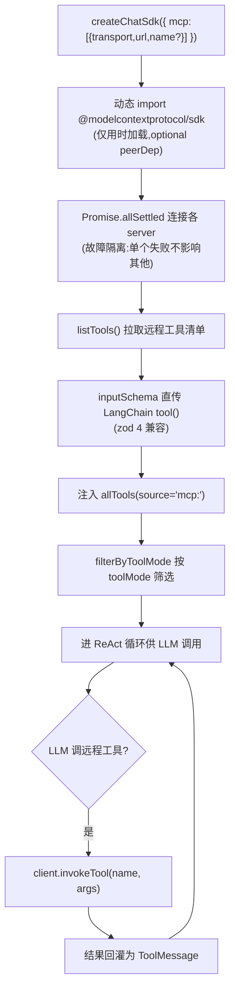

**要点:**
- MCP 仅支持远程 transport(http/sse/websocket),浏览器无本地 stdio
- `Promise.allSettled` 故障隔离:单个 server 连接失败不影响其他
- `inspect().mcp.servers` 与每个工具 `source` 字段反映 MCP 配置
- dev 预构建坑:`vite.config.ts` 的 `optimizeDeps.include` 已预声明 SDK 子路径,否则冷启动首次注入失败

---

## ⑪ Approval 人工确认(human-in-the-loop)

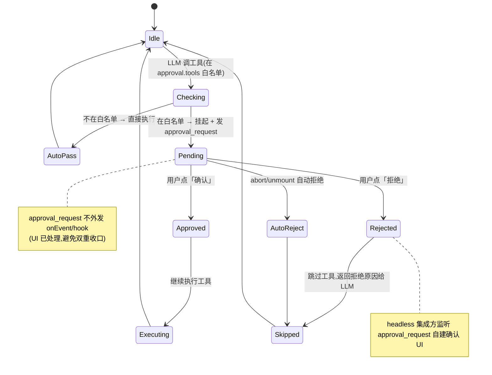

**要点:**
- `approval:{ tools?, confirm?, ... }` 默认关闭,传 `approval` 即启用
- 被动白名单:`approval.tools` 列出需确认的工具名;主动工具:`request_human_confirmation` 工具供 LLM 主动请求确认
- `approval_request` 不外发 `onEvent`/`hook`(内置 UI 已处理,避免集成方误调 `resolve` 双重收口);headless 集成方监听 `approval_request` 自建确认框
- abort/unmount 自动拒绝,防永久挂起

---

## ⑫ 模块抽离(源码组织 / 可维护性)

> 单文件膨胀(createChatSdk 曾 1751 行 / dataOps 969 行)不利于维护与测试。`refactor-module-extraction` 把**纯函数**与**工厂/解析逻辑**抽到独立模块,原文件 import 复用,运行时行为零变化。纯重构,无契约改动。

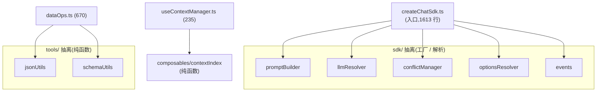

| 抽离模块 | 来源 | 职责 | 关键导出 |
|---|---|---|---|
| `tools/jsonUtils.ts` | dataOps | 16 个零依赖纯函数(路径 / 克隆 / 序列化 / patch / hash) | `getByPath` / `setByPath` / `deepClone` / `hashValue` / `applyPatchToClone` ... |
| `tools/schemaUtils.ts` | dataOps | 6 个 schema 白名单投影函数 | `getSchemaTopKeys` / `isPathAllowed` / `projectBySchema` ... |
| `sdk/promptBuilder.ts` | createChatSdk | systemPrompt 拼装(身份 + data + rules) | `buildSystemPrompt` / `buildDataPrompt` / `DEFAULT_SYSTEM_PROMPT` |
| `sdk/llmResolver.ts` | createChatSdk | LLM 能力解析 + 摘要 invoke | `resolveLlm` / `isChatModel` |
| `sdk/conflictManager.ts` | createChatSdk | 冲突状态机(工厂) | `createConflictManager` / `ConflictManager` |
| `sdk/optionsResolver.ts` | createChatSdk | storage / dialog 配置解析 | `resolveStorage` / `resolveDialogConfig` |
| `sdk/events.ts` | createChatSdk | 事件系统(工厂) | `createSdkEvents` / `SdkEvents` |
| `composables/contextIndex.ts` | useContextManager | 分词 / 估算 / 摘要 / 召回纯函数 | `tokenize` / `indexSummarize` / `recallRounds` |

**要点:**
- **纯函数模块**(jsonUtils / schemaUtils / contextIndex)零依赖,可独立 import + 白盒单测;为后续 change(cyrb53 / diffObjects / describeSchemaNode)建好骨架
- **工厂模块**(conflictManager / events)用「emit getter 延迟求值」适配闭包时序(emit 晚于工厂定义);llmResolver 用结构化参数纯函数返回 `{modelCaps, summaryLlmInvoke}`,主 LLM 实例化 / `setLlm` 闭包仍留 createChatSdk(依赖运行时配置)
- 顶层 `.` 入口导出不变;**subpath exports**(`./storage` / `./query` / `./llm`)开放按需引入(指向同一 dist + types,体积靠 bundler tree-shaking)
- 行数变化:createChatSdk 1751→1613、dataOps 969→670、useContextManager 321→235;selftest 537→630、e2e 210 全过
- **skillStore 桥接延后**:`userSkills` 被 12+ 处引用 + skillsMw / core.infoTick 闭包时序交错,完整抽离风险 > 收益,留独立 change

---

## ⑬ 体验平面改进(2.16.0):complex 预设 + vfs JSON 感知 + 三池分池 + offload 元数据

> 面向**多步复杂任务 / 大 JSON 操作 / 长流程编排**场景的四项体验平面改进。不改契约、不动数据流,在现有「上下文压缩 / vfs 工作区 / 大结果外存」三个机制上做面向使用者的增强。

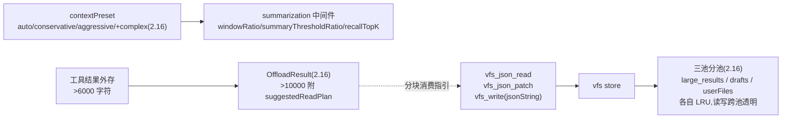

**① `complex` 上下文预设**(与 `auto`/`conservative`/`aggressive` 并列):比例制 `windowRatio=0.6` / `summaryThresholdRatio=0.7` / `recallTopK=5` / `enableLLMSummary=true`,`preserveLastToolResults` 默认含 `describe_data`/`read`/`query_data`/`search_data`。动机:复杂任务工具结果体积大、跨轮关联强、字段描述需保留,`auto` 的窗口比偏小易把关键字段摘要掉。`inspect().contextPreset`(新增字段)反映生效档;`contextOptions` 仍可逐字段覆盖。

**② vfs JSON 感知工具**:`vfs_json_read({path, jsonPath?})` 按 jsonPath 读 vfs 文件内 JSON 子树(省略读整体);`vfs_json_patch({path, patches})` 在 clone 上原子应用多 patch(`op:set/remove/merge/append`),任一失败整体不写回(`PATCH_FAILED`,原文件不变);`vfs_write({path, content, jsonString?})` 的 `jsonString:true` 写前校验合法 JSON(`VFS_JSON_INVALID` 不写入)。动机:大 JSON 整体 `vfs_read` + `vfs_write` 重写易被 `max_tokens` 截断致文件不完整;局部 jsonPath patch 与主数据侧 `write({patch})` 同构,只发改动规避截断。

**③ vfs 三池分池**:`large_results/*`(offload 自动,4MB)、`drafts/*`(2MB)、`userFiles`(2MB)三个**独立 LRU 池**。动机:单池 LRU 下工具结果外存会挤掉 Agent/用户的草稿与文件(误删),分池后各池只淘汰本池最旧文件,互不影响。`vfs.maxBytes` 默认 8MB(总)、`vfs.poolBytes` 单池配;读写跨池透明(按路径前缀路由)。

**④ offload 结构化元数据**:工具结果外存返回值升级为 `OffloadResult`,大结果(>10000 字符)附 `suggestedReadPlan`(vfs_read 分页/分段读取建议)。动机:外存后 LLM 面对一个大文件不知从何读起、易一次塞满上下文;`suggestedReadPlan` 给出分块消费指引,引导 Agent 分页 `vfs_read` 而非整体加载。

> 四项均**默认可用、零配置**,集成方按需通过 `contextPreset:'complex'` / `vfs.{maxBytes,poolBytes}` / 调用 vfs JSON 工具采用;不调用 = 现状。详见 `doc/usage-guide.md` §6.8「complex 预设 + vfs JSON 感知工具」。

---

## ⑭ 数据槽深潜(白名单 / 读写链 / 工具形态 / 受保护资源 / vfs)

> CLAUDE.md「架构要点 · 数据槽操作」只留不变量;细节在这。源码:`src/core/tools/{dataOps,dataSlotQuery,jsonUtils,schemaUtils,resources}.ts` + `backends/vfs.ts`。

**schema 形状白名单(ZodObject 时生效;非 ZodObject 全开放向后兼容):**
- 顶层 key = 可读写白名单。**读路径统一深投影**:`projectBySchemaDeep` 单一口径(read 整体 / get_data 整体 / jsonPaths 根 / query / search / eval 根 / diff 一律递归投影,未声明字段不泄露)
- **写路径逐段校验**:`write`/`edit`/`delete` 的 `jsonPath` 经 `isPathAllowed` 逐段判(ZodArray 严格判索引 `/^\d+$/`;discriminatedUnion/union 静态不知 option → 降级开放,交 `schema.safeParse` 兜底)
- 整体 `set` 自动转 **merge 语义**(未声明字段保留防误删);拦截器补充的未声明字段同样被白名单挡下
- 校验不合法 → **结构化错误**(不写入);错误码/JSONPath 子集/sandbox 禁用列表见 `dataOps.ts` 头注

**快照回退:**`set/edit/delete` 前自动存快照(**per-path 栈**);`restore_data` 一键回退;`history_data({list:true})` 只读查看快照时间线;`diff_data` 对比。

**乐观锁与冲突:**`get_data`/`read` 返回附 `hash=xxx`;写工具传 `expectedHash` 或高层 `write` `autoLock`(默认开,用最后 read 的 hash)启用。外部改过(hash 不匹配)→ 冲突挂起 `sdk.pendingConflict`(ref)+ ChatDialog 冲突条三选一 → `sdk.resolveConflict('keep_external'|'overwrite'|'restore')`(状态机见 §⑤)。**per-scope 基线**:基线 Map 按 caller scope 隔离,子 agent 委派期间经 scope proxy 切换,子 read/write 不污染主基线。**契约:同 scope 连续写永不互相冲突**(写成功即刷基线,解析→检查→提交同步无 await)。headless 可 watch `pendingConflict` 自建 UI。

**高层 `read`/`write`:**
- `read({jsonPath?, jsonPaths?, fields?, depth?, offset?, limit?})`:多路径一次读、字段裁剪、深度截断、数组分页
- `write({value?, patch?, patches?, del?, dryRun?})`:四意图(整体 set / 单 patch / **批量 patches 原子应用任一失败回滚** / 删除)+ dryRun 预检(校验链全走但不落盘,冲突照常检测不挂起)

**eval_script:**`transform` 沙箱脚本(Worker 三层防护)返回新值或 `{patches}` 增量;`jsonPath` 子树模式(仅 clone 子树,>100KB 超时自适应)。

**分块写(opt-in `capabilities.draftWrite`):**`draft_write`/`draft_commit`(类 git add→commit),commit 走完整校验链 + 乐观锁;大 JSON 场景建议 `maxToolRounds` 20-30。

**toolMode:**`simple`(默认,7 工具,主推 read/write)/ `advanced`(14,全暴露)/ `minimal`(2);`filterByToolMode` 纯函数;usageHints 按 mode 注入运行时工具说明(**集成方 systemPrompt 只写业务知识,不重复声明工具语法**)。

**interceptors:**`read(value)` 脱敏/派生(只改 LLM 看到的值);`write(payload, current)` 转换/审计/拒绝(返回 `{error}`)。**仅守高层 read/write;advanced 底层工具绕过**(集成方需知情);`input(input)`/`output(json)` 在 agent IO 入口/出口改写。

**受保护资源(opt-in):**`data.resources:[{path, mode}]`;`freeze` 只读(read 返 `⟦frozen:path⟧` 占位符,写撞 `FROZEN_FIELD`);`verbatim` 原样保留(read 返 `⟦res:handle⟧`,改值经 `resource_update`,直写新值 `VERBATIM_MISMATCH`)。**bind 恒持原始值,占位符只在读写边界替换**(hash/快照/乐观锁零干扰);强制层 `enforceSet`/`enforcePatches` 先于 schema 校验;需 vfsStore;配 `resourcesPin` 跨压缩注入。skill `precise-value-protection`。

**vfs 四池 + 大结果外存:**`large_results`(4MB)/`drafts`(2MB)/`userFiles`(2MB)/`resources`(4MB)独立 LRU(§⑬ 三池 + resources 池);`vfs.maxBytes` 默认 8MB 总上限兜底。工具结果超自适应阈值(窗口 3.5% 推导,clamp [2000,20000])转存 vfs,留预览 + 引用;`offloadLargeResult` 返回结构化 `OffloadResult`。JSON 感知工具:`vfs_json_read`/`vfs_json_patch`/`vfs_write({jsonString})`(§⑬)。

**零桥接 + 审计:**工具直接读写 `bind`(reactive 响应式);set/edit/delete/restore 记审计日志(`onAudit` 回调)。

---

## ⑮ 能力全景与鲁棒性契约

> CLAUDE.md「架构要点」各能力小节的细节汇总。

### 记忆与上下文管理
- **上下文压缩**(纯内存、会话级):`summarization` 中间件复用 `useContextManager`(滑动窗口 + 摘要 + 关键词召回);`contextPreset`:`auto`/`conservative`/`aggressive`/`complex`(比例制,映射在 `sdk/contextPreset.ts`);详见 [`context-management.md`](./context-management.md)
- **压缩 LLM 摘要异步化**:模板先行 + 后台前缀缓存 —— 触发时立即用索引摘要返回(零阻塞),fire-and-forget 后台 LLM 入前缀缓存(`{coveredCount, text}`);后续命中:全覆盖直接用 / 部分覆盖 = LLM 前缀 + 尾部索引增量;失败不污染缓存。agentCompression 的 decide(≤6s)维持同步(opt-in 默认关)
- **压缩不丢关键信息**:① 压缩时注入当前主数据 description 快照;② `preserveLastToolResults`(默认 `['describe_data','read']`)跨轮保留工具 result 摘要;③ 写成功返回附可操作 path 列表;④ `systemPromptHelpers.reliableWriteRules` 建议拼进 systemPrompt
- **双摘要协同**:`summarization`(compressInput,不改 messages 原数组)与 `trimMemoryMessages`(afterRound,内存 OOM 裁剪)独立。配置建议:`maxMemoryRounds >= summaryThresholdRounds`
- **跨轮召回 + trim 异步增强**:关键词召回纳入 `steps.result`;trim 触发后同步模板占位 + 异步 LLM 增强(fire-and-forget,竞态守卫,失败保留模板)
- **持久化韧性**:mission/workingMemory/focus 跨刷新持久化(switchSession 切走前补 persist);trim 删前 emit `context_trimmed`(dropped 原文 + 引用的 vfs 大结果)+ 可达性 GC;vfs 在 storage 开时随 persist 持久化
- **健壮性**:窗口 ≥200K 硬约束(`MIN_CONTEXT_WINDOW`,启动/setLlm/子 agent 解析后校验);三闸阈值(offload/trim/compress)跟随 `setLlm` 新窗口;反应性兜底:context overflow 识别 → 激进 trim → 单次重试 → 仍超抛;vfs 引用保护(LRU 跳过被引用 large_results);系统段预算(超 25% 窗口 drop 非 pin 段;systemPrompt 本身超预算 fatal 早退)
- **agentCompression**(opt-in):gate(`shouldTriggerCompression`)通过才 `summaryLlm.decide`(两段式工具循环:bind 临时 `inspect_context` 工具 → 模型查构成 → 回灌 → JSON schema 校验;`decisionTimeoutMs` 6s / `decisionMaxTokens` 2048);决策覆盖切分/摘要 mode/召回/preserve;失败降级静态压缩;决策经 `inspect().lastCompression` 可观测

### 规划与任务锚定
- **自适应规划**:`write_todos`(整表替换,框架生成 id `t-1/t-2…`)+ `update_todo({id, content?, status?})`(增量改单项);一轮内两者不可混用;`maxPlanRevisions`(默认 5)防规划死循环:主数据写工具成功才退出规划,超限回灌「停止调研去执行」;复杂度判断由 LLM 做(usageHints 引导),框架不做启发式;`capabilities.planning:false` 关
- **Mission**(默认开 `capabilities.missionAnchor`):会话级目标锚定 `{goal, acceptanceCriteria?, …}`;首条任务型 user 启发式 capture(宁漏不误)+ `send({mission})`/`setMission` 显式;`augmentPrompt` 每轮注入 pin 段(在 state 不在 messages → 天然跨压缩)
- **workingMemory**(默认开):自动捕获 `read`/`query_data`/`search_data` 的 locatedPaths(LRU ≤10)+ read hash(lastHashes,LRU ≤10);pin 段每轮注入跨压缩;防压缩后重复检索/凭记忆写致 autoLock 误冲突
- **Focus 上下文聚焦**(默认开,opt-in 需主动聚焦):多焦点 `Focus[] {path, label?}`;三层收敛 —— 目标提示 + 子树 schema 视野 + **范围 strict**(写工具 `jsonPath` 不在任一焦点子树 → `PATH_DENIED` 回灌自纠;无 jsonPath 整体写 = 越界拒;eval_script 参与拦截;vfs_write/vfs_edit 不拦);API `setFocus`/`addFocus`/`removeFocus`/`clearFocus`/`getFocuses` + agent 工具(advanced)+ ChatDialog 输入框 chip + user message 焦点历史标注;持久化 + 子 agent 继承全部焦点

### 子 agent 授权面与协同
- **授权与拦截面**:子池装配期源头 filter(排除 `spawn_*`/`use_*`/`load_skill`/`write_todos`/`update_todo`/`restore_last_checkpoint`/`request_human_confirmation`/`*_focus` 等框架/保留工具);`allTools` getter 指向 agent 合并池(含中间件工具);spawn 自授 `tools` 剥离写工具(写权限仅经 `writablePaths` path guard,含 patches 无 jsonPath 根写拦截);**子栈继承主 permissions/approval 实例**,子的 approval_request 直通转发回主循环;子 offload 直落主 vfs 共享池(vfs-bridge)
- **子 agent 扩展**(`SubagentConfig`):`allowedTools`(额外工具名)/`middleware`(自定义)/`summarization`(跨轮压缩)/`maxVerifyAttempts`(beforeReturn 自纠上限,配 verify 类中间件时必开);`sdk.vfsWrite(path, content)` 集成方注入 vfs 文件
- **能力包工厂**(opt-in 可组合):`createRagSubagent({retriever?, loader?, useVfs?})`(多源知识检索,只读)/ `createHtmlSubagent({writablePaths, codeVfsPrefix?, formatCheck?})`(代码组件生成:代码正文→vfs 工作副本,data 存 code;装 todos + summarization)。HTML 包细节(单模式,完整页面级):生成**完整、自包含 HTML 页面**(script/style 默认含、集中放 `<style>`/`<script>` 块,可引外部 JS/CSS),改造(抽 body/包组件/片段化)由下游插件/tool 做;`formatCheck` 默认开 = `validate_code` 自检工具 + verify beforeReturn 门禁(确定性扫 vfs 代码文件,回灌自纠,`maxVerifyAttempts:2`),校验器纯函数 `validateHtmlFormat` 已导出(集成方渲染层纵深防御复用)
- **观察层**:`createSubagentTracker` 会话级 active/history 运行态(纯观察,不改生命周期);`inspect().subagent.{active,history}` + DebugDrawer「🤖 子 agent」tab
- **主×子协同**:per-scope 乐观锁基线(子上);spawn_agents allSettled(单失败不拖垮整批,逐任务 ✓/✗ 结算);子 usage 回传 `core.usage`(`sdk.usage` 含子消耗);子执行超时 opt-in(`subagent.timeoutMs`,链式 abort)

### 其他能力
- **MCP**:`createChatSdk({ mcp: [{ transport, url, name?, timeoutMs? }] })` 连远程 server 动态注入 tools(`Promise.allSettled` 故障隔离;握手 15s 超时降级);动态 import;dev 需 `optimizeDeps.include` 预声明(§⑩)
- **Verify 自检**(opt-in `capabilities.verify`):agent 返回前跑 `check`,不通过 feedback 回灌自纠(限 `maxAttempts`,默认 2);内置 `createWriteBackCheck()`(写操作读回 + schema 校验);可自定义 + adversarial 对抗验证(§③)
- **DOM 读取**:`get_dom`(opt-in `capabilities.domInspect`):结构化 `{tag, attrs, text, children[]}`,`depth` 默认 3,attrs 白名单 id/class/style/href+data-*
- **环境探查**:`inspect_env`(默认开):window 安全摘要 + `key` 读调试变量;`safeSerialize` 防超大
- **actions 宿主动作**:`createChatSdk({ actions: { name: { description, run, params? } } })` 自动包成命名 tool;run 异常隔离(错误字符串回灌自纠)
- **Skill 扩展**:`SkillSpec.exec`(加载时执行脚本:sandbox 默认三层防护 / host 需 `capabilities.skillHostScript` 且仅集成方内联;失败不缓存)+ `tools`(附带工具工厂,load_skill 后注入,卸载随 setSkills);exec=一次性初始化,tools=反复查询,勿双轨
- **Approval 人工确认**:`approval:{ tools?, confirm?, timeoutMs? }` 工具调用前 human-in-the-loop;无响应方路径 30s 自动拒(`APPROVAL_AUTO_REJECTED`);UI 交互确认无限等用户(§⑪)
- **Checkpoint**(opt-in `checkpoint:true`):每轮自动存档(对话 + bind + vfs + todos),脏标记增量 save;`restoreLastCheckpoint()` / LLM 工具 / UI 回退按钮;叶子 bind(原始类型)无法就地还原
- **Automation**(opt-in `capabilities.automation`):tokenBudget/timeBudgetMs 资源预算 + maxAutoRetries 错误恢复 + 断点续跑 + `sdk.batch` 批处理

### 对话鲁棒性契约
- **三档错误模型**:`AgentError.severity`(recoverable 回灌 LLM 自纠 / fatal emit+中断 / observable 记录);`routeError`/`asAgentError`/`agentError` 导出(框架内置 catch 用简化路由,供集成方自定义);`onEvent('error')` payload 带 `{severity?,code?,context?}`
- **模型调用重试**(`harness/retry.ts`):网络/429/5xx 指数退避(默认 `maxRetries`=2);4xx 与 abort 不重试;⚠️ 错误判定**先排除 abort 再判 status**
- **停止生成(abort)**:signal 穿透 `llm.stream`;abort 保留已生成 partial
- **挂起有界收口三契约**:① 超时默认值表(approval/humanConfirm 无响应方 30s 自动拒 / MCP 握手 15s / skills fetch 30s / LLM 流停滞看门狗 `streamStallMs` 90s,`StreamStalledError` 408 不重试);② 兜底收口必留痕(结构化 error/warn/debugLogs);③ abort 收口:`activeControllers` 注册表 **core 级**,send/batch 接 `signal` 可中断;unmount/switchSession/resetSession 先 abort 全部在途流再收口
- **resetSession**(同步公开 API):abort 在途流 + 收口挂起冲突(keep_external)+ 重置全部内存态(messages/vfs/todos/memory/mission/workingMemory/focus/checkpoint/debugLogs)+ 新 sessionId;**storage 关也完整执行**(store 相关才门控)
- **shareContext**:同 `id` 多实例复用同一 `AgentCore`;**串行闸与在途流注册表 core 级**(send/batch/switchSession/stream 全经 `core.runSerial`);生命周期收口中止共享 core 的**全部**在途流(含其他实例发起的)
- **onEvent / hook**:构造时 `onEvent` 订阅常用时机(`data_change`/`message_update`/`tool_call`/`tool_result`/`text`/`round_start`/`done`/`usage`/`session_restored`/`error` 等,§⑦);`approval_request` 不外发;流式事件仅 stream 模式;`sdk.hook(handler)` 运行时动态订阅(返回取消函数)
- **便捷 API**:`exportData()`/`importData(json,{validate?})`/`setSkills`/`invalidateSkillCache`/`addSkill`/`removeSkill`/`listUserSkills`/`getUserSkill`(用户 skill 独立 SkillStore 持久化,默认 indexedDB)/ `sdk.usage` 累计 token
- **运行时动态重配置**(零破坏):`setTools`/`addTool`/`removeTool`(内置不动,rebind)/ `setLlm`(切模型/切 provider;重解析窗口)/ `setMemory(string|同步/异步函数;异步后台求值,`refreshMemory` 强制)`/`setSubagents`/`addSubagent`/`removeSubagent`(需创建时配 `subagents:[]`)。均触发 `infoTick++` DebugDrawer 刷新
- **工具重名覆盖**:装配期 `dedupeTools` 按名去重,后注册覆盖先者 + warn;`removeTool` 仅删用户工具(禁用内置用 `capabilities`)
- **SkillPanel**:ChatDialog 内置 skill 管理面板(创建/编辑/删除用户 skill),已从入口导出
- **markdown 渲染性能**:`useMarkdown` 尾随节流(大内容 ≤100ms 渲染一次 + 尾沿保证)+ hljs 尺寸闸(单代码块 >20K 跳高亮转义直出;**sanitize 永不跳过**)。导出 `renderMarkdownHtml`/`markedToHtml`/`HLJS_BLOCK_MAX_CHARS`(仅主包)

---

## 关键特性

| 维度 | 设计 |
|---|---|
| **Agent 核心** | 自研 ReAct + 中间件契约(对齐 Deep Agents,零 LangGraph 依赖)+ 格式自纠 + verify 自纠 |
| **数据操作** | 单主对象 `data:{schema,bind}`;schema 校验 + 增量编辑(jsonPath)+ 按路径读 + 快照回退 + **乐观锁(expectedHash)+ 冲突人工介入** + **schema 形状自动白名单**(ZodObject 顶层声明字段隐藏未声明项)+ 高层 `read`(fields/depth 裁剪)+ `write`(批量 patches 原子)+ 大结果外存 vfs |
| **能力扩展** | 中间件(todos/skills/vfs/summarization/memory/permissions/verify/subagent/usageHints)+ 工具(`defineTool`)+ 技能(`defineSkill` 渐进披露) |
| **记忆** | 纯内存会话级;summarization 复用 `useContextManager`(滑动窗口 + 摘要 + 关键词召回);`maxMemoryRounds` 防长会话 OOM |
| **持久化** | 多后端(IndexedDB/WebStorage/Memory)+ 多 agent 隔离 + 全局配额 LRU 淘汰 + 降级内存 |
| **响应式** | `bind = reactive() 或普通对象`(工具直接读写 bind,不挂 window;普通对象经 `onEvent('data_change')` 或 `:key` 重渲染);set 子属性不替换引用 → 页面实时更新 |
| **鲁棒性** | 模型调用重试(网络/429/5xx)+ 停止生成(abort 保留 partial)+ 出错重试 + 冲突挂起自动收口 |
| **交付** | 框架无关 SDK(vue 打包进)+ 命令式 `mount` + headless(`ui:false`)+ 纯 HTML 集成(`demo/plain.html`) |

---

## 相关文档
- 使用手册:[`./usage-guide.md`](./usage-guide.md)(安装/配置项/能力详解/FAQ)
- 上下文压缩策略:[`./context-management.md`](./context-management.md)
- 项目指引 / 约定与坑:[`../CLAUDE.md`](../CLAUDE.md)
- 框架无关集成示例:[`../demo/plain.html`](../demo/plain.html)
