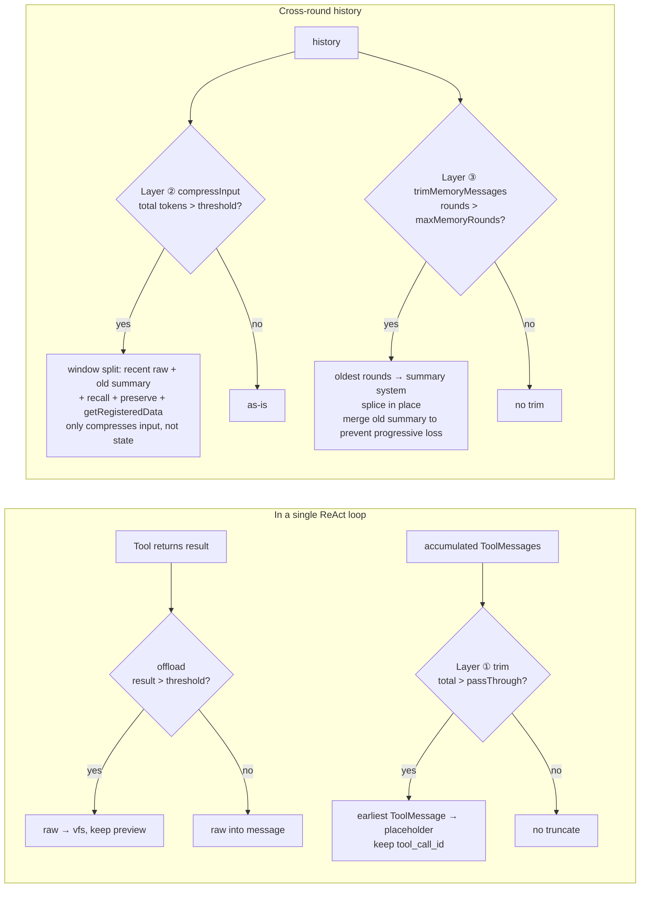
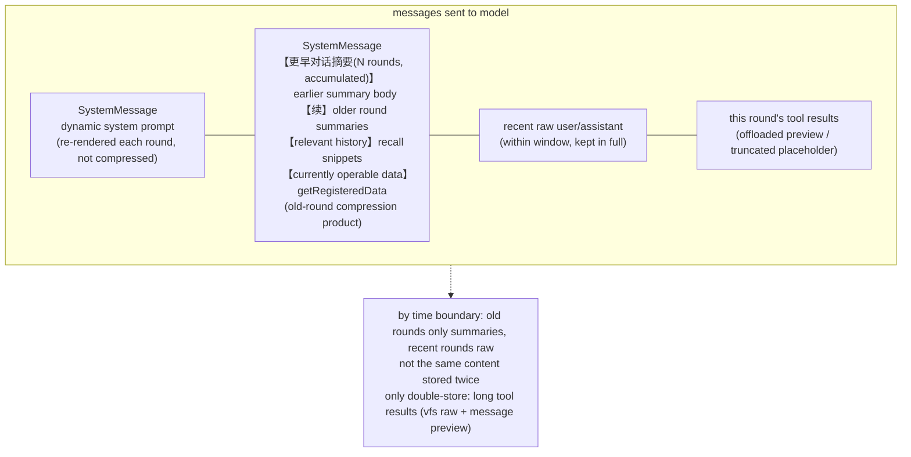

# Context Composition & Compression Strategy

> How page-agent-sdk assembles the context (messages sent to the LLM), when it compresses, and what the compressed result looks like. Includes per-layer principles, flow, parameters, boundaries, and flowcharts.
>
> Aligns with Deep Agents' context-management philosophy, but adapts for the browser with auto-tuning and zero-cost fallbacks.

---

## 1. Overview: 3 compression layers + 1 offload

The SDK's context management consists of **3 compression layers + 1 offload mechanism**. Each owns a segment, triggers on demand, is in-memory session-scoped (not cross-session):

| Layer | Mechanism | Trigger | Scope | Mutates `state.messages`? | Lossy | Cost |
|---|---|---|---|---|---|---|
| **Offload** | Large-result offload `offload` | On tool return | Single tool result | No (only that message's content) | No (raw goes to vfs) | Zero (no LLM) |
| **①** | In-round truncation `trimContextIfNeeded` | Before each model call | In-round ToolMessages | No (only input copy) | Yes (truncate) | Zero |
| **②** | Cross-round summary `summarization` (`compressInput`) | Before each agent run (`beforeAgent`) | Cross-round history | **No** (only input; state keeps raw) | Yes (old rounds → summary) | LLM summary or zero (index summary) |
| **③** | Memory round-cap trim `trimMemoryMessages` | After each agent run (`afterRound`) | Cross-round history | **Yes** (splice in place) | Yes (old rounds → summary) | Zero (index summary) |

**Core design principles**

- **Each owns a segment**: offload → single large result; ① → in-round accumulation; ② → cross-round compression; ③ → memory OOM backstop
- **Zero-cost fallback**: ②③ default to "index summary" (zero LLM cost); ② optionally uses LLM summary; ①③ always zero cost
- **No loss of key info**: offload keeps raw in vfs (re-readable); ②③ inject data-registry snapshot + preserve specified tool results; ③ merges old summary into new to prevent progressive loss
- **Auto-tuning**: thresholds adapt to model `contextWindow`; large models rarely trigger, small models trigger earlier

---

## 2. Context composition

Before each agent action, the messages sent to the model are assembled from **3 parts**:

```
[ SystemMessage(dynamic) , ...history(user/assistant/tool) ]
        ↑ 1) system prompt                ↑ 2+3) history & tool results
```

### 1. System Prompt (re-assembled each round, never compressed)

`buildSystemPrompt()` is re-built each round, **not in history, not compressed**:

```
base systemPrompt(integrator's identity/rules + auto-appended reliableWriteRules)
  + augmentPrompt segments (in middleware load order):
      usageHints, todos, skills, memory, ...custom middleware
  + buildDataPrompt segment (schema .describe() auto-extracted field hints)
```

- base defaults to "JSON operation assistant" + `reliableWriteRules` (`appendReliableWriteRules` defaults `true`, separated by `---`)
- segments optional (off if capability disabled); all off → only base + dataPrompt
- **Re-rendered each round** → todos progress, memory updates, `setData` schema swap all reflect immediately, no cumulative loss

### 2. History (user / assistant, compressible)

`state.messages` reactive array, shared reference with UI. Each assistant may carry `reasoning` and `steps` (tool steps).

- Pushed by useChat / `core.send`
- Main target of ②③ compression

### 3. Tool results (tool role, accumulate within a single ReAct loop)

- Only accumulate (ToolMessage) **within a single chat() ReAct loop**, not kept cross-round
- Long ones go through "large-result offload" (see below)

> Note: cross-round `state.messages` only contains user/assistant text + ③trim-produced summary system; tool results don't cross rounds. So cross-round compression ②③ focuses on "window + summary + recall".

---

## 3. Offload: large-result offload (`offload`)

### Principle

Tool results can be large (e.g. `read` of a big JSON, `query_data` hitting many nodes). Putting the whole thing into LLM context wastes tokens and may get truncated (losing info). The offload mechanism intercepts at the **single chokepoint** of tool results (`coreExecTool`): when exceeding the threshold, the raw content is moved to **vfs** (in-memory virtual workspace), and the message keeps only a **preview + vfs reference**. The LLM can later read full or partial data via `vfs_read` / `vfs_grep` → **no info loss, only saves tokens**.

### Flow

1. Tool returns `result`, serialized to `content` string
2. `offloadLargeResult(content, ctx)` decides:
   - `content.length <= threshold` (default 6000, ≈1500 tokens) → **return as-is** (no offload)
   - `content.length > threshold` and **vfs available** (`ctx.files` exists + `allTools` has `vfs_read`) → write to vfs (`large_results/<toolName>-<contentHash>.txt`, **content-addressed dedup**: same content → same filename, reuses existing file just updating `updatedAt`, repeated offload doesn't add files), return "first 1000 chars preview + vfs_read ref + vfs_grep ref"
   - `content.length > threshold` but **vfs unavailable** → pass per `passThroughChars`: ≤ pass-through limit passes fully (trust large context), > limit hard-truncates with a hint ("consider enabling vfs")

> **Content-addressed dedup**: filename uses `contentHash(content)` (djb2 variant) instead of a random id; same content reuses the same vfs file. Prevents repeatedly loading the same skill / re-querying the same large data from repeatedly consuming vfs space (LRU 4MB backstop aside, dedup is better). Different content → different filenames, one copy each.

> **Skill full-text cache can be proactively invalidated**: the `skills` middleware's instance-level `contentCache` (reuses skill full text across rounds/sessions, avoiding repeated `getContent` / vfs reads / repeated offload) is retained long-term by default. Integrators can proactively invalidate it via `sdk.setSkills(skills)` (replace the entire skill list, same-name overwrites, clears all cache) or `sdk.invalidateSkillCache(name?)` (clear one / all) — for dynamic skills (e.g. lazy-loaded component scenarios that add/remove skills at runtime) whose content changes, ensuring the next `load_skill` re-fetches the latest full text (incl. vfs doc).

### Parameters

| Param | Default | Adaptive formula |
|---|---|---|
| `offloadThreshold` | 6000 chars | `max(2000, min(20000, contextWindow × 3.5%))` (1M→20000, 32K→2000) |
| `passThroughChars` | same as threshold | `min(200000, max(threshold, contextWindow × 70%))` (large models cap 200k) |
| `vfs.maxBytes` | 4MB | vfs LRU eviction limit |

### Boundaries

- **The only "raw preserved"**: offload is the only mechanism keeping the raw (other history is dropped after compression)
- vfs unavailable (`capabilities.vfs:false`) degrades to truncation (loses info; hence vfs defaults on)
- Offloaded results don't enter cross-round history (consumed in-round), but vfs files persist session-scoped (re-readable cross-round)

---

## 4. Layer ①: in-round tool-result truncation (`trimContextIfNeeded`)

### Principle

Within a single ReAct loop, the LLM may call multiple tools; each ToolMessage accumulates into context. Single results are already capped by offload, but **multi-message accumulation** can still exceed the model context. ① checks total accumulation before each model call; when exceeding the pass-through limit, it truncates from the **earliest ToolMessage** into a "first N chars + original-length hint" placeholder, **keeping `tool_call_id`** (structurally complete, model can still correlate tool calls and results).

### Flow

1. Before each model call (after `beforeModel`), `trimContextIfNeeded(currentMessages, offloadPassThrough)` runs
2. Compute total chars `total` across all messages
3. `total <= maxChars` → return as-is (no truncate)
4. `total > maxChars`:
   - `need = total - maxChars` (chars to cut)
   - `keep = clamp(100, 400, round(maxChars/500))` (adaptive: small threshold keeps 100, large keeps 400)
   - From the earliest ToolMessage, truncate those with `content.length > 400` into `…[auto-compressed N chars, kept first keep]\n + content.slice(0, keep)`
   - Stop once cut accumulation reaches `need`; later ToolMessages preserved
5. **Only compresses the input copy, not `state.messages`** → each round re-judges from full raw, no cumulative loss

### Parameters

| Param | Default | Notes |
|---|---|---|
| `offloadPassThrough` | see offload formula | In-round ToolMessage accumulation cap; large models high (200k) rarely trigger |
| `keep` | adaptive | First chars kept when truncating, clamp [100, 400] |
| Min truncate length | 400 | ToolMessages with `content.length <= 400` not truncated (too short to bother) |

### Boundaries

- **Doesn't touch conversation/system/ai messages**, only ToolMessages
- Keeps `tool_call_id`; model can still correlate tool-call chains
- Large models (1M context) pass-through 200k, rarely trigger; small models (32k) ~22k, long tool chains may trigger
- Only compresses input copy; `state.messages` raw unchanged → re-judged each round, no cumulative loss

---

## 5. Layer ②: cross-round summary compression (`summarization` / `compressInput`)

### Principle

Cross-round history grows as the conversation proceeds; old-round details are often no longer key to the current question. ② splits history into a **recent window** (raw preserved) and **old rounds** (compressed into one system summary message). Summary modes:

- **Index summary** (zero LLM cost, default): each round takes `userQuery` 60 chars + `assistantPreview` 80 chars + tool-name list, joined as `- Round N: query → preview [tools: ...]`
- **LLM summary** (`enableLLMSummary:true`): feeds the index summary to a summary LLM for a more coherent paragraph (falls back to index summary on failure/timeout)

It also performs **keyword recall**: from old rounds, retrieve the Top-K most relevant to the current question, and append their short snippets into a "relevant history" section of the summary message, so the LLM gets both the compressed summary and early details directly related to the current question.

**Key: only compresses input, doesn't mutate `state.messages`** → each round re-summarizes from full raw, no cumulative loss stacking (the essential difference from ③).

### Flow

1. `beforeAgent` triggers the `summarization` middleware's `compressInput(messages)`
2. `groupRounds(messages)` splits by user messages (a round = one user + all following assistants)
3. **Extract head old-summary body**: if messages head already has a "【更早对话摘要】" system left by ③, extract its body (strip header) to merge into the new summary later (prevents ③'s accumulated history from being silently dropped by ②)
4. **Window split** (token-driven first):
   - With `contextWindow` → `totalTokens = Σ estimateRoundWireTokens(round)` (**wire scope, content only**: steps tool results / reasoning of past rounds are never re-sent across invokes, so counting them inflated estimates several-fold for long tool-chain sessions → premature compression; 4.9.2); `totalTokens <= contextWindow × summaryThresholdRatio` → not triggered; else accumulate tokens backward from the newest until reaching `contextWindow × windowRatio`; rounds before that are old
   - Without `contextWindow` → round mode: `rounds.length <= summaryThresholdRounds` → not triggered; else keep the latest `windowRounds`, the rest are old
5. **Summary generation**:
   - `enableLLMSummary && llmInvoke` → `summaryText = await llmInvoke(indexSummarize(older, preserveSet))` (falls back to index on failure)
   - Else → `summaryText = indexSummarize(older, preserveSet)`
   - `indexSummarize` for tools in `preserveLastToolResults` additionally keeps their `result` summary (120 chars) in a "field hints" section (prevents field descriptions from being summarized away)
6. **Recall**: `enableRecall` → `recallRounds(older, query, recallTopK)` matches old rounds by current-question keywords (stop-words removed), returns Top-K hits' short snippets
7. **Assemble summary system message**:
   ```
   【Conversation history summary】Below are the key points of the previous N rounds (latest M rounds kept in full):
   <summaryText>
   【Earlier accumulated summary】      ← if head old summary exists, merged here (prevents progressive loss)
   <prevSummaryBody>
   【Early conversation possibly relevant to the current question】  ← recall hits
   - Round m: ...
   【Currently operable data (latest state after dynamic add/remove; refer to read before operating)】  ← getRegisteredData injection
   - main data object description
   ```
8. Return `[summaryMsg, ...recentMessages]` as the compressed input; **`state.messages` raw unchanged**

### Parameters

| Param | Default | Notes |
|---|---|---|
| `contextPreset` | `auto` | Preset profile (see §9) |
| `summaryThresholdRatio` | 0.5 (auto) | Triggers when history tokens exceed `contextWindow × this ratio` |
| `windowRatio` | 0.4 (auto) | Token budget ratio for keeping recent rounds |
| `recallTopK` | 3 (auto) | Number of most-relevant old rounds to recall |
| `enableRecall` | true | Enable keyword recall |
| `enableLLMSummary` | true (auto) | Use LLM summary (else zero-cost index summary) |
| `summaryLlm` | main llm | Dedicated summary model (can be a cheaper small model) |
| `summaryTemperature` | 0.3 | Summary LLM temperature |
| `summaryMaxTokens` | 1024 | Summary LLM max output |
| `summaryTimeoutMs` | 15000 | Falls back to index summary on timeout (non-blocking) |
| `preserveLastToolResults` | `['schema_data','read']` | Keep result summaries of these tools across-round (prevents field descriptions from being summarized away); `[]` disables (since 4.9 describe_data → schema_data) |
| `getRegisteredData` | auto-injected | Returns current main-data description, injected into summary (prevents LLM from operating on stale memory after `setData` swapped schema) |
| `contextOptions` | — | Fine params override preset; `false` disables summarization middleware |

### Boundaries

- **Only compresses input, not state** → each round re-summarizes from full raw, no cumulative loss (essential difference from ③)
- **Coordination with ③**: ③ leaves a "【更早对话摘要】" system at the messages head; ②'s `groupRounds` skips head system → the old accumulated summary would be silently dropped by ②. Fixed: `compress` now extracts the head old-summary body and merges it into the new summary's "Earlier accumulated summary" section
- Recommend `maxMemoryRounds >= summaryThresholdRounds` (else ③ trims first, ② never triggers)
- `summaryLlm` missing apiKey auto-falls back to index summary with a warn (warns even without debug)

---

## 6. Layer ③: memory round-cap trim (`trimMemoryMessages`)

### Principle

② only compresses input without mutating state; under long sessions `state.messages` still grows unboundedly → OOM risk. ③ checks **round count** after each agent run (`afterRound`); when exceeding `maxMemoryRounds`, it compresses the **oldest rounds** into one "【更早对话摘要】" system message and `splice` **replaces in place** in `state.messages` (preserving the reactive reference). This is the only compression layer that **actually mutates state**.

### Flow

1. `afterRound` calls `trimMemoryMessages()`
2. `trimMemoryMessagesImpl(messages, maxMemoryRounds)`:
   - `maxMemoryRounds <= 0` → disabled, no trim
   - `groupRounds(messages)`; `rounds.length <= maxMemoryRounds` → not triggered
   - Else: `keepFromIdx = rounds[rounds.length - maxMemoryRounds].startIdx`; `older = rounds.slice(0, rounds.length - maxMemoryRounds)`
3. **Extract head old-summary body** (key fix): `groupRounds` skips head system; the previous "【更早对话摘要】" at the head isn't in `older` → if not merged, it would be silently dropped by splice, causing progressive loss. The function walks head systems and extracts the old-summary body (strip header)
4. **Generate new summary**:
   - `olderDigest = older.map(r => - Round N: query(60ch) → preview(80ch)).join('\n')`
   - With old summary: `content = 【更早对话摘要(M rounds, accumulated)】\n<prevBody>\n【续】\n<olderDigest>`
   - Without: `content = 【更早对话摘要(M rounds)】\n<olderDigest>`
5. Return `{ trimmed: true, deleteFrom: 0, deleteCount: keepFromIdx, summary }`
6. `messages.splice(0, keepFromIdx, summary)` in-place (preserves reactive reference)

### Parameters

| Param | Default | Notes |
|---|---|---|
| `maxMemoryRounds` | 50 | In-memory kept round cap; over this compresses oldest to summary; `0` disables |

### Boundaries

- **The only compression layer that mutates state** (② only compresses input); `splice` preserves the reactive reference, UI auto-updates
- `storage:false` still applies (pure-memory OOM backstop)
- **Old-summary merge prevents progressive loss**: head old-summary body merges into the new summary's 【续】 section, ensuring accumulated history isn't lost
- Coordination with ②: ③'s left summary is extracted and merged by ② next round (see Layer ② flow step 3)

---

## 7. What the compressed context looks like

After compression triggers, the messages sent to the model (by time boundary, not the same content stored twice):

```
[
  SystemMessage(dynamic system prompt),        ← re-rendered each round, not compressed
  SystemMessage(【更早对话摘要(N rounds, accumulated)】  ← old rounds compressed (Layer ② or ③ product)
      ...earlier summary body...
      【续】
      - Round k: query → preview
      ...older round summaries...
      【Early conversation possibly relevant to current question】  ← recall hits (Layer ②)
      - Round m: ... )
  ...recent raw (user/assistant)...             ← within window, kept in full
  ...this round's ReAct tool results (offloaded/truncated)  ← offload + Layer ①
]
```

**The only "raw preserved"**: long tool results → vfs stores raw + message keeps preview (offload, saves tokens without loss). Other history raw is dropped after compression, only summaries kept.

---

## 8. Flowcharts

### Fig 1: per-round context build & compression total flow

```mermaid
flowchart TD
    U[User sends message] --> PUSH[useChat pushes user msg<br/>state.messages shared reactive array]
    PUSH --> BA[beforeAgent: middleware init<br/>todos/skills/memory/checkpoint save]
    BA --> CI{{Layer ② compressInput<br/>summarization middleware}}

    CI -->|below threshold| KEEP[raw history]
    CI -->|at threshold| SPLIT[window split<br/>recent / old]
    SPLIT --> SUM[old rounds → summary system msg<br/>LLM summary or index summary<br/>+ preserve tool results + getRegisteredData injection]
    SPLIT --> REC[recall: keyword topK old rounds<br/>append "relevant history" section]
    SUM --> COMB[assemble: summary system + recent raw<br/>only compresses input, not state]
    REC --> COMB

    KEEP --> RS[replaceSystem: re-render system prompt<br/>base + augmentPrompt + dataPrompt]
    COMB --> RS
    RS --> TRIM[Layer ① trimContextIfNeeded: in-round ToolMessages<br/>over passThrough → truncate to placeholder]
    TRIM --> MC[model call modelHandler<br/>wrapModelCall onion]
    MC -->|has tool_calls| EXEC[coreExecTool runs tool]
    EXEC --> OF{{offload: result > offloadThreshold?}}
    OF -->|yes| VFS[raw → vfs, keep preview + ref]
    OF -->|no| RAW[raw into message]
    VFS --> PUSH2[tool result pushed back to messages]
    RAW --> PUSH2
    PUSH2 --> BA
    MC -->|no tool_calls, about to return| BR[beforeReturn: verify self-check?]
    BR --> AA[afterAgent: middleware cleanup]
    AA --> AR[afterRound: Layer ③ trimMemoryMessages memory cap trim<br/>+ debounced persist save]
    AR --> DONE[round done]
```

### Fig 2: compression strategy decision (each owns a segment)



### Fig 3: compressed message structure (by time boundary)



---

## 9. Configuration

### Preset profiles (`contextPreset`, default `auto`)

| Profile | summaryThresholdRatio | windowRatio | recallTopK | enableRecall | enableLLMSummary | Use case |
|---|---|---|---|---|---|---|
| `auto` (default) | 0.5 | 0.4 | 3 | true | true | General, auto-adapts to model window, default LLM summary |
| `conservative` | 0.7 | 0.5 | 2 | true | false | Large models / cost-saving, triggers later, zero-cost index summary |
| `aggressive` | 0.3 | 0.3 | 5 | true | true | Small models / context-saving, compresses earlier, more recall |

### Fine param override (`contextOptions`)

Override individual fields on top of a preset: `contextWindow` / `windowRounds` / `summaryThresholdRounds` / `summaryThresholdRatio` / `windowRatio` / `recallTopK` / `enableRecall` / `enableLLMSummary` / `preserveLastToolResults` / `getRegisteredData`. `contextOptions: false` disables the summarization middleware.

### Dedicated summary LLM

- `summaryLlm`: dedicated summary model (defaults to main agent llm); missing apiKey auto-falls back to zero-cost index summary with a warn
- `summaryTemperature` (default 0.3) / `summaryMaxTokens` (default 1024) / `summaryTimeoutMs` (default 15000, falls back to index summary on timeout, non-blocking)

### Memory / backstop limits

- `maxMemoryRounds` (default 50): over this compresses to summary system; `0` disables Layer ③
- `vfs.maxBytes` (default 4MB): over this LRU evicts oldest files
- `maxSnapshots` (default 20): dataOps per-path snapshot stack
- `checkpoint.maxCheckpoints` (default 5): session-level rollback points

---

## 10. Observability

- `agent.inspect().lastCompression`: last cross-round compression stats (triggered / roundsTotal / roundsSummarized / roundsRecalled / originalMessages / compressedMessages / strategy)
- DebugDrawer "Agent info" tab shows compression stats
- `agent.inspect().checkpoints`: session-level rollback point list
- `sdk.usage`: cumulative token usage (accumulated per LLM call, per-round emitted via `onEvent('usage')`)

---

## 11. Differences from Deep Agents

| Dimension | Deep Agents | page-agent-sdk |
|---|---|---|
| Cross-round compression | checkpointer archives each step | Layer ② input compression (not state) + Layer ③ memory trim (mutates state) |
| Summary accumulation | persisted checkpoint history | old summary merged into new (prevents progressive loss), but in-memory only |
| Tool results | into graph state | accumulate in-round, long ones offloaded to vfs (raw not lost) |
| store | cross-thread KV semantic memory | not implemented (memory is a single string directive) |
| Time travel | any historical checkpoint (persisted) | in-memory checkpoint only (lost on refresh) |

**In one sentence**: page-agent-sdk context = dynamic system prompt (not compressed) + old-round summaries + recent raw + this round's tool results (long ones offloaded to vfs); offload + 3 compression layers trigger adaptively, zero-cost backstop, old-summary merge prevents cumulative loss.
