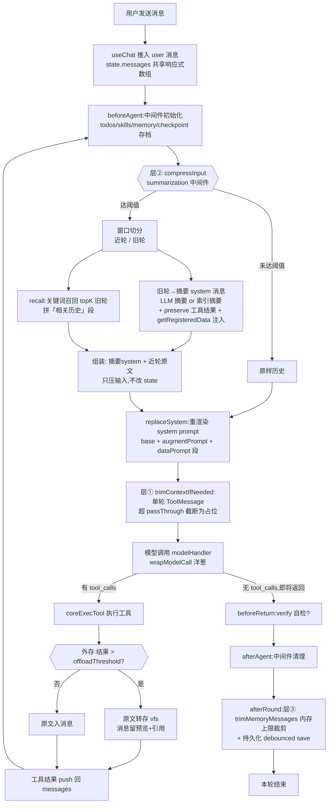
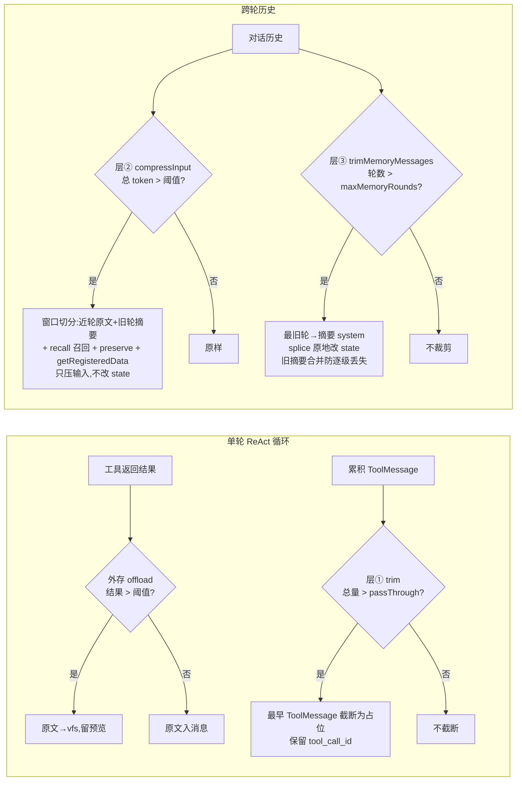
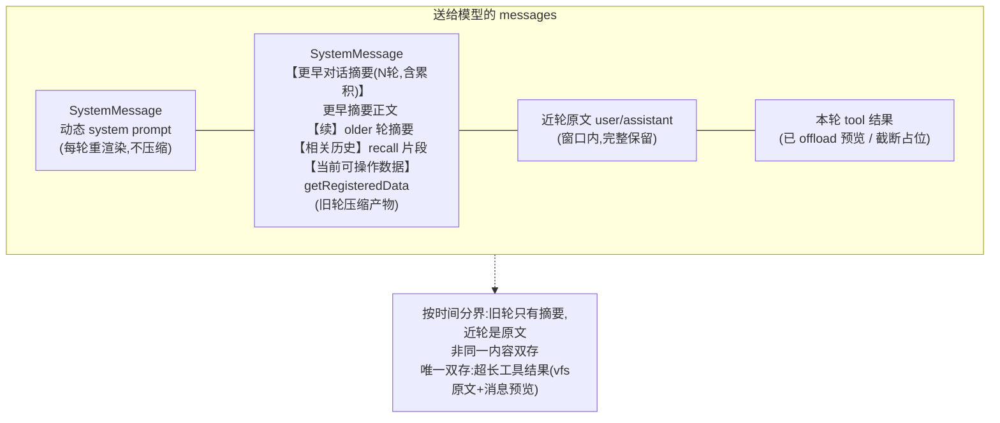

# 上下文组成与压缩策略

> page-agent-sdk 的上下文(送给大模型的 messages)如何组装、何时压缩、压缩后长什么样。含每层原理、流程、参数、边界与流程图。
>
> 对齐 Deep Agents 的 context 管理思路,但面向浏览器场景做了自适应与零成本兜底。

---

## 一、总览:三层压缩 + 一外存

SDK 的上下文管理由 **3 层压缩 + 1 个外存机制** 组成,各管一段、按需触发、纯内存会话级(不跨会话):

| 层 | 机制 | 触发时机 | 作用域 | 是否改 `state.messages` | 有损 | 成本 |
|---|---|---|---|---|---|---|
| **外存** | 大结果外存 `offload` | 工具返回时 | 单条工具结果 | 否(只改该条消息内容) | 否(原文进 vfs) | 零(无 LLM) |
| **①** | 单轮截断 `trimContextIfNeeded` | 每轮模型调用前 | 单轮内 ToolMessage | 否(只改输入副本) | 是(截断) | 零 |
| **②** | 跨轮摘要 `summarization`(`compressInput`) | 每轮 agent 开始前(`beforeAgent`) | 跨轮历史 | **否**(只压输入,state 保留原文) | 是(旧轮→摘要) | LLM 摘要或零(索引摘要) |
| **③** | 内存轮数上限裁剪 `trimMemoryMessages` | 每轮 agent 结束后(`afterRound`) | 跨轮历史 | **是**(splice 原地改) | 是(旧轮→摘要) | 零(索引摘要) |

**核心设计原则**

- **各管一段**:外存管单条大结果,①管单轮内累积,②管跨轮历史压缩,③管内存 OOM 兜底
- **零成本兜底**:②③默认用「索引摘要」(零 LLM 成本),②可选 LLM 摘要;①③始终零成本
- **不丢关键信息**:外存原文进 vfs 可回读;②③压缩时注入数据注册表快照 + 保留指定工具结果摘要;③旧摘要并入新摘要防逐级丢失
- **自适应**:阈值按模型上下文窗口(`contextWindow`)自适应,大模型几乎不触发,小模型提前触发

---

## 二、上下文组成

每轮 agent 行动前,送给模型的 messages 由 **3 部分**拼接:

```
[ SystemMessage(动态组装) , ...对话历史(user/assistant/tool) ]
        ↑ 1) system prompt                ↑ 2+3) 历史与工具结果
```

### 1. System Prompt(每轮动态组装,从不压缩)

`buildSystemPrompt()` 每轮重新拼接,**不进对话历史、不被压缩**:

```
base systemPrompt(集成方注入的身份/规则 + 自动追加的 reliableWriteRules)
  + augmentPrompt 段(按中间件装载序,正序拼接):
      usageHints  能力用法提示
      todos       当前任务清单渲染
      skills      已声明技能索引
      memory      持久指令
      ...用户自定义中间件
  + buildDataPrompt 段(schema .describe() 自动提取的字段说明)
```

- base systemPrompt 缺省「JSON 操作助手」+ `reliableWriteRules`(`appendReliableWriteRules` 默认 `true`,用 `---` 分隔线区分)
- 各段可选(能力关则不注入);全部关则只剩 base + dataPrompt
- **每轮重渲染** → todos 推进、memory 更新、`setData` 替换 schema 都能即时反映,且无累积损失

### 2. 对话历史(user / assistant,可被压缩)

`state.messages` 响应式数组,与 UI 共享同一引用。每条 assistant 可含 `reasoning`(思考)与 `steps`(工具步骤)。

- 由 useChat / `core.send` 推入
- 是②③压缩的主要对象

### 3. 工具结果(tool 角色,单轮 ReAct 循环内累积)

- 仅在**单次 chat() 的 ReAct 循环内**累积(ToolMessage),跨轮不保留
- 超长时走「大结果外存」(见下文)

> 注:跨轮 `state.messages` 只含 user/assistant 文本 + ③trim 产生的摘要 system;工具结果不跨轮。所以跨轮压缩②③聚焦于「窗口 + 摘要 + 召回」。

---

## 三、外存:大结果外存(`offload`)

### 原理

工具返回的结果可能很大(如 `read` 整个大 JSON、`query_data` 命中大量节点)。若整条进 LLM 上下文,既费 token 又可能被截断丢信息。外存机制在**工具结果的唯一收口处**(`coreExecTool`)拦截:超阈值时把原文转存到 **vfs**(内存虚拟工作区),消息里只留**预览 + vfs 引用**。LLM 后续可经 `vfs_read` / `vfs_grep` 按需回读完整或局部数据 → **不丢信息,只省 token**。

### 流程

1. 工具执行返回 `result`,序列化为 `content` 字符串
2. `offloadLargeResult(content, ctx)` 判断:
   - `content.length <= threshold`(默认 6000,≈1500 token)→ **原样返回**(不外存)
   - `content.length > threshold` 且 **vfs 可用**(`ctx.files` 存在 + `allTools` 含 `vfs_read`)→ 写 vfs(`large_results/<toolName>-<contentHash>.txt`,**内容寻址去重**:相同内容 → 相同文件名,复用已有文件只更新 `updatedAt`,反复外存不新增文件),返回「首 1000 字预览 + vfs_read 引用 + vfs_grep 引用」
   - `content.length > threshold` 但 **vfs 不可用** → 按 `passThroughChars` 放行:≤ 放行上限完整放行(信任大上下文),> 上限才硬截断兜底(末尾附提示「建议开启 vfs」)

> **内容寻址去重**:文件名用 `contentHash(content)`(djb2 变体)而非随机 id,相同内容复用同一 vfs 文件。避免反复加载同一 skill / 重复查询同一大数据时反复占 vfs 空间(虽有 LRU 4MB 兜底,但去重更优)。不同内容 → 不同文件名,各一份。

> **skill 全文缓存可主动失效**:`skills` 中间件实例级 `contentCache`(跨轮跨会话复用 skill 全文,避免重复 `getContent`/读 vfs/重复 offload)默认长期保留。集成方可经 `sdk.setSkills(skills)`(替换整个 skill 列表,同名覆盖,清全部缓存)或 `sdk.invalidateSkillCache(name?)`(清指定/全部缓存)主动失效 —— 用于动态 skill(如懒加载组件场景运行时增删 skill)内容变化后,确保下次 `load_skill` 重新取最新全文(含 vfs doc)。

### 参数

| 参数 | 默认 | 自适应公式 |
|---|---|---|
| `offloadThreshold` | 6000 字符 | `max(2000, min(20000, contextWindow × 3.5%))`(1M 上下文→20000,32K→2000) |
| `passThroughChars` | 同 threshold | `min(200000, max(threshold, contextWindow × 70%))`(大模型放行上限 200k) |
| `vfs.maxBytes` | 4MB | vfs LRU 淘汰上限 |

### 边界

- **唯一「原文另存」**:外存是唯一保留原文的机制(其余历史压缩后原文即丢)
- vfs 不可用(`capabilities.vfs:false`)时退化为截断,会丢信息(故 vfs 默认开启)
- 外存结果不进跨轮历史(单轮内消费),但 vfs 文件本身会话级保留(可跨轮回读)

---

## 四、层 ①:单轮工具结果截断(`trimContextIfNeeded`)

### 原理

单轮 ReAct 循环内,LLM 可能连续调用多个工具,每个工具的 ToolMessage 都累积进上下文。虽然单条已由外存限制,但**多条累积**仍可能超模型上下文。①在每轮模型调用前检查累积总量,超放行上限时从**最早的 ToolMessage** 起截断为「首 N 字 + 原长度提示」占位,**保留 `tool_call_id`**(结构完整,模型仍能对应工具调用与结果)。

### 流程

1. 每轮 `beforeModel` 后、模型调用前,`trimContextIfNeeded(currentMessages, offloadPassThrough)` 被调用
2. 计算所有消息总字符数 `total`
3. `total <= maxChars` → 原样返回(不截断)
4. `total > maxChars`:
   - `need = total - maxChars`(需裁掉的字符数)
   - `keep = clamp(100, 400, round(maxChars/500))`(自适应:小阈值保留首 100、大阈值保留首 400)
   - 从最早 ToolMessage 起,把 `content.length > 400` 的截断为 `…[已自动压缩 N 字符,保留首 keep]\n + content.slice(0, keep)`
   - 累计裁掉字符达 `need` 即停,后续 ToolMessage 保留
5. **只压输入副本,不改 `state.messages`** → 每轮从完整原文重新判断,无累积损失叠加

### 参数

| 参数 | 默认 | 说明 |
|---|---|---|
| `offloadPassThrough` | 见外存公式 | 单轮内 ToolMessage 累积上限;大模型阈值高(200k)几乎不触发 |
| `keep` | 自适应 | 截断时保留的首字符数,clamp [100, 400] |
| 最小截断长度 | 400 | `content.length <= 400` 的 ToolMessage 不截断(太短不值得) |

### 边界

- **不动对话/system/ai 消息**,只截 ToolMessage
- 保留 `tool_call_id`,模型仍能对应工具调用链
- 大模型(1M 上下文)放行上限 200k,单轮几乎不触发;小模型(32k)放行上限 ~22k,长工具链可能触发
- 只压输入副本,`state.messages` 原文不变 → 每轮重新判断,无累积损失

---

## 五、层 ②:跨轮摘要压缩(`summarization` / `compressInput`)

### 原理

跨轮历史随着对话推进不断增长,旧轮的细节对当前问题往往不再关键。②在每轮 agent 开始前(`beforeAgent`),把历史切成**近轮窗口**(原文完整保留)与**旧轮**(压成一条 system 摘要消息)。摘要方式可选:

- **索引摘要**(零 LLM 成本,默认):每轮取 `userQuery` 60 字 + `assistantPreview` 80 字 + 工具名列表,拼成 `- 第N轮:query → preview [工具: ...]`
- **LLM 摘要**(`enableLLMSummary:true`):把索引摘要喂给摘要专用 LLM 生成更连贯段落(失败/超时回退索引摘要)

同时做**关键词召回**:从旧轮按当前问题关键词检索最相关的 Top-K 轮,把命中轮的简短片段拼进摘要消息的「相关历史」段,让 LLM 既能看到压缩摘要,又能拿到与当前问题直接相关的早期细节。

**关键:只压输入,不改 `state.messages`** → 每轮从完整原文重新摘要,无累积损失叠加(与③的本质区别)。

### 流程

1. `beforeAgent` 触发 `summarization` 中间件的 `compressInput(messages)`
2. `groupRounds(messages)` 按用户消息切分为轮次(一轮 = 一条 user + 其后所有 assistant)
3. **提取头部旧摘要正文**:若 messages 头部已有③留下的「【更早对话摘要】」system,提取其正文(去 header),稍后并入新摘要(防③留下的累积历史被②静默丢失)
4. **窗口切分**(token 驱动优先):
   - 有 `contextWindow` → `totalTokens = Σ estimateRoundTokens(round)`;`totalTokens <= min(contextWindow × summaryThresholdRatio, promptSoftCap)` → 不触发;否则从最新轮往回累加 token 到 `contextWindow × windowRatio` 为止,其后为旧轮
     - `promptSoftCap`(成本上限,context-economy-phase2):`resolvePromptSoftCap(contextWindow, promptSoftCapTokens)` 单一真源解析 —— 显式 >0 用该值 / 显式 0 = Infinity(关)/ 未传且窗口 ≥320K → 默认 160_000 / 其余不参与(Infinity)。取 `min` 语义:softCap 只会更早触发、不会放宽带宽,小窗口模型的原行为不受影响
     - 动机:大窗口模型(flash 类 1M)按 ratio 触发要烧到 50 万 token 才压缩,成本不可接受;softCap 把「何时压缩」从窗口维度改成成本维度
     - 反射:`inspect().getInfo().compression = { contextWindow, summaryThresholdRatio, promptSoftCap }` 可核对生效值
   - 无 `contextWindow` → 轮数模式:`rounds.length <= summaryThresholdRounds` → 不触发;否则保留最近 `windowRounds` 轮,其余为旧轮
5. **摘要生成**:
   - `enableLLMSummary && llmInvoke` → `summaryText = await llmInvoke(indexSummarize(older, preserveSet))`(失败回退索引摘要)
   - 否则 → `summaryText = indexSummarize(older, preserveSet)`
   - `indexSummarize` 对 `preserveLastToolResults` 集合内的工具,额外保留其 `result` 摘要(120 字)进「字段提示」段(防字段描述被摘要掉)
6. **召回**:`enableRecall` → `recallRounds(older, query, recallTopK)` 按当前问题关键词(去停用词)匹配旧轮,返回 Top-K 命中轮的简短片段
7. **组装摘要 system 消息**:
   ```
   【对话历史摘要】以下是之前 N 轮对话的要点(最新 M 轮已完整保留):
   <summaryText>
   【更早累积摘要】           ← 若有头部旧摘要,并入此处(防逐级丢失)
   <prevSummaryBody>
   【与当前问题可能相关的早期对话】  ← recall 命中片段
   - 第m轮:...
   【当前可操作数据(动态增删后的最新状态,操作前以 read 为准)】  ← getRegisteredData 注入
   - 主数据对象描述
   ```
8. 返回 `[summaryMsg, ...recentMessages]` 作为压缩后输入;**`state.messages` 原文不变**

### 参数

| 参数 | 默认 | 说明 |
|---|---|---|
| `contextPreset` | `auto` | 预设档位(见七) |
| `summaryThresholdRatio` | 0.5(auto) | 历史 token 超 `contextWindow × 此比例` 触发 |
| `promptSoftCapTokens` | 窗口 ≥320K 时 160_000 | 触发上限的更紧上界(取 `min`):显式 >0 用该值 / 显式 0 = 关 / 未传且窗口 ≥320K 默认 160_000 / 小窗口不参与。防大窗口模型按 ratio 触发前烧穿预算 |
| `windowRatio` | 0.4(auto) | 保留近轮的 token 预算比例 |
| `recallTopK` | 3(auto) | 召回最相关旧轮数 |
| `enableRecall` | true | 是否启用关键词召回 |
| `enableLLMSummary` | true(auto) | 是否用 LLM 摘要(否则零成本索引摘要) |
| `summaryLlm` | 主 llm | 摘要专用模型(可配更便宜的小模型) |
| `summaryTemperature` | 0.3 | 摘要 LLM 温度 |
| `summaryMaxTokens` | 1024 | 摘要 LLM 最大输出 |
| `summaryTimeoutMs` | 15000 | 董时回退索引摘要不阻塞 |
| `preserveLastToolResults` | `['schema_data','read']` | 跨轮摘要时保留这些工具的 result 摘要(防字段描述被摘要掉);设 `[]` 关(4.9 起 describe_data → schema_data) |
| `getRegisteredData` | 自动注入 | 返回当前主数据 description,压缩时注入摘要(防 LLM 基于过时记忆操作已 `setData` 替换的 schema) |
| `contextOptions` | — | 细参覆盖预设;`false` 关闭 summarization 中间件 |

### 边界

- **只压输入,不改 state** → 每轮从完整原文重新摘要,无累积损失(与③的本质区别)
- **与③协同**:③会把「【更早对话摘要】」system 留在 messages 头部,②的 `groupRounds` 跳过头部 system → 旧累积摘要会被②静默丢失。②已修复:`compress` 提取头部旧摘要正文并入新摘要的【更早累积摘要】段
- 配置建议 `maxMemoryRounds >= summaryThresholdRounds`(否则③先裁,②永不触发)
- `summaryLlm` 缺 apiKey 自动回退索引摘要并 warn(非 debug 也 warn)

---

## 六、层 ③:内存轮数上限裁剪(`trimMemoryMessages`)

### 原理

②只压输入不改 state,长会话下 `state.messages` 仍无限增长 → 内存 OOM 风险。③在每轮 agent 结束后(`afterRound`)检查**轮数**,超 `maxMemoryRounds` 时把**最旧轮**压缩成一条「【更早对话摘要】」system 消息,`splice` **原地替换** `state.messages`(保持响应式引用)。这是唯一**真正改 state** 的压缩层。

### 流程

1. `afterRound` 调 `trimMemoryMessages()`
2. `trimMemoryMessagesImpl(messages, maxMemoryRounds)`:
   - `maxMemoryRounds <= 0` → 关闭,不裁
   - `groupRounds(messages)`,`rounds.length <= maxMemoryRounds` → 不触发
   - 否则:`keepFromIdx = rounds[rounds.length - maxMemoryRounds].startIdx`;`older = rounds.slice(0, rounds.length - maxMemoryRounds)`
3. **提取头部旧摘要正文**(关键修复):`groupRounds` 跳过头部 system,头部已有的上一轮「【更早对话摘要】」不在 `older` 内 → 若不并入会被 splice 静默丢弃,更早摘要逐级丢失。函数遍历头部 system,提取旧摘要正文(去 header)
4. **生成新摘要**:
   - `olderDigest = older.map(r => - 第N轮:query(60字) → preview(80字)).join('\n')`
   - 有旧摘要:`content = 【更早对话摘要(M 轮,含累积)】\n<prevBody>\n【续】\n<olderDigest>`
   - 无旧摘要:`content = 【更早对话摘要(M 轮)】\n<olderDigest>`
5. 返回 `{ trimmed: true, deleteFrom: 0, deleteCount: keepFromIdx, summary }`
6. `messages.splice(0, keepFromIdx, summary)` 原地替换(保持响应式引用)

### 参数

| 参数 | 默认 | 说明 |
|---|---|---|
| `maxMemoryRounds` | 50 | 内存保留的对话轮数上限;超限压缩最旧轮为摘要;`0` 关闭 |

### 边界

- **唯一改 state 的压缩层**(②只压输入);`splice` 保持响应式引用,UI 自动更新
- `storage:false` 也生效(纯内存 OOM 兜底)
- **旧摘要合并防逐级丢失**:头部旧摘要正文并入新摘要【续】段,保证累积历史不丢
- 与②协同:③留下的摘要被②下一轮提取并入(见层②流程步骤 3)

---

## 七、压缩后的上下文长这样

压缩触发后,送给模型的 messages 结构(按时间分界,非同一内容双存):

```
[
  SystemMessage(动态 system prompt),        ← 每轮重渲染,不压缩
  SystemMessage(【更早对话摘要(N轮,含累积)】  ← 旧轮压缩(层②或③产物)
      ...更早摘要正文...
      【续】
      - 第k轮:query → preview
      ...older 轮摘要...
      【与当前问题可能相关的早期对话】        ← recall 召回片段(层②)
      - 第m轮:... )
  ...近轮原文(user/assistant)...             ← 窗口内原文保留
  ...本轮 ReAct 的 tool 结果(已 offload/截断)  ← 外存 + 层①
]
```

**唯一「原文另存」**:超长工具结果 → vfs 存原文 + 消息留预览(外存,省 token 又不丢)。其余历史原文压缩后即丢,仅保留摘要。

---

## 八、流程图

### 图 1:每轮上下文构建与压缩总流程



### 图 2:压缩策略决策(各管一段)



### 图 3:压缩后消息结构(时间分界)



---

## 九、配置

### 预设档位(`contextPreset`,默认 `auto`)

| 档位 | summaryThresholdRatio | windowRatio | recallTopK | enableRecall | enableLLMSummary | 适用 |
|---|---|---|---|---|---|---|
| `auto`(默认) | 0.5 | 0.4 | 3 | true | true | 通用,按模型窗口自适应,默认 LLM 摘要 |
| `conservative` | 0.7 | 0.5 | 2 | true | false | 大模型/省成本,更晚触发,零成本索引摘要 |
| `aggressive` | 0.3 | 0.3 | 5 | true | true | 小模型/省上下文,更早压缩,更多召回 |

### 细参覆盖(`contextOptions`)

在预设基础上覆盖个别字段:`contextWindow` / `windowRounds` / `summaryThresholdRounds` / `summaryThresholdRatio` / `promptSoftCapTokens` / `windowRatio` / `recallTopK` / `enableRecall` / `enableLLMSummary` / `preserveLastToolResults` / `getRegisteredData`。`contextOptions: false` 关闭 summarization 中间件。

### 摘要专用 LLM

- `summaryLlm`:摘要专用模型(不配用主 agent llm);缺 apiKey 自动回退零成本索引摘要并 warn
- `summaryTemperature`(默认 0.3)/ `summaryMaxTokens`(默认 1024)/ `summaryTimeoutMs`(默认 15000,超时回退索引摘要不阻塞)

### 内存/回退上限

- `maxMemoryRounds`(默认 50):超限压缩为摘要 system;`0` 关闭层③
- `vfs.maxBytes`(默认 4MB):超限 LRU 淘汰最旧文件
- `maxSnapshots`(默认 20):dataOps per-path 快照栈
- `checkpoint.maxCheckpoints`(默认 5):会话级回滚档

---

## 十、可观测性

- `agent.inspect().lastCompression`:最近一次跨轮压缩统计(triggered / roundsTotal / roundsSummarized / roundsRecalled / originalMessages / compressedMessages / strategy)
- DebugDrawer「Agent 信息」tab 展示压缩统计
- `agent.inspect().checkpoints`:会话级回滚档列表
- `sdk.usage`:累计 token 用量(每轮 LLM 调用累加,经 `onEvent('usage')` 单轮外发)

---

## 十一、与 Deep Agents 的差异

| 维度 | Deep Agents | page-agent-sdk |
|---|---|---|
| 跨轮压缩 | checkpointer 每步存档 | 层②输入压缩(不改 state)+ 层③内存裁剪(改 state) |
| 摘要累积 | 持久化 checkpoint 历史 | 旧摘要合并进新摘要(防逐级丢失),但仅内存 |
| 工具结果 | 进 graph state | 单轮内累积,超长外存到 vfs(原文不丢) |
| store | 跨 thread KV 语义记忆 | 未实现(memory 为单字符串指令) |
| 时间旅行 | 任意历史 checkpoint(持久化) | 仅内存 checkpoint(刷新丢) |

**一句话**:page-agent-sdk 上下文 = 动态 system prompt(不压缩)+ 旧轮摘要 + 近轮原文 + 本轮工具结果(超长外存 vfs);外存 + 3 层压缩自适应触发,零成本兜底,旧摘要合并防累积丢失。
