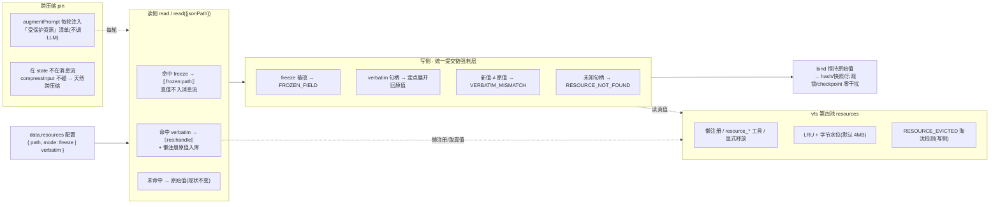
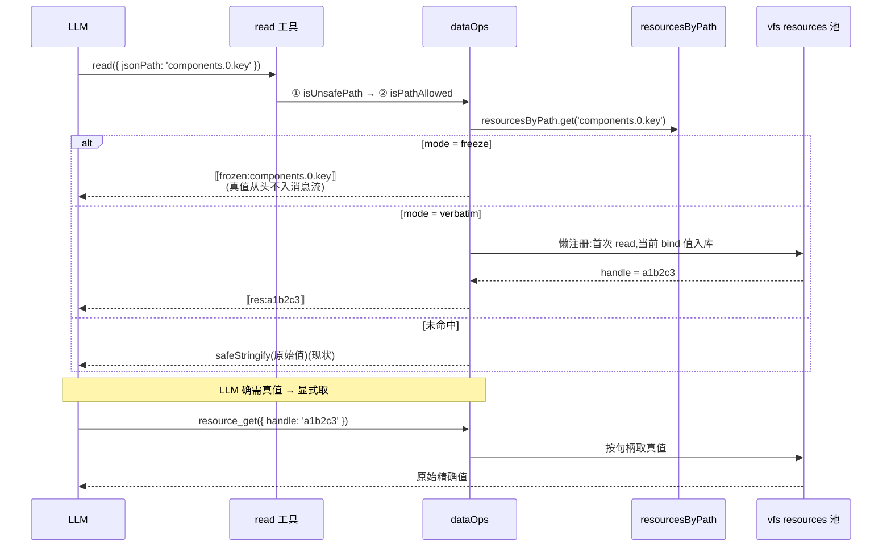
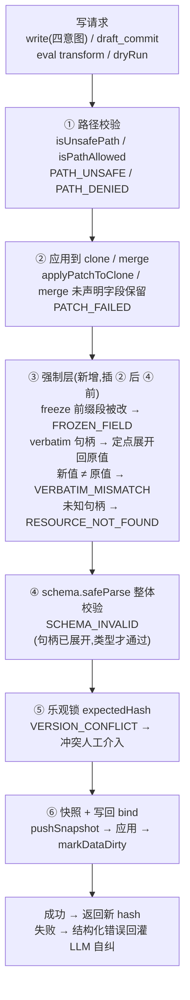
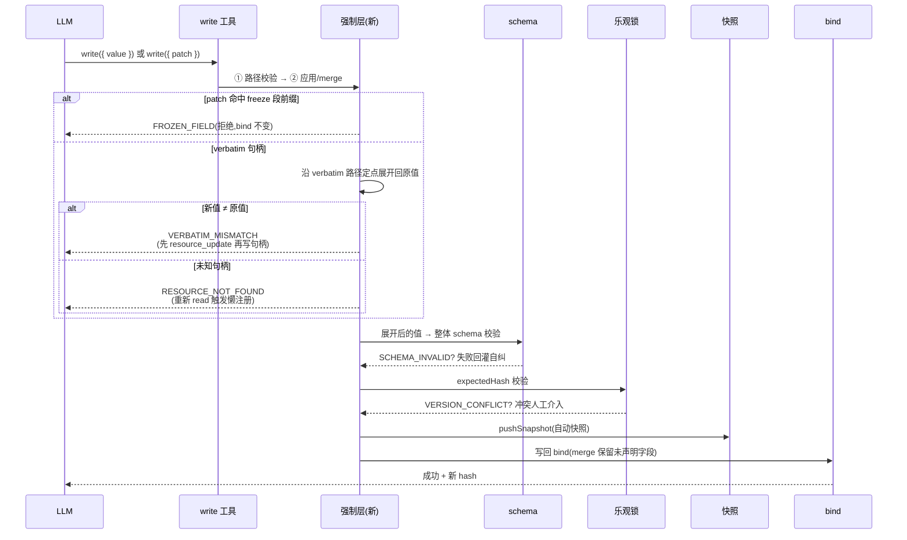
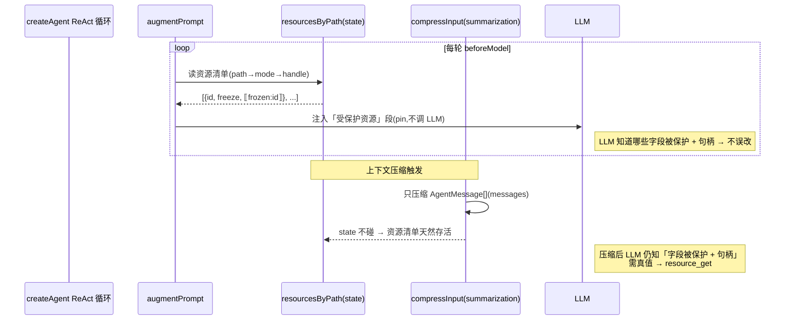

# 占位符替换读写:精确值保护(设计文档)

> **状态**:规划阶段(未实施)。对应 OpenSpec change [`placeholder-protected-read-write`](../openspec/changes/2026-08-04-placeholder-protected-read-write/proposal.md),本文为其设计落地版(原理 + 流程图/时序图 + 实施前审查结论)。
>
> **一句话核心**:给「需要精确保存的内容」(id / hash / 长 verbatim 串 / 关键配置)一条**占位符替换读写**通道 —— read 侧把精确值换成稳定句柄(值不入 LLM 消息流,防压缩丢字 + 防幻觉改错),写侧强制精确性(freeze 拒绝 / verbatim 展开校验),配套资源存储(vfs 第四池)与生命周期(懒注册/显式释放/淘汰检测/跨压缩 pin)。

---

## 1. 原理:为什么能防两类问题

精确值如果直接给 LLM,有两个坑:

| 坑 | 机理 | 占位符解法 |
|---|---|---|
| **压缩丢字** | 值在消息流里,context 压缩时被摘走 | 精确值**根本不在消息流里**,LLM 只看到稳定短句柄 |
| **幻觉改错** | LLM 凭记忆「猜一个差不多」的值写回 | LLM **没见过真值** → 既记不错、也无从猜错 |

**关键不变式(全设计的基石)**:

> **bind 恒持原始值,占位符只在「读渲染层」与「写提交层」做变换,永不落 bind。**

因为 hash(A3 惰性)/ A4 子路径 hash / 快照(A2)/ clone / checkpoint 全部基于 bind,而 bind 里的值从头到尾没变过 → **全部零干扰**。

### 两条保护模式

| 模式 | 语义 | read 时 | 写侧 |
|---|---|---|---|
| **freeze**(P0) | 这字段**不能改**(id/hash/时间戳/系统维护字段) | `⟦frozen:<path>⟧`,真值**入都不入**消息流 | 改它 → `FROZEN_FIELD` 拒绝 |
| **verbatim**(P1) | 这字段**改不得丢字**(长配置/签名串/密钥材料) | `⟦res:<handle>⟧` + 原值**懒注册**进资源池 | 句柄 → 展开回原值;写了个新值且 ≠ 原值 → `VERBATIM_MISMATCH` |

---

## 2. 整体流程

一句话:**配置声明 → 读侧替换 → 写侧强制 → bind 恒原始值;资源池管真值,pin 保跨压缩。**

---

## 3. 读侧时序(含懒注册)

注意:freeze 真值**从未进入**任何返回路径;verbatim 真值只在懒注册那一刻进池,此后 LLM 只碰句柄。

---

## 4. 写侧校验链(六步,③ 为新增强制层)

**两个顺序硬约束**:
- ③ 句柄展开 **必须先于** ④ schema 校验 —— 否则 `⟦res:a1b2c3⟧` 字符串会被当成 `number` 字段的真实值,类型必挂;
- freeze 比对在 ② merge/apply **之后** —— 要比较目标路径当前值改没改。

---

## 5. 写侧时序

---

## 6. 资源生命周期

```mermaid
stateDiagram-v2
    [*] --> Declared: 配置 data.resources
    Declared --> Registered: 首次 read 懒注册<br/>当前 bind 值入库 → 句柄
    Registered --> Registered: resource_update 改值<br/>(仅 verbatim;freeze 拒绝)
    Registered --> Released: resource_delete / sdk.releaseResources
    Released --> Registered: 再次 read 懒注册(新句柄)
    Registered --> Evicted: 池 LRU 字节水位淘汰
    Evicted --> Registered: 再次 read 懒注册自愈<br/>(写侧展开时报 RESOURCE_EVICTED 提示重注册)
    Declared --> Cleared: setData 替换(路径可能失效)
    Cleared --> Declared: 新 data 配置重新声明

    note right of Registered: checkpoint 随 vfs 保存/恢复<br/>dataOps 快照/restore 不受影响<br/>(bind 恒持原始值)
```

### 生命周期矩阵

| 事件 | 行为 |
|---|---|
| 首次 read 受保护路径 | 懒注册:当前 bind 值入库 → 返回句柄 |
| `setData` 替换 | 清空 resources(路径可能失效;与快照/hash 重置一致) |
| checkpoint save/restore | 随 vfs 天然保存/恢复(resources 池在 vfs 内) |
| dataOps 快照/restore | 不受影响(bind 恒持原始值,占位符只在读写边界) |
| 池 LRU 淘汰 | **读侧**自愈(重新懒注册);**写侧**展开句柄时 `RESOURCE_EVICTED`(原值不可知,提示重注册) |
| 显式释放 | `resource_delete` / `sdk.releaseResources` |

---

## 7. 跨压缩 pin

这是方案里最优雅的一块:**pin 段数据在 `state` 里、不在 messages 里**,所以 `compressInput` 根本不碰它 —— 与 workingMemory / mission 同一机制,**不用改 summarization 一行代码**。

---

## 8. 实施前必须锁死/补齐的点(审查结论)

> 2026-08-04 设计评审。骨架成立,无需推翻;以下 3 架构缺口 + 4 语义细节 + 3 写回/删除边界 + 2 数据一致性漏洞 + 3 实现偏差需在实施前补进规划并锁死。

### A1. 占位符替换的作用面 —— 只有 `read` 被覆盖(架构缺口)

替换目前只写在 `read`/`read({jsonPath})`。SDK 还有多个**读数据的面**未被覆盖:

| 读面 | 所在模式 | 是否被替换覆盖 |
|---|---|---|
| `read` / `read({jsonPath})` | simple+advanced | ✅ 已设计 |
| `describe_data` | 恒暴露 | ❌ 仅返说明文本(无值) |
| `query_data` / `search_data` | simple 就有 | ❌ 直接返真值 |
| `history_data` / `diff_data` | simple/advanced | ❌ 读快照真值 |
| `eval_script` | simple+advanced | ❌ 沙箱脚本直读 bind |

直接矛盾于 freeze 的核心声称「**精确值不入 LLM 消息流**」—— LLM 用 `query_data`,绕一圈就把冻结值看走了。

**结论(选①,与 Non-goal「精确性非安全遮蔽」一致)**:替换仅作用于**结构化读**(read / describe_data);`query_data`/`search_data` 是**显式查询**、`eval_script` 是**信任层沙箱**,返回真值不算破防 —— 因为 **freeze/verbatim 的真正防线在写侧强制**(改冻结路径照拒、verbatim 写非句柄新值照拒),读侧占位符只是「省 token + 防止无意识引用」。文档把「值不入消息流」表述收紧为「**结构化读默认不泄露;显式查询/沙箱可读真值,写侧强制兜底**」。不选全读面统一替换(更重,且与定位冲突)。

### A2. `expandHandles` 全局深遍历 —— 改定点展开(架构缺口)

原设计 `expandHandles` 深度遍历全树遇 `⟦res:⟧` 即替换,有两个隐患:
- **误展开(正确性)**:非受保护字段里恰好以 `⟦res:` 开头的合法字符串被错误替换;
- **性能**:大 JSON 每次写全树遍历,几百 K 成本不可忽略。

**结论**:不做全局深遍历,改为**沿 verbatim 受保护路径定点展开**(`getByPath` 定位 → 检查该位值是否为句柄串 → 替换)。非受保护路径完全不碰 → 无误展开 + 成本 O(受保护路径数) 而非 O(全树);「句柄串被当真实值校验」的顺序问题也因只改受保护位而天然成立。

### A3. 淘汰语义分侧:读侧自愈、写侧报错(架构缺口)

原设计写「资源被池 LRU 删 → `RESOURCE_EVICTED`(读/写)时报错」。

**结论**:**读侧根本不需要报错** —— bind 恒持原始值,`ensureResource` 懒注册时用当前 bind 值重建即可,天然自愈(新句柄);只有**写侧展开句柄**时资源池缺失才真不知道原值(值不在消息流里),此时才报 `RESOURCE_EVICTED`。

| 时机 | 资源被淘汰后 | 行为 |
|---|---|---|
| read / resource_get | bind 有原值可重建 | 懒注册自愈(新句柄) |
| 写侧 expandHandles | 原值不可知 | `RESOURCE_EVICTED`(提示重注册) |

### B1. freeze 匹配按 jsonPath **段边界**,非字符串前缀

`freeze 'components'` 应命中 `components.0.key`,但**不能**误伤 `componentsA` / `componentsExtra`。锁死为「按段边界匹配」并进 selftest。

### B2. handle 派生规则 = 路径派生短哈希(锁死)

- 值 hash:值变了句柄就变 → `resource_update` 后 LLM 手里旧句柄失效 → 撞 `RESOURCE_NOT_FOUND`;
- **路径派生短哈希(选定)**:`⟦res:<path 短哈希>⟧`,值变句柄不变 → 跨轮稳定,update / 淘汰重注册后句柄不漂移,与 pin 每轮重建天然配套;并发懒注册不产生句柄漂移。

### B3. setData 清空 vs checkpoint restore 时序

`setData` 清空资源,但 checkpoint 随 vfs 天然保存 resources 池 → setData 后再 restore 会复活「路径已失效的旧句柄」。后续 read 懒注册自愈,但应写明:restore 后旧句柄读写撞 `RESOURCE_NOT_FOUND`,走自愈。

### B4. verbatim 路径当前**无值**时懒注册什么

路径在 bind 里还不存在(组件未渲染)→ **skip(不注册)**,write 撞 `RESOURCE_NOT_FOUND` 提示「该字段不存在」—— 比注册 `undefined` 语义更清晰。

### C1. 整体写回时占位符被原样带回 —— 必须识别为「未修改」(最关键)

整体读 → 整体写时,LLM 会把占位符**原样带回**:verbatim 回显 `⟦res:handle⟧`、freeze 回显 `⟦frozen:path⟧`。强制层必须把「回显占位符」识别为「未修改」:

| 受保护路径 | LLM 回显 | 正确行为 |
|---|---|---|
| verbatim | `⟦res:handle⟧` | 定点展开回真值(等于没改)→ schema → merge |
| verbatim | 真实新串(≠ 原值) | `VERBATIM_MISMATCH` |
| verbatim | 原值(之前 get 过,原样写回) | 视为未改,放行 |
| freeze | `⟦frozen:path⟧` | **跳过,保留当前值** |
| freeze | 真实新值(≠ 当前) | `FROZEN_FIELD` |

**⚠️「merge 语义天然保留冻结值」这句话不成立**:`safeMerge`(`jsonUtils.ts:18`)是顶层**浅合并**,`target[k] = src[k]`,不会跳过冻结字段。若 LLM 整体写回时把 `⟦frozen:path⟧` 字符串原样带回,浅合并会把**占位符字符串直接写进 bind**(数据污染);或按「freeze 在 merge 后比对当前值」的逻辑比对必不一致 → 误报 FROZEN_FIELD。

**结论**:整体 set 前置一个**沿受保护路径的深度 normalize** —— incoming 值在受保护路径上「展开(verbatim 句柄)/ 保留当前值(freeze 回显)」,然后才 schema → merge。这是 A2 定点展开的**三态扩展**(展开 / 保留 / 拒绝),仍非全局深遍历。

### C2. 批量 patch 失败必须带 `patches[i]` 定位

原子性有(applyPatchesToBind 先 clone 逐 patch 校验,全过才 applyLive),但失败若只报「批量写入失败」,LLM 只能整批盲目重试烧 token。**结论**:强制层失败沿用现有 `patches[i]` 定位约定,如 `patches[2] @ components.3.props.copy: VERBATIM_MISMATCH,需先 resource_get/update`。

### C3. remove/delete 受保护路径 —— 语义未定义,会静默删

`op:'remove'` / `write({patch, del:true})` 走 `deleteByPath` 分支;FROZEN_FIELD / VERBATIM_MISMATCH 只在 patch **set/merge** 时比对值,**拦不住静默删掉一个冻结/verbatim 字段**(删掉冻结字段 = 改了一个冻结字段)。

**结论**:freeze 路径 remove/delete → `FROZEN_FIELD`;verbatim 路径 remove/delete → 默认**拒绝**(要删先 `resource_delete` 释放再删,或视作改值引导先 `resource_update`)。容器 op(merge/append)命中受保护路径同样按 mode 处理(与 op 无关)。

### D1. verbatim 池值 vs bind 当前值漂移 —— 回退/导入会被展开旧值覆盖(真漏洞)

写侧展开句柄时,若**资源池里存的值 ≠ bind 当前值**,展开旧值会把 bind 覆盖回旧值。漂移源:**restore_data 回退**(`dataOps.ts:442` 只 `restoreLive` bind、不碰池)、**importData 替换**(`createChatSdk.ts:1802` 直改 bind、不清池)、**setData 替换**、**外部代码直接改 bind**。

> **具体危险时序**:read(池='B',hash₁)→ restore_data 回退到快照 'A'(池仍='B',hash₂)→ LLM 重新 read(拿到 hash₂;懒注册已存在故句柄不变)→ write 回显 `⟦res:handle⟧` → 展开池里的 'B' → **把刚回退的 'A' 又覆盖回 'B'**。**乐观锁拦不住**(重新 read 后 hash 匹配)。

**结论(锁死)**:写侧展开句柄时**比对「池值 vs bind 当前值」**——不等说明 bind 被非资源感知路径改过,以 **bind 当前值为准自动重注册**(句柄不变,值更新)、按「未改」放行。与读侧懒注册自愈同哲学。**一个对策覆盖 restore/setData/importData/外部改 bind 全部四种漂移源**。

### D2. checkpoint 增量 × 资源池版本不一致

`resource_update` 只改池不改 bind → checkpoint save 时 vfs 脏(池新值入库)但 bind 用 `lastBindClone`(**旧 bind**)→ checkpoint 快照内「池值≠bind」→ 之后 restore 即产生 D1 漂移。

**结论**:`resource_update` 同时标 dataOps 脏(或 checkpoint save 把「池与 bind 同版本」纳入判断),保证 checkpoint 内池与 bind 始终同版本。

### F1-F3. 实现与设计不符(必须照做)

| # | 不符 | 结论 |
|---|---|---|
| F1 | **eval transform 整体替换不走 commitSetToBind**(`dataOps.ts:578-596` 内联 `safeParse`+`safeMerge`/`restoreInPlace`,独立第三条落地路径)→「统一前置层六路径全覆盖」不成立 | 强制层抽**独立函数**,在 commitSetToBind / applyPatchesToBind / **eval 整体替换**三处调用(或重构 eval 复用 commitSetToBind) |
| F2 | `importData`(`createChatSdk.ts:1802`)是另一条直改 bind 路径 | 集成方调用不走强制层可接受;是 D1 漂移源,生命周期矩阵补「importData 后资源池不清空,写侧展开自愈兜底」 |
| F3 | vfs 池键名:design 写 `large_results`,实现是 `largeResults`(`vfs.ts:24`) | 实施统一用 `resources`,勿照 design 写错 |

---

## 9. 关键决策汇总

1. **bind 恒持原始值**,占位符只在读写边界替换 → hash/快照/乐观锁/checkpoint 零干扰。
2. **freeze 与 verbatim 共享基础设施**:freeze 管「不能改」,verbatim 管「改不得丢字」;都走「read 占位 + 写侧强制」同一骨架。
3. **资源存储复用 vfs 第四池**:复用 pool/LRU/字节水位/checkpoint 基建,不新建后端。
4. **懒注册**:首次 read 受保护路径自动把当前 bind 值入库 → 声明式配置零设置。
5. **跨压缩 pin 走 augmentPrompt 读资源清单(不调 LLM)**:同 workingMemory/mission 机制,state 天然跨压缩。
6. **setData 替换清空资源**:旧路径可能失效(与快照/hash 重置一致),新 read 触发懒注册。
7. **写侧强制语义**:freeze → `FROZEN_FIELD`;verbatim 句柄 → 展开;verbatim 新值不匹配 → `VERBATIM_MISMATCH`;未知句柄 → `RESOURCE_NOT_FOUND`。
8. **资源工具 opt-in 装配**:`resource_*` 由 `createDataOps` 动态生成、仅配 `data.resources` 时暴露,不进 `selectBuiltinTools` 静态装配 → 未配置用户零影响。
9. **(审查 A1)替换作用域 = 结构化读**;query/search/eval 返回真值由写侧强制兜底。
10. **(审查 A2)句柄定点展开**,不做全局深遍历。
11. **(审查 A3)淘汰分侧**:读侧自愈、写侧报 `RESOURCE_EVICTED`。
12. **(审查 B2)handle = 路径派生短哈希**,值变句柄不变。
13. **(审查 C1)整体写回显识别 = 未修改**:整体写前置沿受保护路径 normalize —— freeze 回显跳过保留当前值(safeMerge 浅合并不天然跳过,不显式做会把占位符字符串写进 bind);verbatim 回显句柄/原值视为未改放行;新值≠原值 → VERBATIM_MISMATCH。normalize 是 A2 定点展开的三态扩展。
14. **(审查 C2)批量失败带 `patches[i]` 定位**:LLM 精准自纠,不整批盲目重试。
15. **(审查 C3)remove/delete 受保护路径默认拒**:freeze → `FROZEN_FIELD`;verbatim → 拒(先 `resource_delete` 再删)。容器 op 命中受保护路径同按 mode 处理。
16. **(审查 D1)写侧展开自愈**:展开句柄时比对池值 vs bind 当前值,不等以 bind 当前值为准重注册(句柄不变)按未改放行 —— 覆盖 restore_data/importData/setData/外部改 bind 四源,防展开旧值覆盖回退/导入新值。乐观锁拦不住该时序。
17. **(审查 D2)resource_update 标 dataOps 脏**:防 checkpoint 快照内池≠bind → restore 后即 D1 漂移。
18. **(审查 F1)强制层独立函数三处调用**:commitSetToBind / applyPatchesToBind / **eval transform 整体替换**(内联独立路径,不走 commitSetToBind)→ 真六路径全覆盖。

---

## 10. 关键实现文件

| 文件 | 改动 |
|---|---|
| `src/core/tools/dataOps.ts` | read 占位符替换(仅结构化读);commitSetToBind/applyPatchesToBind 冻结/verbatim 强制层(定点展开);懒注册 |
| `src/core/tools/resources.ts` | 资源工具(resource_get/update/list/delete) |
| `src/core/backends/vfs.ts` | 第四池 `resources` + VfsPoolKey 扩 |
| `src/core/harness/workingMemory.ts`(或新 resourcesPin) | 资源清单 augmentPrompt pin |
| `src/core/types/index.ts` + `types/index.d.ts` | `data.resources` / `maxResourceBytes` / 资源工具参数 |
| `src/core/sdk/createChatSdk.ts` | data 配置解析 resources;SDK 资源 API |
| `src/core/index.ts` | 若导出资源工具/resource API 则同步 |
| `skills/precise-value-protection/SKILL.md` | 新内置 skill(入 npm `skills/`);skills 中间件索引自动收录 |
| `skills/page-agent-sdk-integrate/references/api.md` | 补 `data.resources` 配置说明(公开分发同步) |

---

## 相关文档

- OpenSpec 规划真相源:[`proposal`](../openspec/changes/2026-08-04-placeholder-protected-read-write/proposal.md) / [`design`](../openspec/changes/2026-08-04-placeholder-protected-read-write/design.md) / [`tasks`](../openspec/changes/2026-08-04-placeholder-protected-read-write/tasks.md) / [`specs`](../openspec/changes/2026-08-04-placeholder-protected-read-write/specs/placeholder-protected-read-write.md)
- 现状核对证据:设计 §1(无占位符能力 / workingMemory 只保 path/hash / offloadLargeResult 单向 / vfs 三池现成基建)
