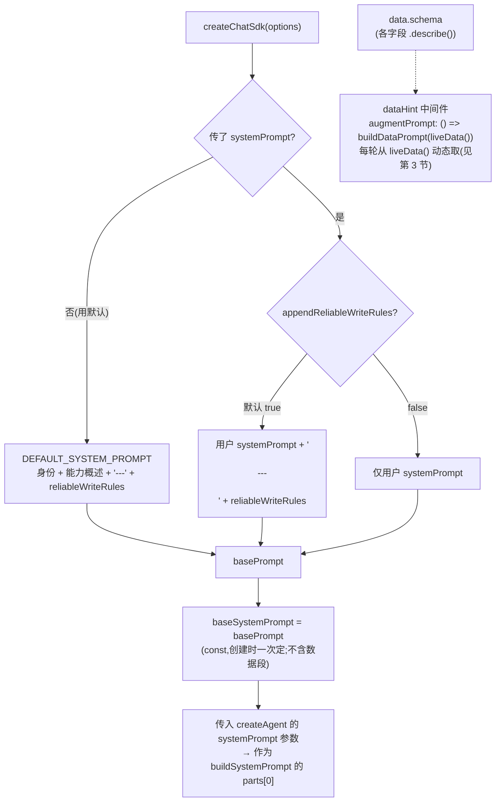
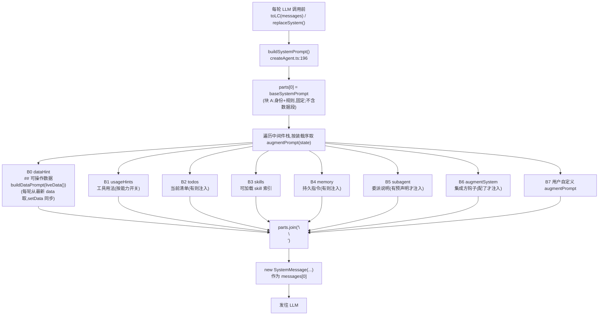

# 系统提示词(System Prompt)构成说明

> SDK 最终发给 LLM 的 `SystemMessage` 由**两层拼接**而成:
> ① `createChatSdk` 在**创建时**拼好 base(`baseSystemPrompt`,仅身份 + 规则,**不含数据段**);
> ② `createAgent` 在**每轮 LLM 调用前**把各中间件的 `augmentPrompt(state)` 段动态叠加上去(含数据段、业务补充段等)。
>
> 关键源码:`src/core/sdk/createChatSdk.ts`(base 拼接 + dataHint/augmentSystem 中间件构造)、`src/core/harness/createAgent.ts:196-205`(`buildSystemPrompt()` 每轮重算)。

---

## 1. 最终结构(组成树)

```
SystemMessage = buildSystemPrompt()   ← createAgent.ts:196,每轮 toLC/replaceSystem 重算
│
├─【块 A · base = baseSystemPrompt】← createChatSdk 创建时定,运行期固定(仅身份+规则,不含数据段)
│  │
│  ├─ A1 身份 + 能力概述
│  │     · 不传 systemPrompt → DEFAULT_SYSTEM_PROMPT(身份 / 范围控制·schema 校验·快照 / 增量 patch)
│  │     · 传 systemPrompt   → 用户业务 systemPrompt(身份/知识/流程)
│  │
│  ├─ A2 --- (分隔线)
│  └─ A3 reliableWriteRules(5 条写入元规则;appendReliableWriteRules 默认 true 追加,false 关闭)
│
└─【块 B · augmentPrompt 段】← createAgent 每轮动态,按中间件装载序,有内容才注入
   │
   ├─ B0 dataHint    ## 可操作数据(字段以 read 返回值为准)← buildDataPrompt(liveData())
   │                 data.description + schema 字段 .describe() 经 extractSchemaHint 自动提取
   │                 每轮从 liveData() 取最新(setData 后自动同步);配了 data 才注入
   ├─ B1 usageHints   工具用法提示(按能力开关自适应;数据工具恒全暴露 14 工具,无档位)
   ├─ B2 todos        当前任务清单(有 todos 才注入)
   ├─ B3 skills       可 load_skill 加载的 skill 索引
   ├─ B4 memory       持久指令 Memory(配了 memory 才注入)
   ├─ B5 subagent     预声明子 agent 委派说明(配了 subagents:[] 才注入)
   ├─ B6 augmentSystem 集成方钩子:按运行时状态(state/data)动态注入业务补充段(配了 augmentSystem 才注入)
   └─ B7 [用户自定义]  用户中间件的 augmentPrompt(如动态写入规则)
```

> 拼接方式:`parts = [baseSystemPrompt, ...各 augmentPrompt 段]`,`parts.join('\n\n')`。块 A 内部用 `'\n\n---\n\n'` 与 `'\n\n'` 连接。
> dataHint 插中间件栈**最前**(usageHints 之前),保证数据段紧跟 base —— LLM 看到的 system 结构与改造前等价(数据段仍在 base 之后第一段)。

---

## 2. 创建期流程:base 怎么拼出来



**要点**
- `baseSystemPrompt` 是 `const`,**创建时拼接一次就固定**(`createChatSdk.ts`),仅含身份 + 规则。
- 数据段不再进 base,改由 `dataHint` 中间件每轮从 `liveData()` 动态重算 —— 见第 3 节。

---

## 3. 运行期流程:每轮怎么叠加 augmentPrompt



**中间件装载序**(决定 B 段顺序,`CLAUDE.md`):
`dataHint → usageHints → todos → skills → vfs → summarization → memory → permissions → checkpoint → humanConfirm → approval → verify → subagent → subagents → augmentSystem → 用户自定义 → sdkEvents`
其中 `vfs / summarization / permissions / checkpoint / humanConfirm / approval / verify / sdkEvents` **没有** `augmentPrompt`(走其它钩子),贡献 B 段的是 `dataHint / usageHints / todos / skills / memory / subagent + augmentSystem + 用户自定义`。

**要点**
- 块 B **每轮重算** —— 这是动态提示词能生效的根因(改个响应式变量 / setData,下一轮立即反映)。
- `augmentPrompt(state)` 入参是当前 `HarnessState`,可基于运行时状态条件注入。
- 除 `usageHints` 外,块 B 各段**有内容才注入**(返回 `undefined` 则跳过),段数随配置浮动。

---

## 4. 各段详解

| 段 | 块 | 来源 | 注入时机 | 动态性 | 条件注入 |
|---|---|---|---|---|---|
| 身份 + 能力概述 | A1 | 用户 `systemPrompt` 或 `DEFAULT_SYSTEM_PROMPT` | 创建时 | 固定 | 必有 |
| `---` + reliableWriteRules | A2/A3 | `systemPromptHelpers.reliableWriteRules`(5 条) | 创建时 | 固定 | `appendReliableWriteRules !== false` |
| 可操作数据 | B0 | `dataHint` 中间件 ← `buildDataPrompt(liveData())` ← `data.schema` 字段 `.describe()` | 每轮 | **动态**(setData 后同步) | 配了 `data` 才注入 |
| usageHints | B1 | `usageHints` 中间件 | 每轮 | 动态 | 必有(装载即注入) |
| todos | B2 | `todos` 中间件 `renderTodos` | 每轮 | 动态 | 有 todos 才注入 |
| skills | B3 | `skills` 中间件 `renderSkillsIndex` | 每轮 | 动态 | 有 skill 才注入 |
| memory | B4 | `memory` 中间件 | 每轮 | 动态 | 配了 `memory` 才注入;运行时可经 `sdk.setMemory(text)` 更新(下轮 augmentPrompt 反映最新) |
| subagent | B5 | `subagent` 中间件 | 每轮 | 动态 | 预声明 `subagents:[]` 才注入 |
| augmentSystem | B6 | 集成方 `options.augmentSystem({ state, data })` 钩子 | 每轮 | **动态**(按运行时 state/data) | 配了 `augmentSystem` 才注入 |
| 自定义 | B7 | 用户 `middleware[].augmentPrompt` | 每轮 | 动态 | 用户自行决定 |

---

## 5. 关键区分与注意事项

### ① 静态 vs 每轮动态
- **块 A(身份/规则)**:`createChatSdk` 创建时拼好的 `const baseSystemPrompt`,运行期固定。
- **块 B(augmentPrompt 段,含数据段)**:`createAgent` **每轮重算**。
- → 想让提示词运行时可变(动态规则、身份切换、条件注入、动态组件说明),走**块 B**:写个中间件,`augmentPrompt(state)` 返回动态内容,下轮立即生效,**无需重建 agent**。这正是 `#3 reliableWriteRules` 动态化的正确路径(见 `问题.md`)。

### ② 「有内容才注入」
块 B 除 `usageHints` 外均条件注入(返回 `undefined` 跳过)。实际段数 = `2~3(A1+A3,可选 A2)` + `1~8(B)`。

### ③ 数据段(B0)随 setData 动态同步
数据段已从创建时 `const` 改为 `dataHint` 中间件每轮从 `liveData()` 重算。运行时 `sdk.setData()` 换 schema 后:
- `inspect()` / `verify`(`createWriteBackCheck`)用 **getter** 实时取最新 schema ✓
- **systemPrompt 里的「可操作数据」hint 段也每轮反映最新 schema** ✓(`dataHint` 中间件每轮重算)
- `inspect().systemPrompt` 经动态重算(`baseSystemPrompt + buildDataPrompt(liveData()) + augmentSystem 段`)也同步反映 ✓

→ 动态换 schema / 懒加载组件场景下,LLM 始终基于最新字段描述操作,不再有过时记忆问题。

### ④ augmentSystem 钩子:动态注入业务补充段
集成方传 `options.augmentSystem = ({ state, data }) => string | undefined`,每轮调用,返回字符串作为 B6 段注入;返回 `undefined` 跳过;回调抛错降级跳过(不崩 agent)。
- `ctx.data` 每轮从 `liveData()` 取最新(setData 后自动同步),可据此动态算「当前相关组件说明」「部分 schema 描述」。
- 段排在内置段(base/dataHint/usageHints/.../subagents)之后、用户 middleware 之前 —— 可在内置数据段 / 能力提示基础上补充。
- 本质是 createChatSdk 层把 `augmentPrompt` 中间件 + `liveData` 闭包预包装成便捷选项(类比 `memory`)。集成方要更灵活(多段 / 复杂逻辑)仍可写自定义 middleware。

### ⑤ 集成方该往哪写内容
| 想加什么 | 放哪 |
|---|---|
| 业务身份 / 字段含义 / 流程 / 技能引用 | **`systemPrompt`**(块 A1) |
| 可操作字段说明 | **`schema` 字段 `.describe()`**(自动进 B0 dataHint,别手写) |
| 工具语法 | ❌ 别写(`usageHints` 自动注入,见 `CLAUDE.md` 职责分工) |
| 运行时可变规则 / 条件提示 | **自定义中间件 `augmentPrompt`**(块 B7) |
| 按运行时 state/data 动态注入业务补充(如当前组件说明) | **`augmentSystem` 钩子**(块 B6,便捷封装) |
| 长文知识(按需加载) | **`skills`**(块 B3 索引,`load_skill` 取全文) |
